Rôles dans Coog
===============

Afin d'exploiter la gestion des droits d'accès, on distingue trois niveaux dans Coog:

- Les groupes: ils permettent de définir un ensemble de droits et de règles d'accès, et peuvent être liés à des rôles et/ou des utilisateurs.
- Les utilisateurs: il s'agit des utilisateurs de Coog. Par leur appartenance à un groupe et/ou un rôle, ils héritent d'un ensemble de droits et règles d'accès.
- Les rôles: un rôle permet de regrouper plusieurs groupes selon des thématiques fonctionnelles par exemple. Ainsi, un rôle contient plusieurs groupes, et un utilisateur peut avoir un ou plusieurs rôles. Lorsqu'un utilisateur a un rôle assigné, il appartient à tous les groupes liés au rôle, et hérite ainsi de l'ensemble des droits d'accès qui y sont définis.

Ajouter un rôle sur un utilisateur dans Coog
............................................

Aller dans le point d'entrée "Utilisateurs"

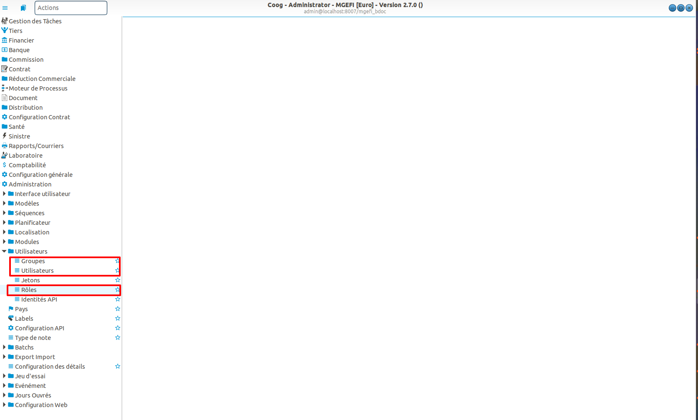

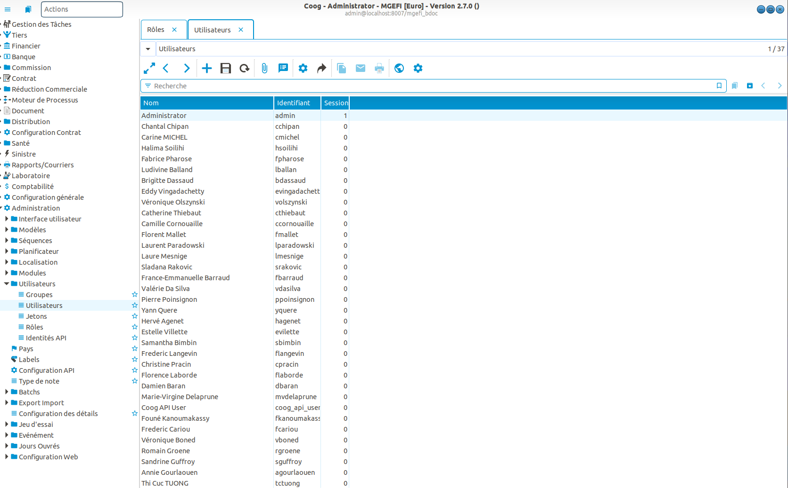

Choisir l'utilisateur sur lequel on souhaite définir un rôle. Dans ce tutoriel, ce sera "Utilisateur de Coog". Se rendre dans l'onglet "Permission d'accès".

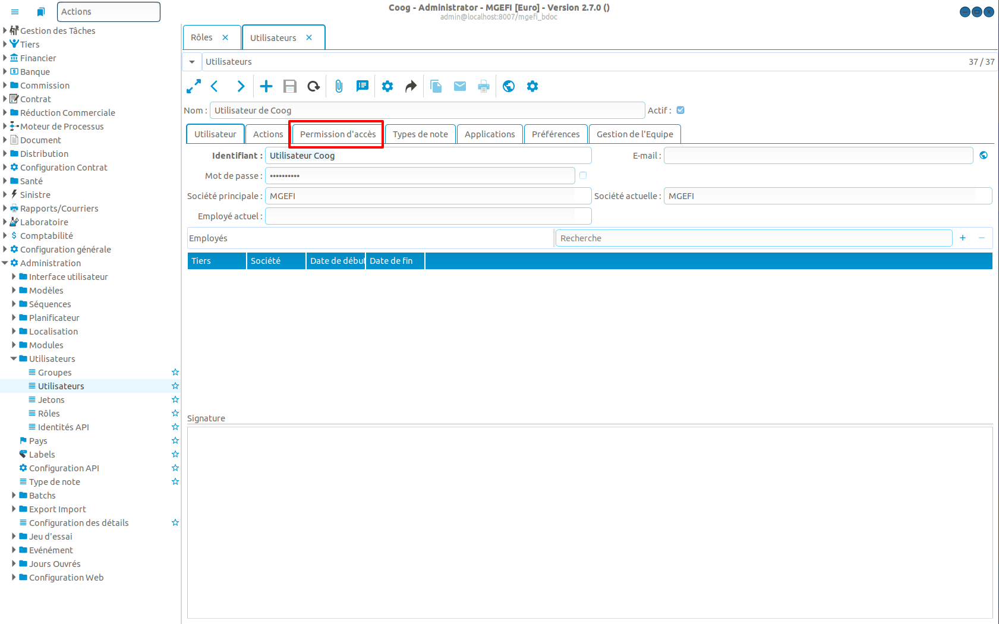

Cliquer sur le bouton "+" lié à la section "Rôles".

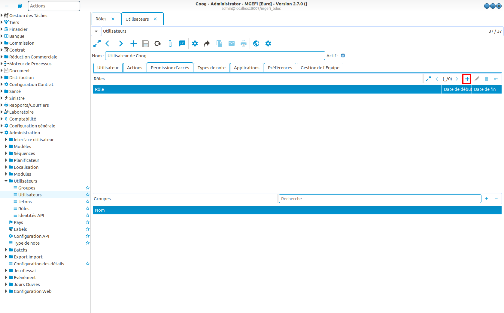

Ainsi, l'écran suivant se présente.

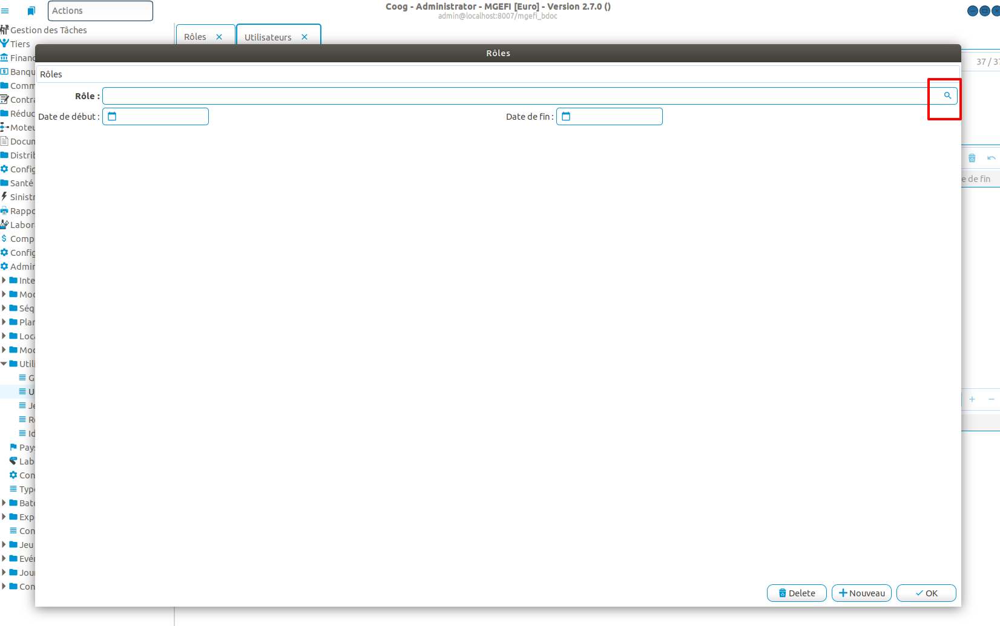

 Il permet de renseigner trois informations:

- Le rôle que l'on souhaite attribuer à l'utilisateur.
- La date de début de l'affectation.
- La date de fin de l'affectation.

Concernant les dates de début et de fin, il suffit de les saisir. Concernant le rôle, cliquer sur la loupe afin de parcourir les rôles disponibles.

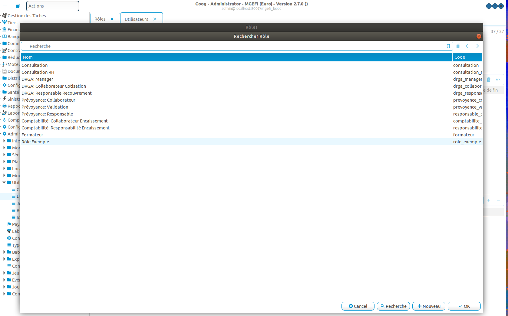

Nous choisirons le rôle "Rôle Exemple" dans ce tutoriel. Cliquer sur OK et saisir une date de début et une date de fin si cela est souhaité. Si ces dates ne sont pas saisies, l'utilisateur sera lié au rôle sans contrainte temporelle.

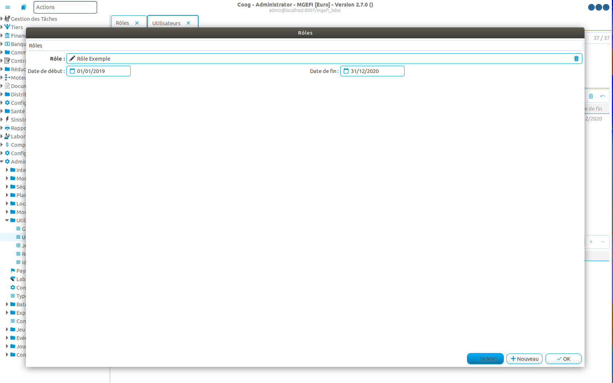

Sauvegarder. L'ensemble des groupes définis sur le rôle apparaît dans la section "Groupes" liée à l'utilisateur, confirmant ainsi que l'utilisateur appartient à l'ensemble des groupes liés au rôle "Rôle Exemple".

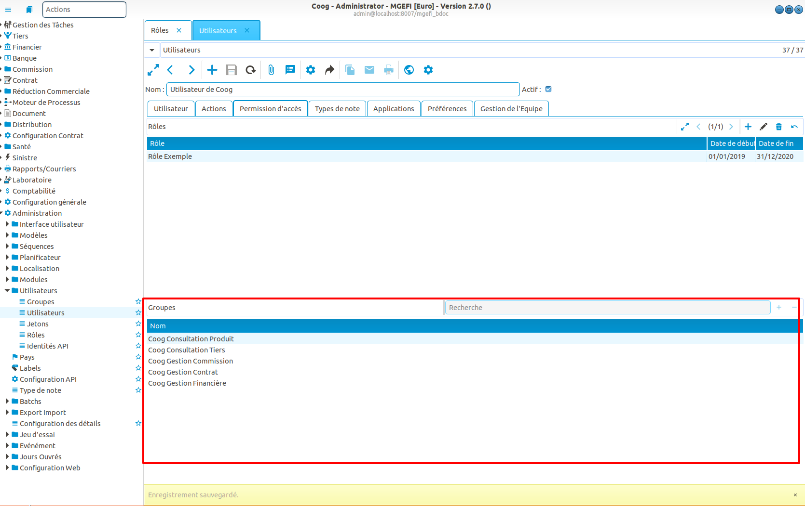

Pour vérifier celà, se rendre dans le point d'entrée "Rôles". Ouvrir le rôle ajouté.

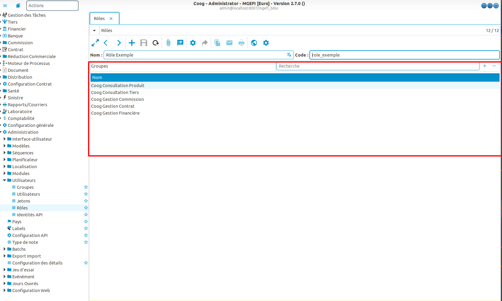

Ainsi, on retrouve les groupes qui ont été automatiquement attachés à l'utilisateur.
Il est possible de définir autant de rôles/groupes que l'on souhaite sur un utilisateur. Si des droits d'accès liés au même objet sont définis sur plusieurs groupes liés à l'utilisateur, les droits les plus permissifs sont retenus.

Il est important de noter que dès lors que l'on choisit d'affecter des rôles et non pas des groupes sur un utilisateur, il n'est plus possible d'affecter des groupes sur cet utilisateur, mais uniquement des rôles. Dans ce cas, les groupes sont verouillés et automatiquement calculés.

Créer un rôle dans Coog
.......................

Afin de créer un rôle dans Coog, se rendre dans le point d'entrée "Rôles".

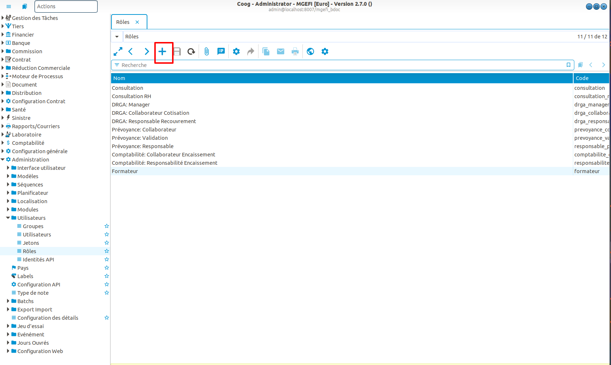

Donner un nom et un code (identifiant unique) au rôle. Ensuite appuyez sur le bouton "+" de la section "Groupes" afin d'attacher des groupes au rôle créé. 

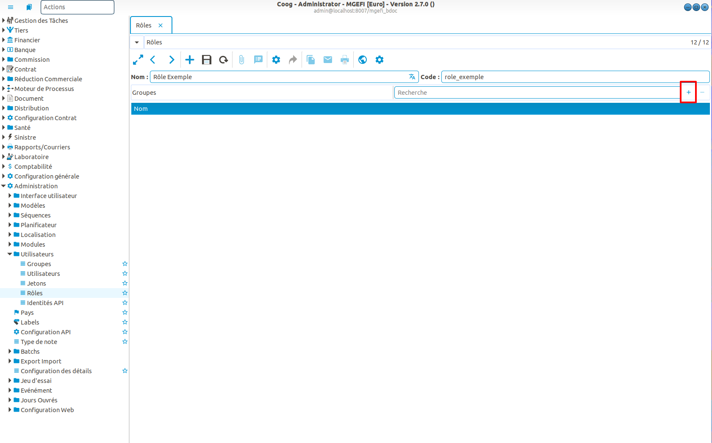

Choisir autant de groupes que souhaité.

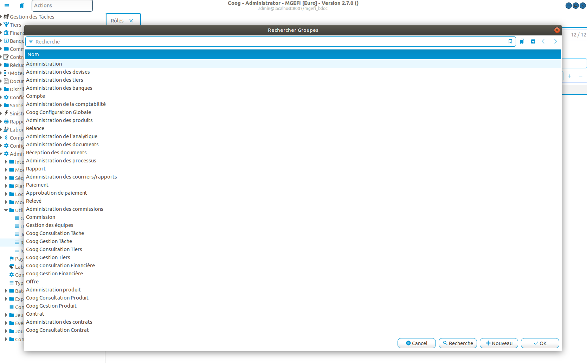

Sauvegarder.

