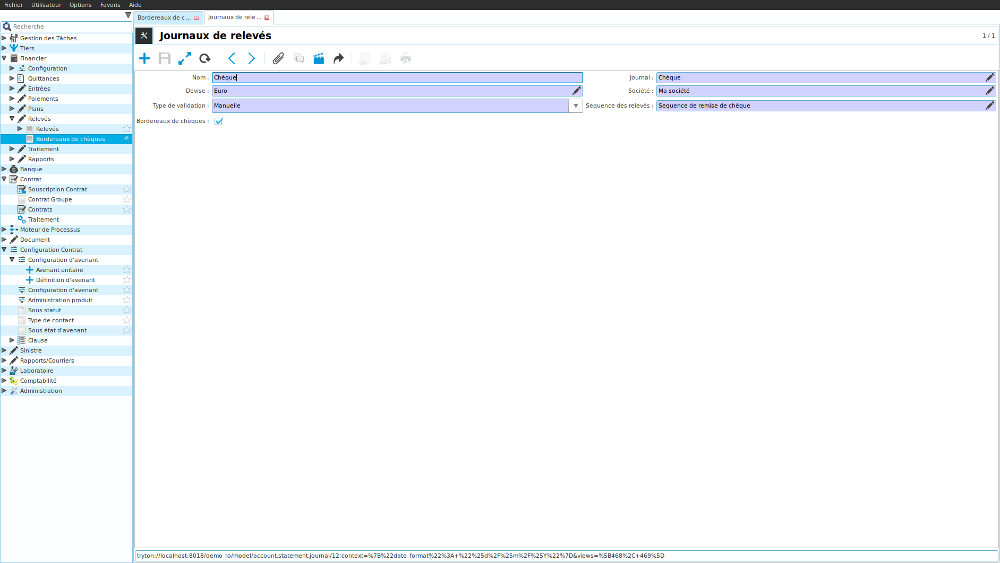
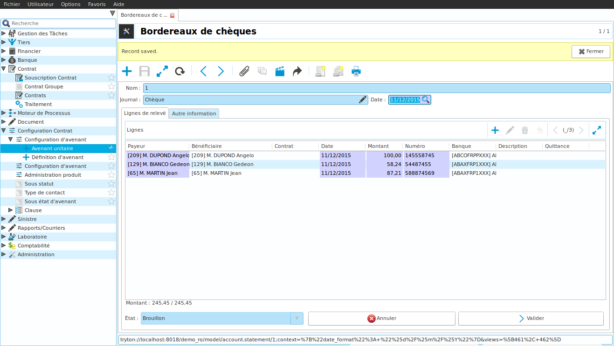
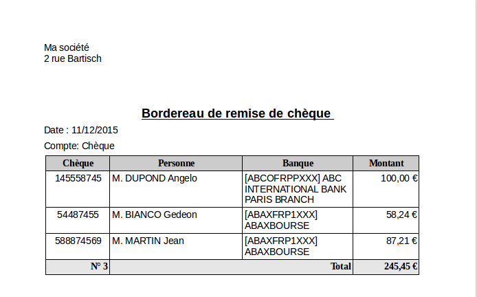

Comment enregistrer un bordereau de chèques
===========================================

Ce tutoriel explique comment faire un bordereau de chèques dans Coog.
Créer un bordereau de chèques dans Coog revient à créer un relevé, à saisir les
lignes qui le composent et valider le relevé.

Configuration
-------------

Un bordereau de chèques (un relevé) se fait sur la base d'un journal de relevé.
Les journaux disponibles sont définis dans le point d'entrée 'Financier/Configuration/Relevés/Journaux de relevés'.

Les éléments à saisir lors de la création d'un nouveau journal sont les
suivants:

- *Nom*: le nom du journal (ex: Chèque)
- *Journal*: il s'agit du journal comptable qui sera utilisé pour la création des mouvements comptables suite à l'émission de la remise de chèques
- *Devise*: devise utilisée lors de la remise de chèques
- *Société*: la compagnie utilisée pour la remise de chèques
- *Type de validation*: permet de définir la méthode de validation du relevé
    -  Manuelle: pas de validation
    -  Montant: somme des montants des chèques remis
    -  Nombres de lignes: nombre de chèques remis
    -  Balance: à ne pas utiliser dans le cas d'un journal de type chèque
- *Sequence des relevés*: séquence utilisée pour le numéro de remise de chèques
- *Bordereaux de chèques*: permet de définir qu'il s'agit d'un journal pour
  remise de chèques.

Faire un bordereau de chèques
-----------------------------

La création d'un bordereau de chèques est disponible depuis le point d'entrée
'Financier/Relevés/Bordereaux de chèques'.

Lors de la création d'un nouveau bordereau, la première étape consiste à
sélectionner le journal paramétré précédemment (cf chapitre Configuration)
et la date de remise du bordereau.
Pour chaque chèque, il faut créer une nouvelle ligne en renseignant les
informations suivantes:

- *Payeur*: la personne qui a émis le chèque
- *Bénéficiaire*: la personne pour qui l'argent sera comptabilisée dans Coog
- *Contrat*: le contrat sur lequel affecter l'argent
- *Date*: date de remise du chèque
- *Montant*: montant du chèque
- *Numéro*: numéro du chèque
- *Banque*: banque d'émission du chèque
- *Description*: champ de saisie d'information non formatée
- *Quittance*: permet de sélectionner la quittance sur laquelle affecter l'argent

Si le montant du chèque dépasse le montant de la quittance, Coog va
automatiquement créer une seconde ligne avec le montant restant. Cela permet
ensuite d'affecter le restant sur une autre quittance. Cela conduit
potentiellement à un nombre différent entre le nombre de chèques et le nombre
de lignes dans le relevé. On verra cependant que lors de l'impression, Coog va
regrouper ces lignes par numéro de chèque: on retrouvera ainsi le nombre et
les montants des chèques déposés.

Un bordereau de chèque a plusieurs états:

- *Brouillon*: il est possible de modifier l'ensemble des informations du bordereau. A la création d'un nouveau bordereau, l'état est brouillon.
- *Validé*: il n'est plus possible de modifier un bordereau à l'état validé. Il est cependant possible de repasser à l'état brouillon.
- *Emis*: le bordereau a été émis dans la comptabilité et ne peut plus être modifié.
- *Annulé*: le bordereau peut être annulé s'il est à l'état brouillon ou validé

Pour passer d'un état à l'autre, il suffit de cliquer sur les boutons
disponibles dans la fenêtre de saisie du bordereau.

Coog vient avec un modèle d'impression de bordereau par défaut disponible dans
le menu impression. Le modèle d'impression agrège les lignes par numéro de
chèques.

