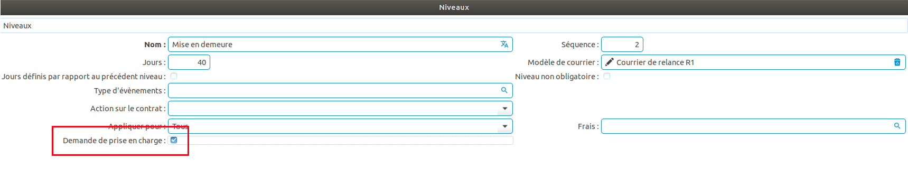
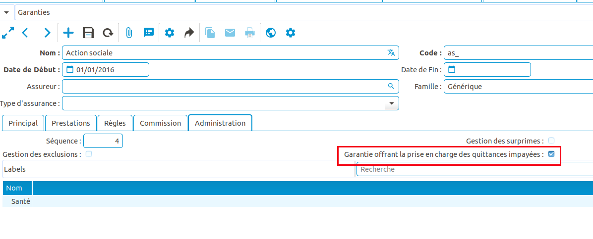
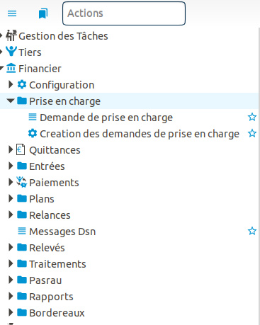
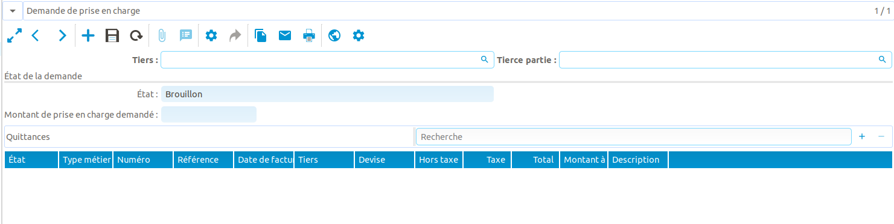
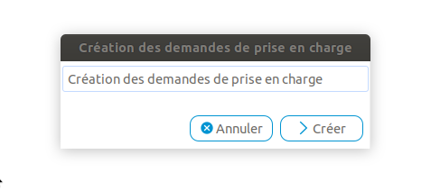
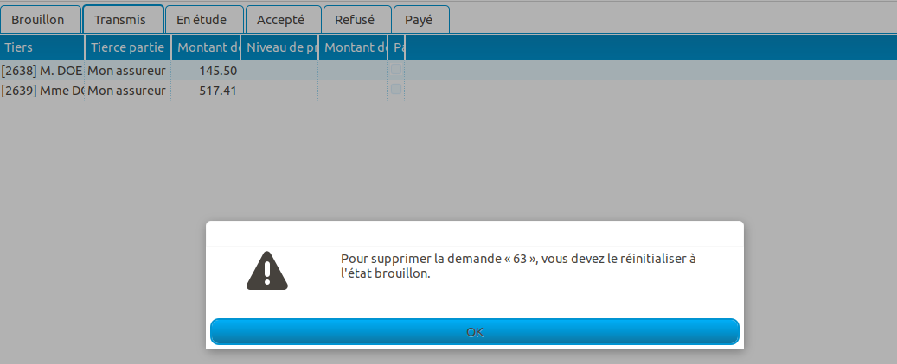

Comment configurer et gérer la prise en charge d'une dette d'impayés par une mutuelle d'action sociale
======================================================================================================

Ce tutoriel explique comment configurer et gérer la prise en charge d'une 
dette d'impayés par une mutuelle d'action sociale.

Configuration
-------------
Le module third_party_debt_assignment doit être installé. Il permet de 
configurer la génération de demande de prises en charge dès lors qu'un contrat 
atteint un certain niveau dans le processus de relance.
Pour cela, deux paramètres sont disponibles:

- Au niveau d'une procédure de relance, une case à cocher spécifie le niveau de
  relance qui va déclencher la création de la prise en charge.

- Au niveau d'une garantie, on spécifie que cette garantie est une garantie 
  offrant une couverture de prise en charge. L'assureur de cette garantie sera 
  la mutuelle d'action sociale.

Utilisation
-----------
Avec le configuration par défaut des habilitations Coog, seuls les utilisateurs 
appartenant aux groupes "Coog Consultation Financière" et "Coog Gestion 
Financière" ont accès au menu "Prise en charge", les utilisateurs appartenant 
au premier groupe peuvent seulement consulter, ceux du second groupe ont tous 
les droits.

La création des demandes de prise en charge peut se faire soit manuellement
à partir du menu "Demande de prise en charge", soit à partir de l'assistant
"Création des demandes de prises en charge". Cet assistant créé les demandes 
pour tous les souscripteurs de contrats dont le niveau de relance nécessitant 
une demande de prise en charge est atteint. Il faut aussi que cet assuré ait
parmi ces garanties une garantie offrant la couverture de prise en charge.

Les demandes de prise en charge ont plusieurs états:

- *Brouillon*: Toutes les demandes sont créées par défaut à cet état. Il est 
  possible de modifier l'ensemble des informations de la demande.
- *Transmis*: il est impossible de passer à cet état si la demande n'a pas de 
  quittance. Il n'est plus possible de modifier ni le tiers, ni la tierce 
  partie et ni les quittances. La date de transmission est définie à la date 
  du jour. Il est possible de repasser à l'état "Brouillon".
- *En étude*: la date de passage à en étude est définie à la date du jour.
- *Accepté*: la date d'acceptation est définie à la date du jour. Il faut 
  définir le niveau de prise en charge: prise en charge totale ou partielle 
  (dans ce cas, il faut préciser le montant pris en charge)
- *Payé*: Ce statut est défini lorsque un paiement a été reçu pour la prise en 
  charge. Il n'est plus possible de modifier le niveau de prise en charge, 
  ni le montant de prise en charge au cas où le niveau de prise en charge était 
  partiel. 
- *Refus*: La date de refus est mis à la date du jour.

Pour passer d'un état à l'autre, il suffit de cliquer sur les boutons 
disponibles dans la fenêtre de saisie de la demande de prise en charge.
On ne peut pas supprimer une demande qui n'est pas à l'état "Brouillon".

Impression
----------
L'objet prise en charge est imprimable. Il est alors possible de configurer des
modèles d'impressions, des reporting de demandes de prise en charge pour envoi 
à la mutuelle d'action sociale.
