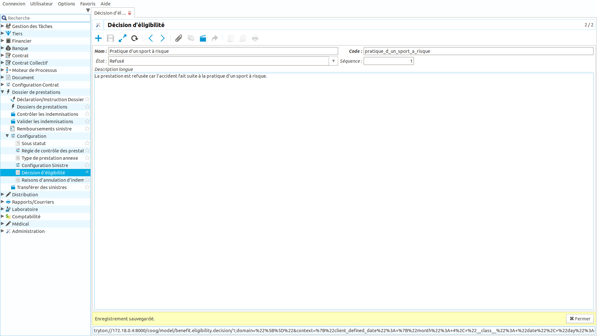
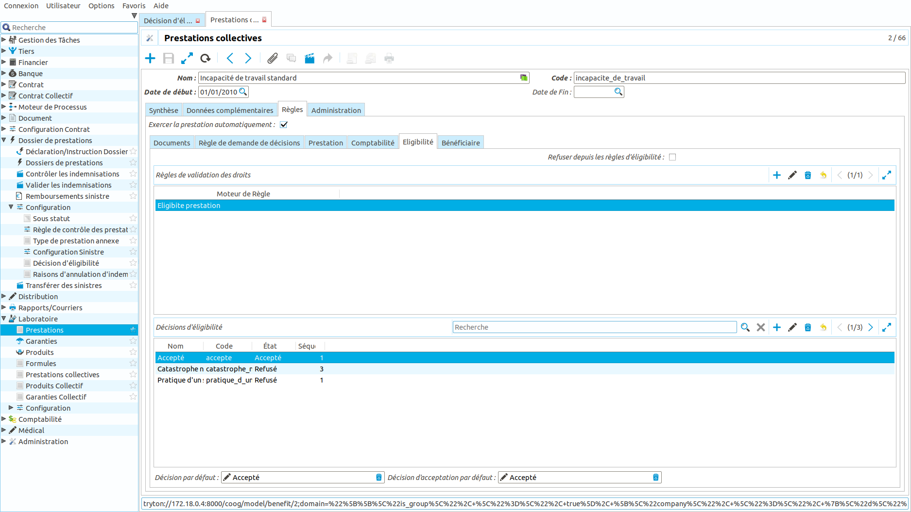
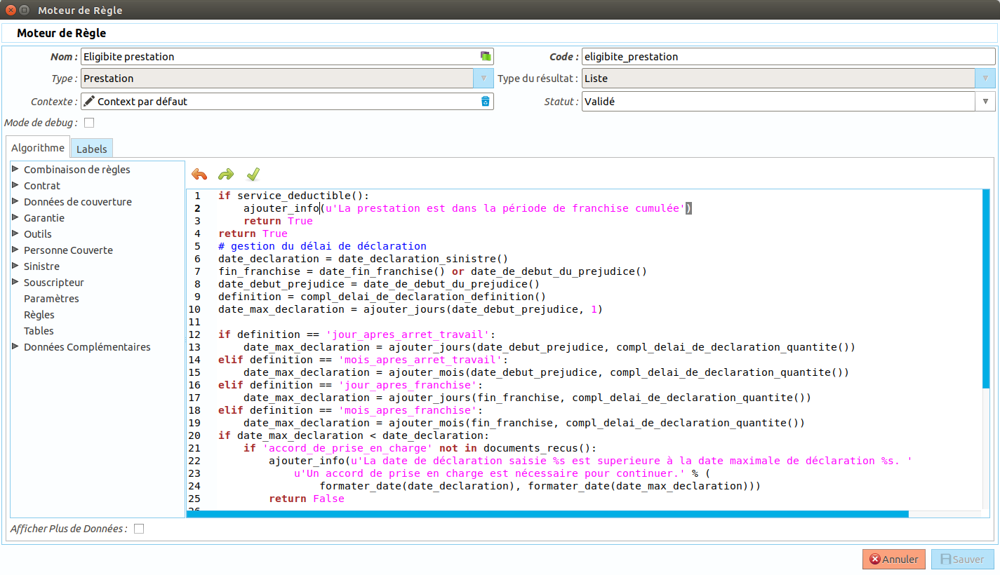
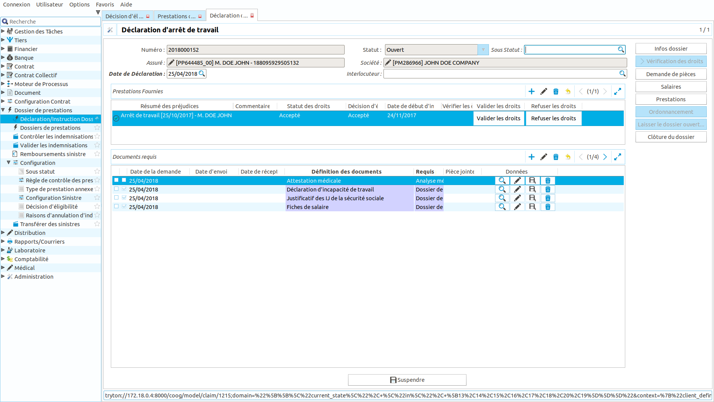
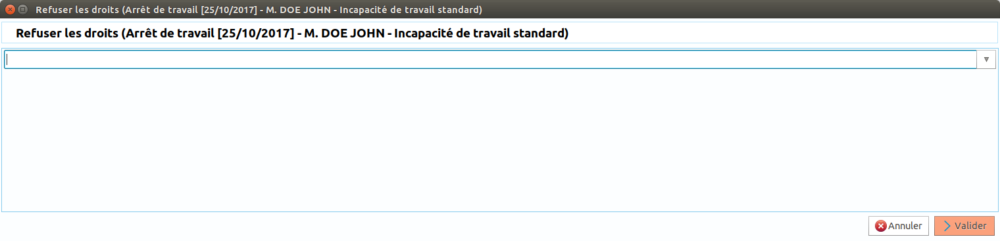

Comment gérer l'éligibilité à une prestation?
=============================================

Ce tutoriel explique comment configurer et gérer l'éligibilité à une prestation 
lors de la déclaration d'un sinistre.

Configuration
-------------

Le module 'claim_eligibility' doit être installé afin de pouvoir bénéficier des 
fonctionnalités décrites dans ce tutoriel.

Les décisions d'éligibilité
+++++++++++++++++++++++++++
Les premiers éléments de paramétrage sont les décisions d'éligibilité. Ces 
décisions sont utilisées au niveau du sinistre afin de définir le motif de 
refus, d'acceptation d'une prestation. Les décisions sont administrées depuis 
le point d'entrée 'Sinistres/Configuration/Décision d'éligibilité'. On peut y 
définir :

- un **nom**
- un **code**: unique dans l'application et utilisé comme identifiant fonctionnel
- un **état**: Accepté, Etude en cours, Refusé
- une **séquence**: permet d'ordonner les décisions (la première décision sera 
  celle avec la séquence la plus petite)
- une **description**: champ texte qui peut être repris dans un courrier

Paramétrage de l'éligibilité d'une prestation
+++++++++++++++++++++++++++++++++++++++++++++
Pour chaque prestation, Coog permet de définir comment sera gérée l'éligibilité. 
Depuis l'écran de configuration d'une prestation, dans l'onglet 'Règles', un 
onglet 'Eligibilité' regroupe les outils de configuration. 

On y retrouve les éléments suivants

- **Refuser depuis les règles d'éligibilité**: Si cette option est sélectionnée 
  et si la règle de validation retourne un refus alors la prestation sera 
  automatiquement refusée avec la décision définie dans le champ 
  "Décision de refus par défaut".
- **Les règles de validation des droits**: Ces règles sont appelées 
  lorsque l'on exerce une prestation suite à une déclaration. La règle doit 
  retourner un booléen (vrai si la prestation est acceptée, faux si la prestation 
  est refusée). Il est possible d'ajouter un message afin d'expliciter le refus 
  avec l'instruction ajouter_info du moteur de règles.

- **Décisions d'éligibilité**: il s'agit des décisions d'éligibilité pouvant 
  être choisie sur une prestation.
- **Décision par défaut**: Décision utilisée par défaut lorsque l'on excerce 
  une prestation
- **Décision d'acceptation par défaut**: Cette décision est utilisée si la 
  règle de validation des droits retourne vrai. 
- **Décision de refus par défaut**: Ce paramétrage n'est possible que si 
  l'option 'Refuser depuis les règles d'éligibilité' a été activée. Dans ce cas, 
  cette décision sera utilisée par défaut pour le refus.

Utilisation de la décision d'éligibilité dans le moteur de règle
++++++++++++++++++++++++++++++++++++++++++++++++++++++++++++++++
Coog permet d'utiliser l'information de la décision dans les règles de gestion 
d'un sinistre. Ainsi il devient possible par exemple de définir des montants de 
remboursement différents selon une décision d'acceptation ou de définir des 
pénalités selon une décision. La donnée disponible dans le moteur de règles est 
'code_decision_eligibilite_prestation' qui retourne le code de la décision 
définie sur la prestation.

Traitement d'un sinistre
------------------------
Lors du traitement d'un sinistre et selon la configuration du processus et de 
la prestation, Coog va calculer et initialiser les décisions d'éligibilité. 

Selon le retour de la règle d'éligibilité, la prestation sera acceptée, refusée 
ou en étude. Il sera toujours possible pour l'utilisateur d'accepter ou de 
refuser manuellement en lançant l'assistant de refus ou d'acceptation. Une 
décision sera alors demandée.

