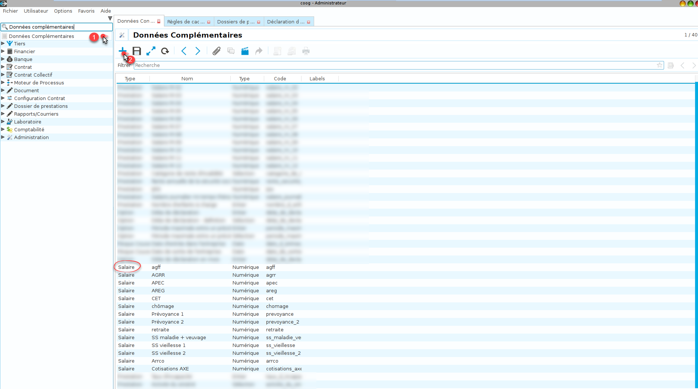
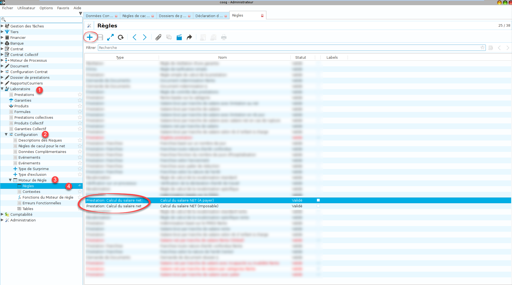
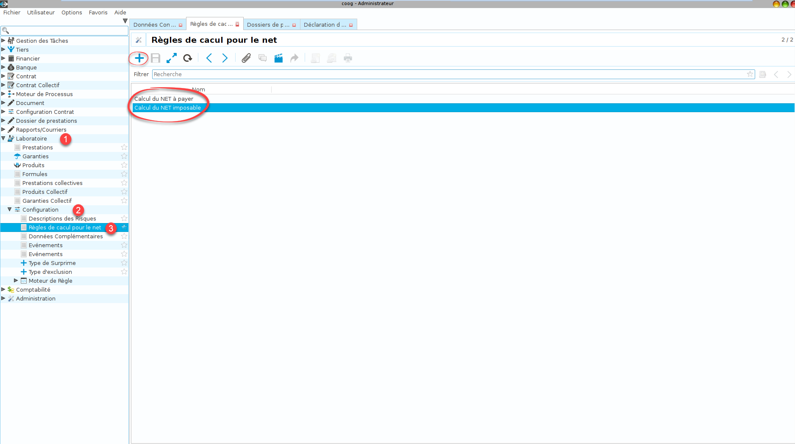
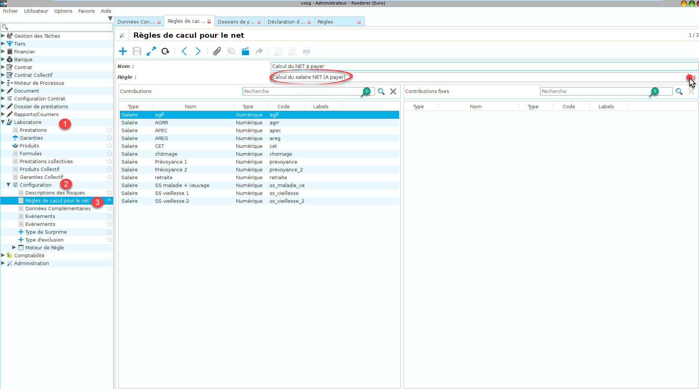

Comment paramétrer le calcul du salaire net
===========================================

Ce tutoriel explique les différentes étapes afin de paramétrer le calcul du salaire net dans Coog.

Description
-----------

Lorsque l'on saisit une prestation, il faut déclarer le salaire brut de la personne couverte.
Il devient dès lors possible de calculer le salaire net en prenant en compte un nombre variable de charges sociales
(taux ou montant fixes) pour les tranches A, B et C.
Ce tutoriel a pour but d'expliquer par étapes :
1. Comment définir des charges sociales à l'aide des données complémentaires.
2. Paramétrer des règles de calcul en utilisant le moteur de règles.
3. Déclarer ces différentes règles de calcul (necessaire afin de les rendre accessible lors de la saisie d'un contrat par exemple) et y associer les charges sociales.

Etapes
------

Dans un premier temps, il faut créer les données complémentaires de type 'Salaire'.
Via la barre de recherche en haut à gauche de l'application, saisir "Données complémentaires" (ou bien suivre le chemin suivant: Laboratoire -> Configuration -> Données complémentaires) puis ouvrir la vue.
Il suffit alors de créer les données complémentaires voulues comme le montre la capture d'écran qui suit :

*Création d'une nouvelle donnée complémentaire de type Salaire :*

Une fois les charges sociales créées, il faut créer la règle de calcul de type 'Prestation : calcul du salaire net',
qui va calculer et retourner le montant du salaire net en fonction des tranches A, B et C.
On accède aux règles via le point d'entrée "Règle" (Voir impression écran). 
Les nouvelles règles créées figurent désormais dans la liste.

*Création d'une nouvelle règle de calcul de type Prestation : calcul du salaire net :*

Désormais il est nécessaire de déclarer la ou les règle(s) de calcul du salaire net, ainsi que d'associer pour chacune d'elle,
les charges sociales applicables.

*Création (déclaration) d'une nouvelle règle de calcul du salaire net :*

*Ajout des charges sociales utilisées par la règle de calcul du salaire net :*

Il faut donc ajouter les données complémentaires (charges de type taux) dans l'emplacement "Contributions" et les données
complémentaires (charges fixes) dans l'emplacement "Contributions fixes".

Il est possible de modifier les règles de calcul existantes afin d'**ajouter** ou **supprimer** des nouvelles données complémentaires
de type Salaire.

**Les charges sociales apparaîtront automatiquement lors de la déclaration d'une prestation, en fonction de la règle de calcul du salaire net choisie dans le contrat.**
