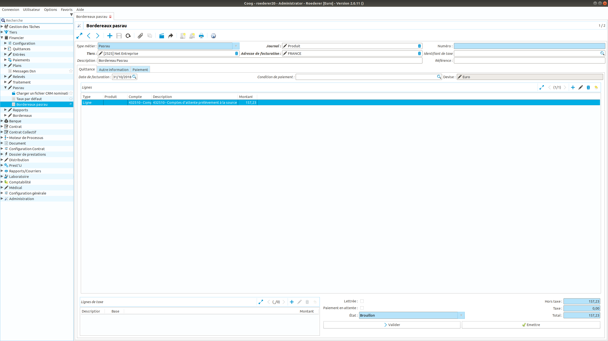

Comment utiliser le module Pasrau
=================================

Ce tutoriel a pour but d'expliquer le fonctionnement du module Pasrau 
(claim_pasrau). Ce module permet de gérer le prélèvement à la source lors du 
versement de prestations à l'assuré, dans le cadre notamment des versements IJ 
et invalidité.

Fonctionnement global
---------------------

Le prélèvement à la source est vu dans Coog comme une taxe. Une fois paramétrée,
la taxe de type prélèvement à la source va utiliser le taux de prélèvement 
défini au niveau de l'assuré pour calculer le montant à prélever. Les taux sont 
intégrés depuis le fichier nominatif de la norme Pasrau ou calculés dans le cas 
du premier prélèvement (taux neutre).

Paramétrage
-----------

Paramétrage de la taxe Pasrau
~~~~~~~~~~~~~~~~~~~~~~~~~~~~~

Depuis le point d'entrée "Financier/Configuration/Taxes/Taxes", créer une 
nouvelle taxe dont le type sera 'Taux Pasrau'. Vous devez définir les 
comptes comptables dans lesquels seront générés les écritures.

Coog permet de définir dans quel ordre les taxes vont s'appliquer et quelle 
sera l'assiette de calcul de la taxe. Pour cela, sur une taxe, un champ 
'Séquence' permet de définir l'ordre d'application des taxes et un champ 
'Mettre à jour le prix unitaire' permet de réduire de l'assiette des taxes 
suivantes le montant calculé pour la taxe.

Par exemple, dans le cas du prélèvement à la source appliqué aux prestations IJ 
et selon le taux d'imposition de l'assuré, il est nécessaire de déduire la CSG, 
RDS, la CSG déductible et le prélèvement à la source. Dans ce cas, le 
prélèvement à la source s'applique sur le montant brut déduit de la CSG 
déductible.

Le paramétrage sera alors:

- taxe CSG avec le champ 'Séquence' à 1 et le champ 'Mettre à jour le prix 
  unitaire' à Faux.

- taxe RDS avec le champ 'Séquence' à 1 et le champ 'Mettre à jour le prix 
  unitaire' à Faux.

- taxe CSG Déductible avec le champ 'Séquence' à 2 et le champ 'Mettre à jour 
  le prix unitaire' à Vrai.

- taxe Prélèvement à la source avec le champ 'Séquence' à 3 et le champ 'Mettre 
  à jour le prix unitaire' à Faux.

Paramétrage du produit comptable
~~~~~~~~~~~~~~~~~~~~~~~~~~~~~~~~

De la même façon que pour toute taxe, la taxe 'Pasrau' pourra être ajoutée 
au niveau d'un produit comptable. C'est sur la base de ce produit comptable que 
lors de l'instruction d'un sinistre, Coog va calculer le montant 
d'indemnisation. 

Paramétrage de la table de calcul du taux neutre
~~~~~~~~~~~~~~~~~~~~~~~~~~~~~~~~~~~~~~~~~~~~~~~~

Le taux neutre nécessaire au premier prélèvement (lorsqu'aucun taux n'a encore 
été communiqué par l'administration) se calcule à partir d'une grille. Cette 
grille est configurable dans Coog à partir du point d'entrée 
'Financier/Pasrau/Taux par défaut'. Un taux est défini selon une période de 
temps, une localisation, une borne inférieure et supérieure de revenu.

Paramétrage du type de bordereau Pasrau
~~~~~~~~~~~~~~~~~~~~~~~~~~~~~~~~~~~~~~~

La génération du bordereau Pasrau se base sur une fonctionnalité générique de
Coog qui permet de générer des bordereaux sur la base d'un compte (module
account_invoice_slip). Il faut donc paramétrer cet outil pour permettre la 
génération d'un bordereau Pasrau. 

Depuis le point d'entrée 'Financier/Bordereaux/Configuration des bordereaux', 
il faut créer une nouvelle configuration de bordereau. Les éléments nécessaires
sont les suivants:

- **Tiers**: Personne morale destinataire du bordereau. Dans le cas de Pasrau, 
  un tiers Net Entreprise peut être créé et renseigné dans ce champ.

- **Type de Bordereau**: Sélectionner le type Pasrau

- **Journal**: Journal utilisé pour le mouvement comptable généré lors de 
  l'émission du bordereau 

- **Nom**: Nom du bordereau

- **Comptes**: Comptes comptables dans lesquels se trouvent les lignes comptables 
  correspondantes aux versements Pasrau générées (souvent un compte d'attente 
  pasrau)

Paramétrage global de la génération du fichier Pasrau
~~~~~~~~~~~~~~~~~~~~~~~~~~~~~~~~~~~~~~~~~~~~~~~~~~~~~
Certaines informations nécessaires à la constitution du fichier Pasrau sont 
définies dans la configuration globale de l'application
(commande ./coog edit coog.conf ). Voici les informations à ajouter:

- **sender_code**: Code dans Coog de la société émettrice du fichier (
  champ S10.G00.01)

- **sender_nic**: NIC de l'émetteur du fichier

- **sender_contact_civility**: Civilité du contact ('01': Monsieur, '02' Madame)

- **sender_contact_full_name**: Nom prénom du contact

- **sender_contact_email**: Adresse email du contact

- **sender_contact_phone**: Numéro de téléphone du contact

- **code_apen**: code apen de l'entreprise (champ S21.G00.06.003)

- **nic_etablissement**: Nic de l'entreprise (champ S21.G00.11.001)

- **apet_etablissement**: APET de l'établissement (champ S21.G00.11.002)

- **fraction_number**: Numéro de fraction de la déclaration (
  champ S20.G00.05.003)

- **testing**: Fichier de test ou réel. Si non renseigné ou valeur True, Coog 
  générera un fichier de test. Si renseigné à False, Coog générera un fichier 
  réel(champ S10.G00.00.005)

- **output_dir**: Répertoire de sortie des fichiers Pasrau

Voici un exemple de configuration

	.. code-block:: sh

		[dsn]
		sender_code = 1 
		sender_nic = 12345
		sender_contact_civility = 01
		sender_contact_full_name = Michel Dupond
		sender_contact_email = michel.dupond@mail.com
		sender_contact_phone = 0101010101
		code_apen = 123
		nic_etablissement = 567
		apet_etablissement = 789
		fraction_number = 10
		testing = False
		output_dir = /tmp

Gestion des taux de prélèvements à la source
--------------------------------------------

A partir d'une fiche adhérent, la liste des taux de prélèvement à la 
source fournie par l'administration est disponible via 'Ouvrir les 
enregistrements liés/taux Pasrau'.

Il est possible selon habilitation de définir un taux manuel sur une personne.

Intégration d'un fichier CRM nominatif
~~~~~~~~~~~~~~~~~~~~~~~~~~~~~~~~~~~~~~

Un des fichiers de retour prévus par la norme PASRAU est le fichier CRM 
nominatif. Il intègre les taux de prélèvement calculés pour l'assuré par 
l'administration. 

Coog intègre ce fichier et initialise sur la fiche de la personne le taux de 
prélèvement à la source à utiliser.

Le fichier peut être intégré soit depuis l'application, soit via un traitement 
automatisé de type batch.

Via l'application
*****************

Depuis le point d'entrée 'Financier/Pasrau/Charger un fichier CRM nominatif', 
un assistant permet de sélectionner un fichier et de le traiter.

Via un batch
************

Le batch 'party.pasrau.rate.batch' inclus dans la chaîne de batch 'pasrau' 
prend en paramètre un chemin de dossier et traite les fichiers de ce dossier.
Le fichier est déplacé dans un dossier 'archive' une fois le traitement réussi.

Exemple de configuration du batch:

	.. code-block:: sh

		[party.pasrau.rate.batch]
		directory=/home/coog/prestij/input

Traitement d'un sinistre avec prélèvement à la source
-----------------------------------------------------

Lors de la création d'une nouvelle période d'indemnisation et selon la 
configuration de la prestation, Coog propose de sélectionner le produit 
comptable. Si ce produit inclut une taxe de type PASRAU, alors Coog générera un 
prélèvement PASRAU. Cette taxe appraitra dans la somme des contributions lors 
du calcul de l'indemnisation. De plus, le détail est accessible sur la facture 
de remboursement comme illustré sur l'image suivante.

Génération des bordereaux Pasrau
--------------------------------

Les bordereaux Pasrau sont configurés pour être générés le dernier jour du mois 
dans la configuration par défaut de lancement des batchs (daily-chain). Il est 
cependant possible de les générer manuellement depuis l'application.

Via l'application
~~~~~~~~~~~~~~~~~

Depuis le point d'entrée 'Financier/Bordereaux/Configuration des bordereaux', 
une action est disponible permettant de lancer un assistant de génération d'un
bordereau. 

Par défaut Coog initialise la date du bordereau avec la date de fin du mois 
précédent. Il est cependant possible de modifier manuellement cette date.
Cette date correspond à la date maximale des dates des lignes de mouvements 
comptables que Coog intégrera dans le bordereau.

Via un batch
~~~~~~~~~~~~

Le chaîne de batch peut être lancée manuellement. La chaîne est dans le module 
account_invoice_slip et se nomme slip.

Consulation d'un bordereau
--------------------------

La liste des bordereaux générés est disponible depuis le point d'entrée 
'Financier/Pasrau/Bordereaux Pasrau'.

Génération des fichiers Pasrau
------------------------------

Lors de l'émission du bordereau (bouton 'Emettre' sur le bordereau), Coog génère
automatiquement le fichier DSN qui est alors disponible depuis le menu '
Ouvrir les enregistrements liés/Message DSN'.

Un message DSN a plusieurs états:

- **brouillon**: état qui permet de supprimer le bordereau si celui ci est 
  erroné

- **en attente**: état par défaut lors de la génération du message

- **fait**: état final du bordereau. Il est impossible de revenir à un autre 
  état.

- **annulé**: état annulé du message

Lors du passage à l'état 'Fait', le fichier est stocké dans le réportoire 
défini dans la configuration globale de l'application.

Une fois un message DSN passé à l'état 'Fait', la génération d'un nouveau 
bordereau 'Annule et Remplace' se fait depuis le bordereau via le menu 'Lancer 
une action' et l'action 'Générer le message DSN'

Gestion de la régularisation avec Pasrau
~~~~~~~~~~~~~~~~~~~~~~~~~~~~~~~~~~~~~~~~

La norme Pasrau prévoit la possibilité de déclarer une régularisation de 
prélèvement dans le cas d'une erreur de taux, d'assiette ou de trop perçu.
Les cas métiers où Coog génère une régularisation sont les suivants:

- Cas d'une régularisation avec 'Réclamation de l'indu à effet immédiat'. Dans 
  ce cas un remboursement négatif est émis qui donne lieu à une déclaration de 
  régularisation

- Cas d'un rejet de virement. Si au moment de la génération d'un bordereau un 
  remboursement est à l'état payé, qu'un rejet de virement est constaté 
  ensuite et que de plus durant le mois du constat du rejet, le remboursement 
  n'est pas soldé alors à la génération du bordereau Pasrau suivant une 
  régularisation sera déclarée.
