Comment utiliser le module prest'IJ
===================================

Ce tutoriel a pour but d'expliquer le fonctionnement du module prest'IJ. Ce 
module permet de gérer la communication avec la CNAM afin de récupérer les 
bordereaux d'IJSS dans le but d'automatiser la création des périodes 
d'indemnisation.

Fonctionnement global
---------------------

Afin de recevoir les bordereaux IJSS, il faut dans un premier temps inscrire la 
société au service. 

Ensuite à l'ouverture d'un dossier de prestation, il faut inscrire l'assuré sur 
une période de couverture.

Une fois l'assuré inscrit, les BPIJ pourront être reçus et traités 
par Coog.

Un processus de traitement des BPIJ a été défini qui permet depuis plusieurs 
BPIJ de lancer la création de période d'indemnisation. 

Paramétrage de prest'IJ
-----------------------

Fichier de configuration de Coog
~~~~~~~~~~~~~~~~~~~~~~~~~~~~~~~~

Certaines données utilisées pour la génération des fichiers Prest'IJ sont 
définis dans le fichier de configuration de Coog. Il s'agit du fichier 
trytond.conf dans le cas d'un déploiement développeur et de 
./coog edit coog.conf (ou ./coog edit-app en 1.12) pour un déploiement docker.

Il faut créer une nouvelle section appelée [prest_ij] et renseigner les 
informations suivantes:

- *code_ga* = IDIp (Identifiant de l’organisme complémentaire)
- *siret_opedi* = SIRET de l'OPEDI émetteur
- *access_key*: Clé d'accès au service
- *opedi_name*: Nom de l'OPEDI émetteur du message

Exemple de configuration:

  .. code-block:: sh

		[prest_ij]
		code_ga = AAAAA
		siret_opedi = 11111111111111	
		access_key = CLEFICTIVE
		opedi_name = COOPENGO

Configuration des batchs 
~~~~~~~~~~~~~~~~~~~~~~~~

Au niveau des batchs, il est nécessaire de définir les dossiers d'entrée et de 
sortie des fichiers Prest'IJ.
La configuration se fait soit dans le fichier batch.conf dans un environnement 
développeur ou ./coog edit batch.conf (./coog edit-batch en 1.12)

Il faut créer une section pour les batchs suivants:

- prest_ij.subscription.process: il s'agit du batch qui génère les fichiers 
  d'inscription. Le répertoire de sortie des fichiers doit être spécifié dans la 
  variable output_dir

- gestip.flux.process: il s'agit du batch qui traite les fichiers ARL et CR de 
  retour. Le répertoire d'entrée des fichiers doit être spécifié dans la 
  variable directory

- prest_ij.periods.batch: il s'agit du batch qui traite les fichiers BPIJ. Le 
  répertoire d'entrée des fichiers doit être spécifié dans la variable 
  directory

Exemple de configuration:

  .. code-block:: sh

		[prest_ij.subscription.process]
		output_dir=/home/coog/prestij/output

		[gestip.flux.process]
		directory=/home/coog/prestij/input

    [prest_ij.periods.batch]
    directory=/home/coog/prestij/BPIJ_input

Attention, avec un déploiement docker, les chemins sont les chemins accessibles 
depuis le container et de la forme /workpsace/io/.

Configuration globale de l'application
~~~~~~~~~~~~~~~~~~~~~~~~~~~~~~~~~~~~~~

Depuis le point d'entrée 'Sinistres/Configuration/Configuration Sinistre', Coog 
requiert que soit renseigné le générateur de numéro de fichier Prest'IJ dans le 
champs 'Sequence du flux Prest'IJ' et le générateur de numéro de couverture 
dans le champs 'Séquence de période IJ'

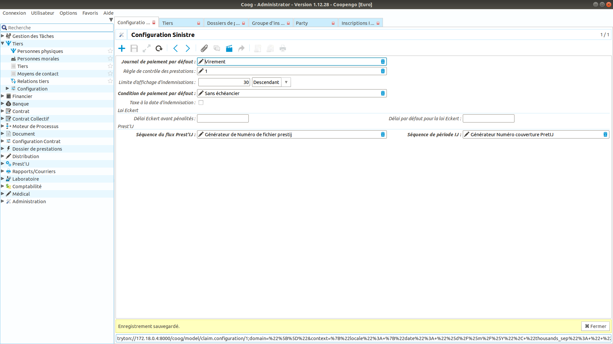

Configuration des produits/prestations
~~~~~~~~~~~~~~~~~~~~~~~~~~~~~~~~~~~~~~

Afin qu'une société et que ses assurés bénéficient du service prest'Ij, il faut 
que cette société ait souscrit un contrat dont une des garanties souscrites ait 
une prestation autorisant le service prest'IJ.

Cette option se coche au niveau du paramétrage d'une prestation dans 
l'onglet Administration au niveau du champ *Gestion du système Prest'IJ*.

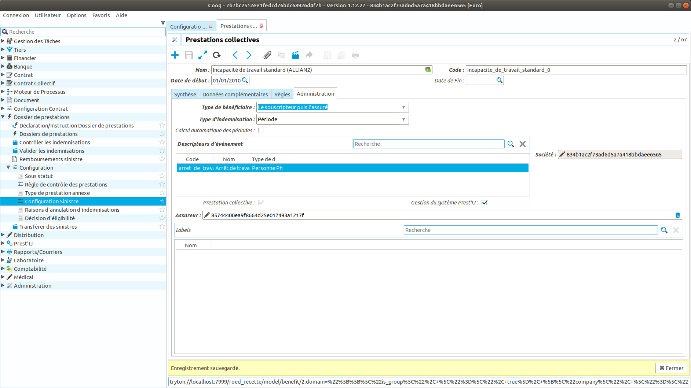

Configuration des événements
~~~~~~~~~~~~~~~~~~~~~~~~~~~~

Afin de pouvoir détecter des changements de nature de prestation lors de 
l'intégration des flux BPIJ, Coog requiert une association entre la nature du 
flux BPIJ et les type d'événements paramétrés dans Coog.

Sur chaque type d'événement, point d'entrée 'Laboratoire/Evénements/", il faut 
renseigner la nature prest'ij correspondant.

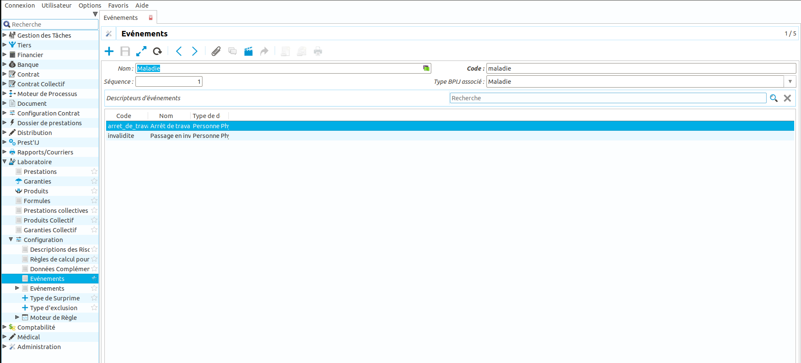

Inscription des sociétés
------------------------

La première étape pour pouvoir bénéficier du service prest'IJ est l'inscription 
de la société. La fiche d'inscription d'une société est accessible depuis la 
fiche société via l'action "Ouvrir les enregistrement liés" et "Consulter 
l'inscription Prest'IJ". 

Sur cette fiche, on visualise les demandes d'inscription/désinscription 
générées et traitées, l'état de l'inscription et les événements liés aux 
inscriptions.

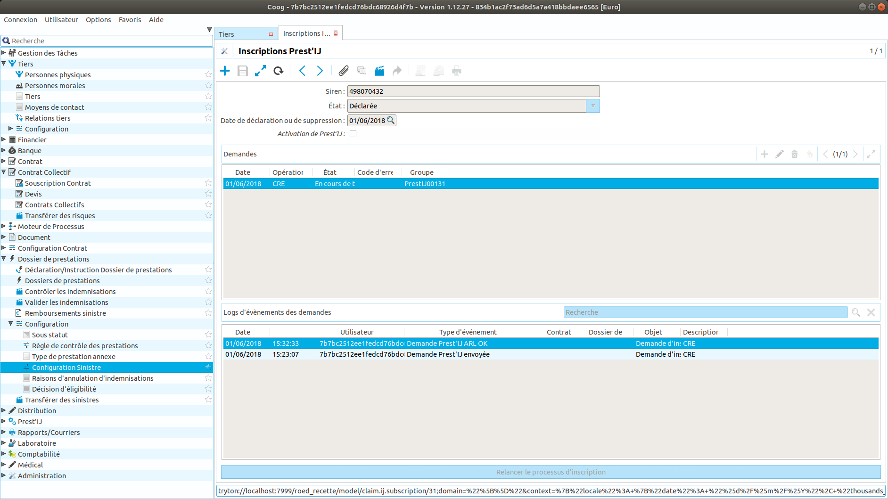

Lors du traitement des fichiers CR, les inscriptions en erreur sont affichées 
dans le point d'entrée "Prest'IJ/Demandes en erreur". Depuis cet écran, on 
visualise les inscriptions en erreur et leurs codes erreur. Lorsque l'erreur 
a été corrigée, un assistant permet de soumettre une nouvelle demande. Cet 
assistant est disponible via l'action "Lancer une action" puis "Relancer le 
processus d'inscription".

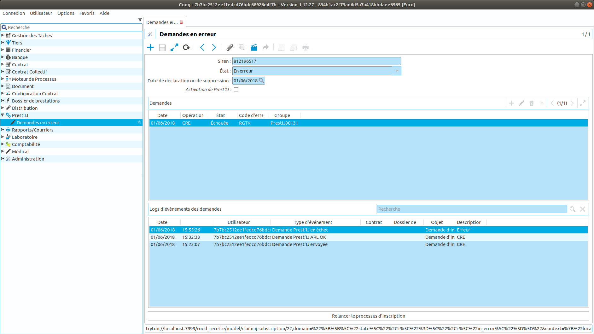

Inscription des salariés
------------------------

Avant de pouvoir inscrire des salariés pour une société, il faut avoir activé 
le service prest'IJ depuis la fiche d'inscription de la société en sélectionnant 
l'option "Activation de Prest'IJ".

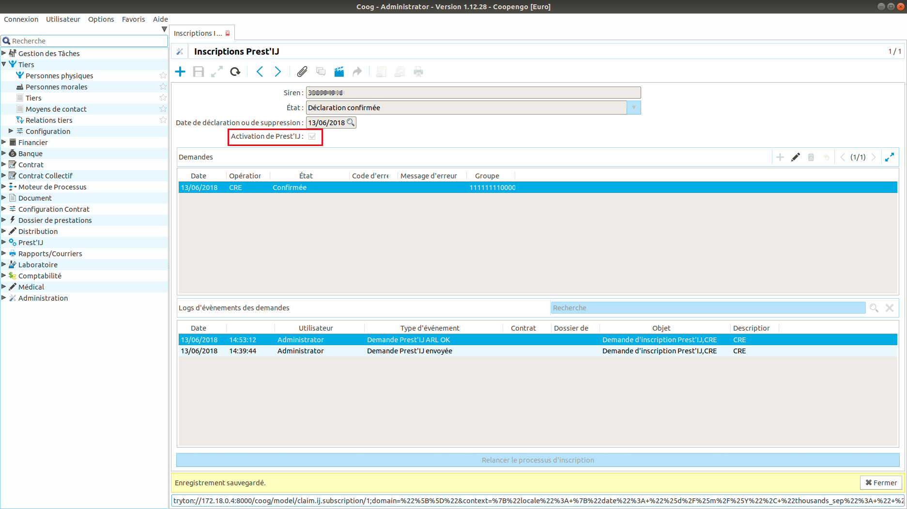

Une fois l'option activée, Coog va créer, par batch, la fiche d'inscription à
Prest Ij qui est accessible depuis la fiche personne via l'action "Ouvrir les 
enregistrement liés" et "Consulter l'inscription Prest'IJ".

Une fois l'option activée, il existe deux possibilités pour inscrire un assuré 
sur une période.

Inscription manuelle
~~~~~~~~~~~~~~~~~~~~

Coog permet depuis la fiche d'inscription d'un assuré de demander une nouvelle 
inscription en renseignant les informations de la période de couverture 
souhaitée. Pour cela, il suffit de lancer l'assistant "Création manuelle d'une 
souscription Prest IJ".

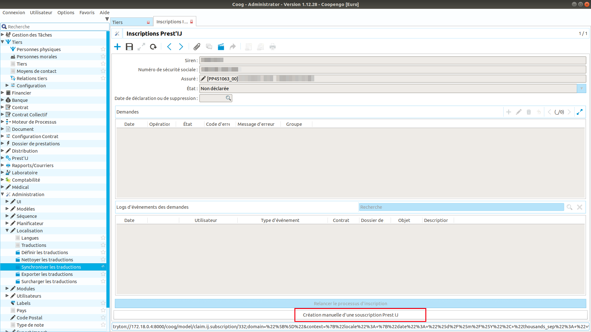

Coog demande alors que soient saisies les informations de la date de début de 
couverture, de la date de fin de couverture et de la date rétroactivité.

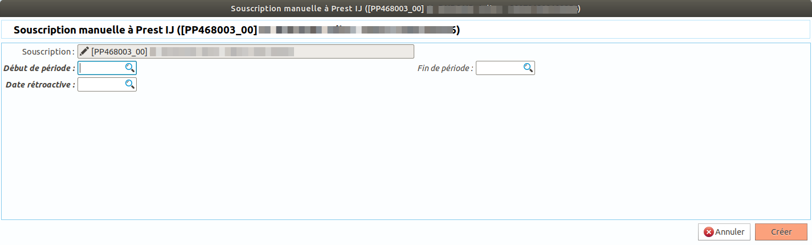

Une fois la saisie validée, une demande d'inscription est générée et 
visualisable depuis la fiche d'inscription de l'assuré.

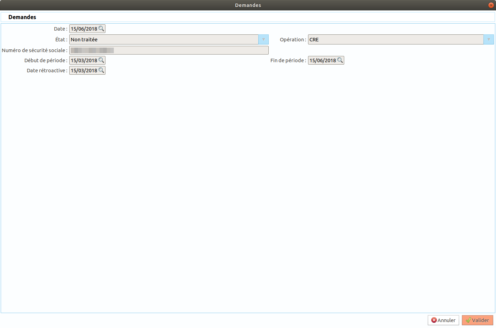

Le traitement des demandes assurés est similaire à celui des demandes 
d'inscription des sociétés. Plusieurs traitements batchs vont envoyer les 
fichiers d'inscriptions et réceptionner les ARL et CR produit par la CNAM. 

Les inscriptions en erreur sont affichées dans le point d'entrée 
"Prest'IJ/Demandes en erreur". Depuis cet écran, on visualise les inscriptions 
en erreur et leurs codes erreur. Lorsque l'erreur a été corrigée, un assistant 
permet de soumettre une nouvelle demande. Cet assistant est disponible via 
l'action "Lancer une action" puis "Relancer le processus d'inscription".

Inscription automatique
~~~~~~~~~~~~~~~~~~~~~~~

Selon certains événements Coog va générer automatiquement les inscriptions 
prest'IJ selon le schéma suivant:

- lorsqu'un sinistre de type incapacité de travail dépasse la franchise, Coog
  génère une demande d'inscription. Selon le type de franchise, la date de début 
  et de rétroactivité seront différentes. Si la franchise est continue, ces dates 
  seront positionnées à la date d'arrêt. Si il s'agit d'une franchise cumulée, 
  ces dates seront positionnées à la date de début de la période de cumul. Dans 
  les deux cas, la date de fin ne sera pas renseignée.

- la désinscription se fait 2 mois après la clôture de l'arrêt afin de
  permettre la réception de BPIJ pendant la période de rechute.

Depuis un sinistre, il est possible de visualiser la fiche d'inscription 
prest'Ij de l'assuré via l'action "Ouvrir les enregistrement liés" et "Consulter 
l'inscription Prest'IJ".

Traitement des BPIJ
-------------------

A partir de la chaine de batch bpij, Coog va lire les fichiers BPIJ et créer 
des BPIJ dans Coog.

Un BPIJ dans Coog est un regroupement de lignes de prestation. Les lignes sont 
regroupées en fonction de la balise 'Assurance', de la date comptable et du 
sens des montants.

Visualisation des BPIJ
~~~~~~~~~~~~~~~~~~~~~~

Depuis un assuré, l'action 'Ouvrir les enregistrements liés/BPIJs' affiche 
l'ensemble des BPIJ reçus pour cet assuré.

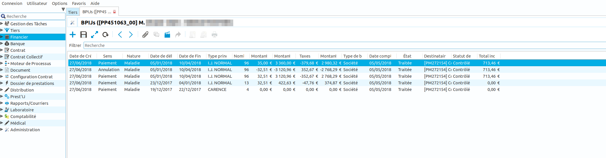

Les informations "Statut de l'indemnisation" et "Total de l'indemnisation" ne 
sont affichées que si la période à traiter a généré une période d'indemnisation.

En consultant une BPIJ, le détail des lignes est affiché. Chaque ligne 
correspond à une ligne de prestation reçu dans le fichier BPIJ.

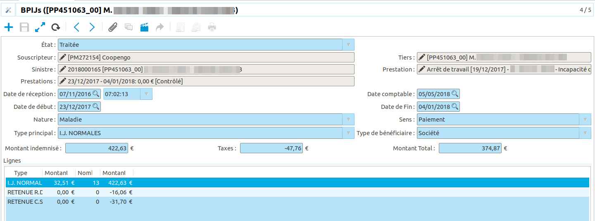

Un point d'entrée 'Prest'IJ/BPIJs' regroupe l'ensemble des BPIJs reçus.

Un BPIJ a un statut qui peut prendre les valeurs 'reçu' et 'traité'. Ce second 
statut est défini une fois le traitement expliqué dans le chapitre suivant fini.

Traitement des BPIJs
~~~~~~~~~~~~~~~~~~~~

A la réception d'une BPIJ Coog génère une tâche de traitement. Cette tâche est 
visible dans le point d'entrée 'Gestion des Tâches/Tâches en attente'.

Une tâche porte sur un assuré. Ainsi si plusieurs BPIJs sont à l'état 'reçu', 
en attente de traitement, une seule tâche sera présente.

Double cliquer sur la tâche pour lancer le processus de traitement.

Une fois lancé, le processus affiche la liste des BPIJs non traités et la 
liste des sinistres qui correspondent à ces BPIJs.

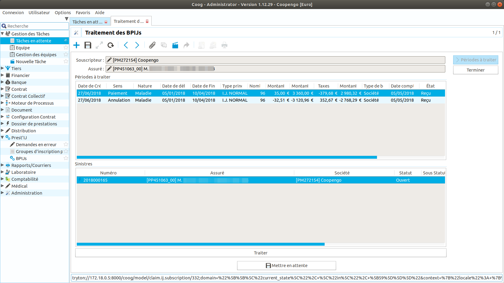

Le bouton en bas 'Traiter' permet de lancer le traitement d'un ou plusieurs 
BPIJs qui va conduire à la création d'une ou plusieurs périodes d'indemnisation.

La première étape est la sélection des BPIJ à traiter. 

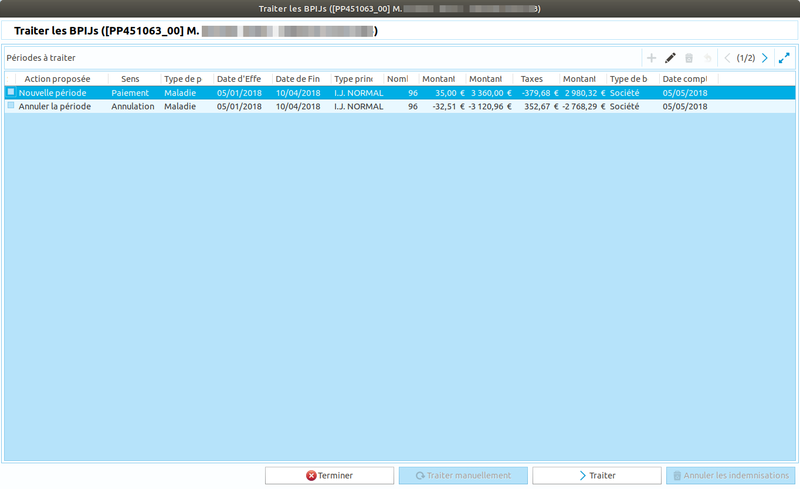

La colonne 'Action proposée' indique à partir des informations de la BPIJ et du 
dossier de prestations l'action que Coog vous propose d'effectuer. Les actions 
possibles sont les suivantes:
 
  - **Nouvelle période**: Création d'une nouvelle période d'indemnisation à 
    partir des informations du BPIJ
  - **Sinistre non trouvé** : Aucun arrêt de travail n'a été trouvé pour la 
    période du BPIJ
  - **Période non réglée à annuler**: Coog va supprimer une période qui n'a pas 
    encore été payée.
  - **Annuler la période**: Annule une période déjà réglées.
  - **Impossible de déterminer un comportement**: Pas d'action proposée. Dans 
    ce cas il faut passer par un traitement manuel.

Le bouton 'traiter' permet de lancer le traitement proposé par Coog. Il est 
toujours possible de marquer le BPIJ comme traité manuellement et de faire le 
traitement manuellement ensuite.

Le traitement consiste dans un premier temps à alerter l'utilisateur si un 
changement d'IJSS est intervenu ou si la nature de la prestation a changée.

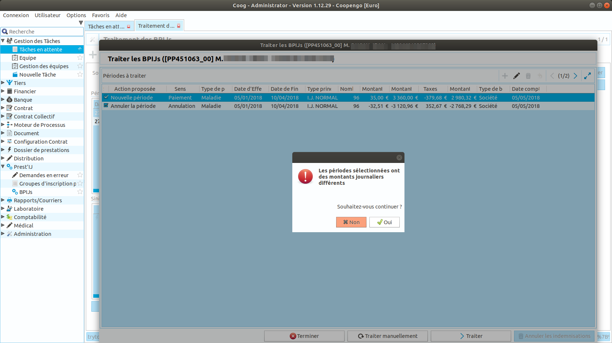

Ensuite Coog lance l'assistant de création d'une période en initiant l'IJSS.

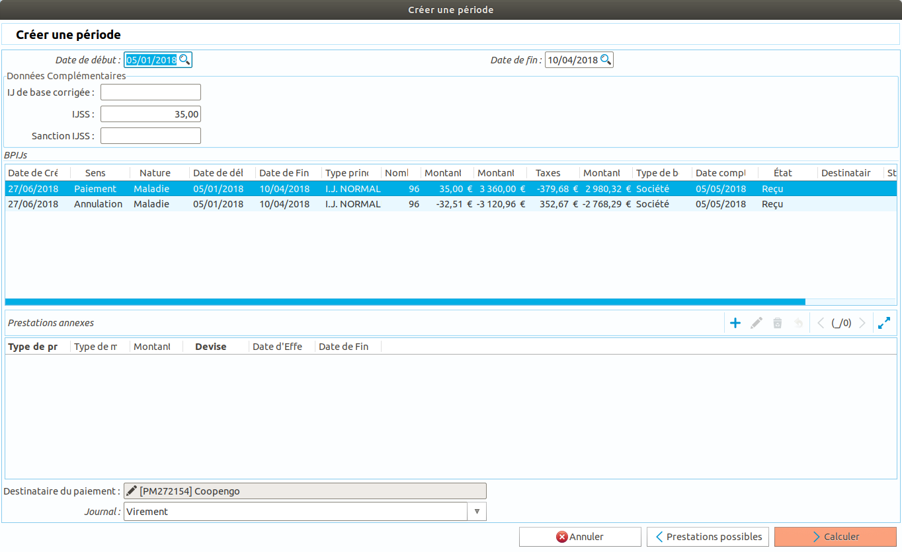

Une fois que le traitement des différents BPIJ est fini, clqiuer sur 
'Terminer' afin de marquer la tâche comme traitée.

Gestion des batchs
------------------

Plusieurs batchs automatisent la création, le traitement des demandes 
d'inscription et le traitement des fichiers retour. Ces batchs ont été 
regroupés en deux chaînes:

- la chaîne de génération des demandes d'inscription et de génération des 
  fichiers prest'IJ. La chaîne est dans le module claim_prest_ij_service et se 
  nomme submit.

- la chaîne de génération des demandes de désinscription et de génération des 
  fichiers prest'IJ. La chaîne est dans le module claim_prest_ij_service et se 
  nomme submit_sup.

- la chaîne de traitement des fichiers retours. La chaîne est dans le module 
  claim_prest_ij_service et se nomme gestip.

- la chaîne de traitement des fichiers BPIJ. La chaîne est dans le module 
  claim_prest_ij_service et se nomme bpij.