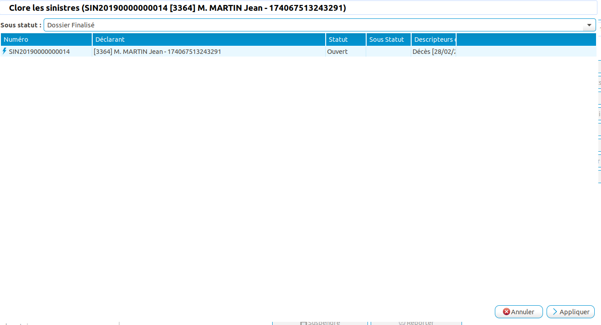

Processus de traitement d'un dossier décès
==========================================

Ce tutoriel a pour but de détailler la déclaration et l'instruction d'un 
décès dans Coog. Le processus présenté est un exemple et peut être adapté grâce 
au moteur de processus de Coog.

Déclaration d'un décès
----------------------

Depuis le point d'entrée "Déclaration/Instruction de sinistre", Coog offre un 
assistant de déclaration de sinistre. Depuis cet assistant, renseigner le tiers 
et sélectionner le processus "Déclaration de décès". En cliquant sur 
"Démarrer le processus", Coog va initialiser le sinistre décès et afficher le 
processus.

La première étape permet de saisir les informations du décès, la date de 
survenance, le fait générateur et la personne décédée.

La deuxième étape affiche les prestations de type décès pour lequel l'assuré 
est couvert. Dans notre exemple, nous avons une prestation "Capital Décès" 
qui a été exercée et acceptée automatiquement. Cette acceptation est régie par 
la règle d'éligibilité paramétrée sur la prestation.

L'écran de l'étape suivante "Bénéficiaires" est divisé en deux parties.

- sur la partie basse, une liste de notes typées "Loi Eckert" permet de 
  renseigner des informations liées à la recherche de bénéficiaires. Ces notes 
  ne sont visibles que selon les habilitations du gestionnaire.

- sur la partie haute, la liste des bénéficiaires est affichée. Pour ajouter 
  des bénéficiaires, vous devez renseigner les éléments suivants: le tiers 
  bénéficiaire, la part bénéficiaire, la date d'identification. 

  .. image:: images/eckert_saisie_beneficiaire.png

La date d'identification formelle du bénéficiaire est un des indicateurs 
défini par la loi Eckert. Une fois cette date renseignée, l'action 
"Valider l'identification" peut être lancée. Cette action appelle la règle 
des documents requis pour les bénéficiaires définis sur la prestation et 
initialise la liste des documents requis.

Depuis la liste des bénéficiaires, Coog permet de lancer une impression des 
pièces manquantes pour chaque bénéficiaire.

Dès que l'ensemble des documents sont reçus, la date de réception des 
documents est renseignée avec la date de réception de la dernière pièce. La loi 
Eckert impose un délai à partir de la date de réception de l'ensemble des 
documents. Si cette date est dépassée, alors des pénalités seront appliquées. 
Cette date limite est affichée dans Coog et correspond à la "date de règlement 
avant pénalités".

Le délai avant pénalités est paramétrable depuis le point d'entrée 
"Sinistres/Configuration/Configuration Sinistre".

Dès qu'un bénéficiaire est saisi et ces documents reçus, il est possible 
de procéder au paiement de la prestation. Pour cela, sur l'étape "Capitaux", 
lancer l'assistant de calcul du capital "Nouveau Capital".

Le premier écran de cet assistant reprend les informations du bénéficiaire, 
le mode de paiement, la date d'indemnisation qui permettra de calculer les 
intérêts et les éventuelles pénalités. La date limite de paiement correspond à 
la date après laquelle des pénalités s'appliquent.

La deuxième étape affiche le calcul du montant et le détail de ce calcul.

La troisième étape permet d'ordonnancer le capital pour contrôle et validation.

Une fois que les différents capitaux pour chaque bénéficiaire ont été 
ordonnancés, le dossier peut être clos.

