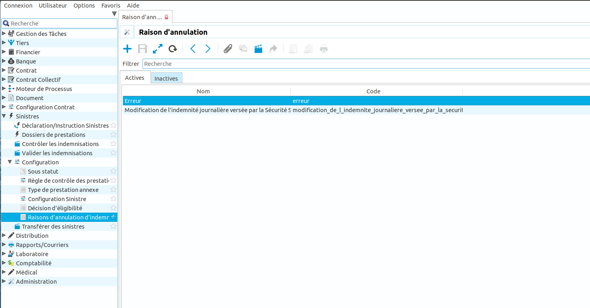
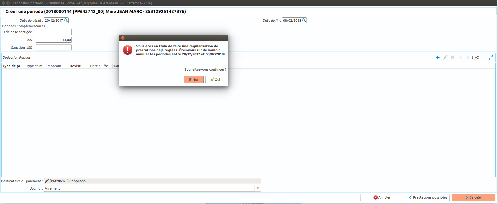
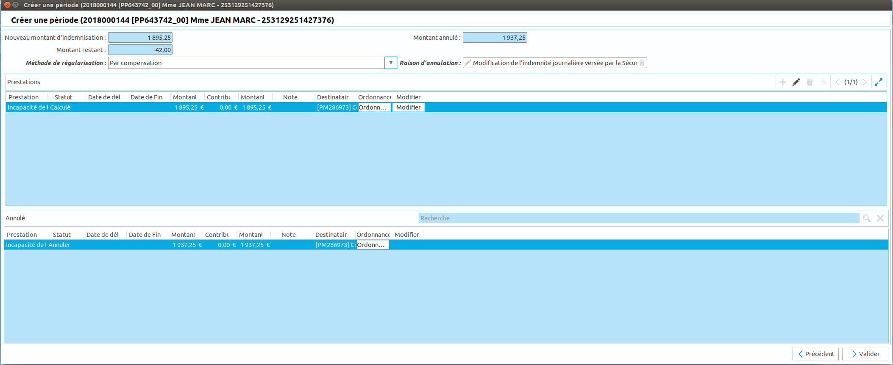
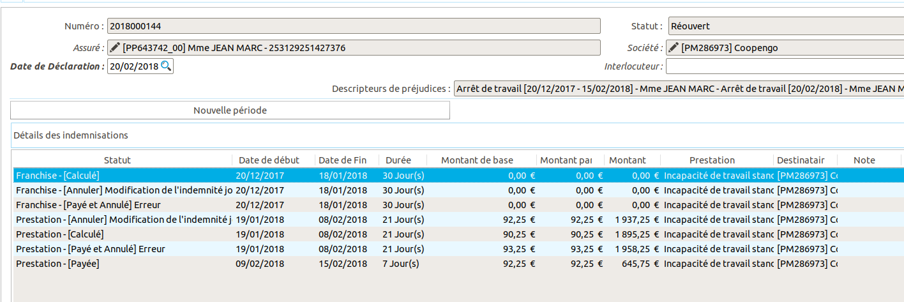

Comment procéder à une régularisation
=====================================

Ce tutoriel explique comment configurer et procéder à une régularisation sur 
un sinistre.

Configuration
-------------

Depuis le point d'entrée 
``Sinistres / Configuration / Raison d'annulation d'indemnisations``, Coog 
permet de saisir les raisons d'annulation. Coog inclus un paramétrage par 
défaut: "Erreur". celui ci peut être désactivé si besoin. La raison est 
demandée lors de la procédure de régularisation.

Régularisation sur un sinistre
------------------------------

Pour faire une régularisation sur une période déjà réglée, il faut lancer 
l'assistant de création d'une indemnisation en renseignant la période à 
régulariser. Coog va dans un premier temps annuler la période existante.

Une fois la nouvelle période recalculée à partir des nouvelles informations, 
Coog vous propose de procéder à la régularisation selon plusieurs méthodes dans 
le cas d'une régularisation négative:

- Par compensation: l'argent dû par le bénéficiaire sera déduit du prochain versement.
- Par planification: un échéancier peut être sélectionné afin de planifier le remboursement par le bénéficiaire.
- Par réclamation de l'indu à effet immédiat: le montant de la régularisation négative est demandé au bénéficaire.

Depuis le dossier, la raison de l'annulation est visible sur les périodes 
annulées.

