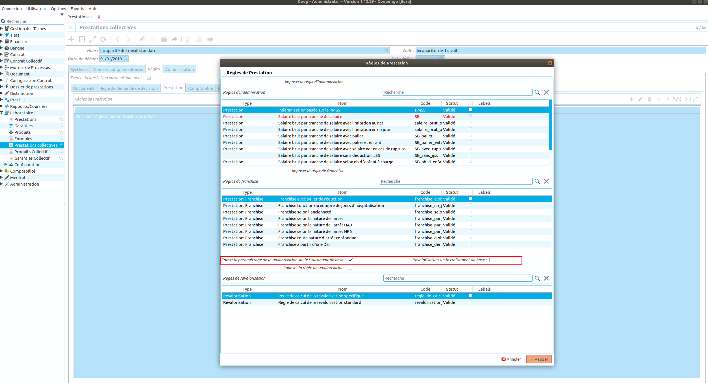
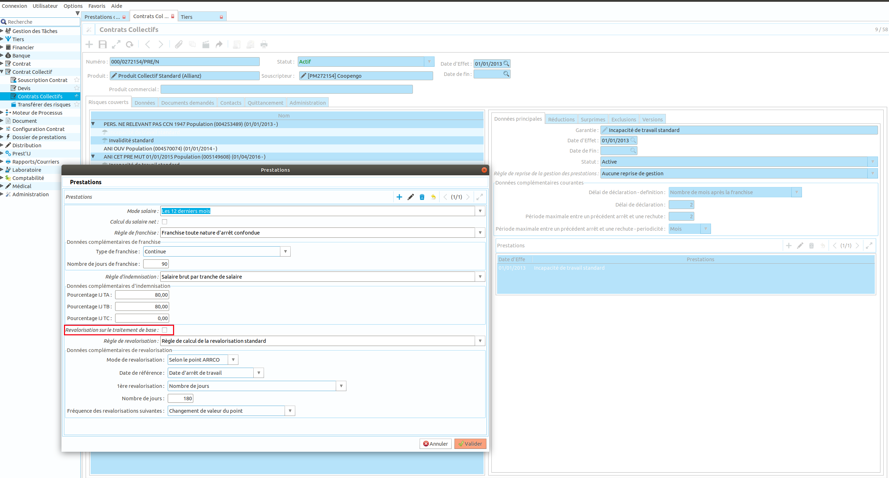

Comment configurer une revalorisation sur le traitement de base
===============================================================

Ce tutoriel explique comment configurer et calculer une revalorisation sur le 
traitement de base. Cette option n'est disponible que si le module 
claim_salary_fr est installé.

Dans le cas du paramétrage d'un produit collectif, le paramétrage de la 
revalorisation sur le traitement de base peut être défini au niveau de la 
garantie offerte dans le cas d'une offre packagée, ou au niveau de la 
garantie souscrite (sur le contrat) dans le cas d'offre sur-mesure.

Paramétrage au niveau de la prestation
--------------------------------------

Sur la prestation, le champs "Forcer le paramétrage de la 
revalorisation sur le traitement de base" permet de fixer le mode de 
revalorisation. Ainsi au niveau du contrat, il ne sera pas possible de modifier 
la valeur défini par le champ "Revalorisation sur le traitement de base"

A l'inverse si ce champ n'est pas saisi, le paramétrage se fera lors de la 
scoucription du contrat.

Paramétrage au niveau du contrat
--------------------------------

Sur une option souscrite d'un contrat, lors de la saisie des paramètres de la 
prestation, si la valeur n'est pas fixée au niveau de la prestation, le champs 
"Revalorisation sur le traitement de base" apparait. 

Paramétrage du moteur de règle
------------------------------

Si l'option "Revalorisation sur le traitement de base" est activée, Coog va 
appliquer la formule de revalorisation sur la donnée "tranche_salaire" du moteur 
de règles. Ainsi la valeur retournée par défaut par cette donnée sera les 
tranches de salaire sur le traitement de base revalorisé.

Il est possible cependant de récupérer le salaire non revalorisé en définissant 
le second paramètre à False (par défaut celui ci est à True)

.. code-block:: python

	tranches = tranche_salaire(['gross_salary',  'salary_bonus'], False)

Dans le règle de revalorisation, la donnée "salaire_journalier_de_base" est 
définie avec le traitement de base.

Une donnée est disponible dans le moteur de règle afin de savoir si la 
revalorisation est faite sur le traitement de base ou sur le montant de 
l'indemnite: "revalorisation_sur_traitement_de_base". Cette donnée est de type 
booléen. 

** Si la revalorisation est définie pour s'effectuer sur le traitement de base 
alors la règle de revalorisation ne sera pas appelée sur le montant de 
l'indemnisation.**