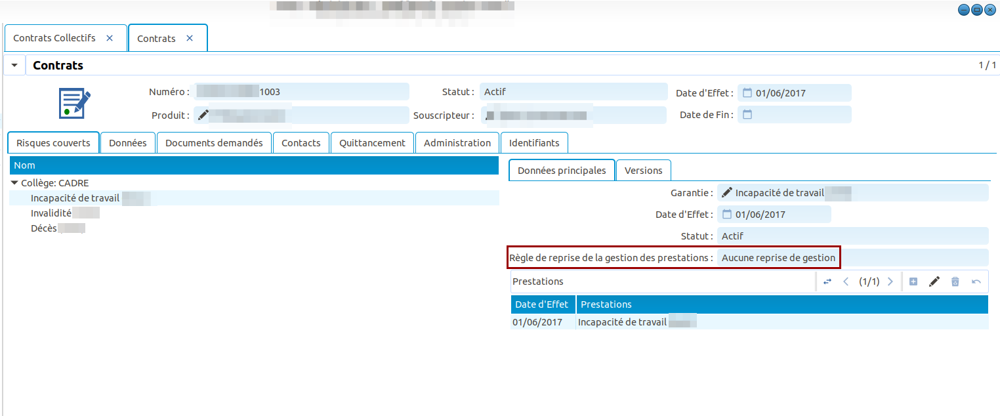
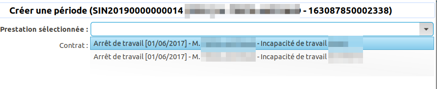

Comment transférer un contrat collectif d'un premier assureur vers un second
============================================================================

Ce tutoriel explique comment transférer un contrat collectif prévoyance d'un
premier assureur vers un second. Cela ne nécessite pas de paramétrage en
particulier, seulement des actes de gestion précis.
Il sera dès lors possible de transférer les risques du premier contrat 
vers le second, tout en continuant d'indemniser les différents dossiers
couverts par les contrats concernés, soit "en complément" (c'est à dire que 
le second assureur ne reversera que les revalorisations sur les périodes),
soit en "gestion complète".

Souscription du contrat (Assureur initial)
------------------------------------------

Pour cela il suffit de souscrire un contrat collectif classique avec
le premier assureur

Souscription du contrat de reprise "en complément"
--------------------------------------------------

Dans ce cas de figure, l'assureur va reprendre la gestion du contrat et des
sinistres en "complément". C'est à dire que les montants des indemnisations
calculées par le premier assureur seront "figés" à partir de la date de
fin du contrat, tandis que l'assureur reprenant le contrat versera
uniquement les revalorisations calculées.

Résiliation du premier contrat: "Changement d'assureur"
-------------------------------------------------------

Afin de transferer les risques automatiquement via l'assistant disponible,
il faut résilier le premier contrat comme suit:

Il existe trois choix possibles pour le champ "Comportement des sinistres 
suite à résiliation":

* Figer le montant des prestations au niveau atteint (Généralement utilisé
  lors d'un reprise "En complément")
* Arrêter les indemnisations (Généralement utilisé lors d'une reprise
  "Complète")
* Continuer les indemnisations

Dans cet exemple, nous ferons une reprise "En complément".

Transfert des risques vers le nouveau contrat
---------------------------------------------

Une fois le contrat initial résilié, il est possible d'effectuer un transfert
des risques automatiquement via l'assistant présenté ci-dessous:

Instruction d'un nouveau sinistre
---------------------------------

Les risques étant transférés vers le second contrat assureur, un nouveau 
sinistre peu être déclaré et comportera jusqu'à deux services délivrés
automatiquement: l'un pour la couverture du premier assureur et l'autre
pour celle du second assureur "En complément".

.. image:: images/declaration_sinistre _deux_services.png

Les périodes d'indemnisation peuvent être calculées sur chacun des services
indépendamment (sélection du service dans l'assistant de création de période
d'indemnisation).

Comme on peut le remarquer, le montant des périodes calculées est figé à partir
de la date de fin du contrat assureur principal (31/12/2017). Le montant des
IJs ne pourra dépasser 68,90 euros + 4,75 euros de revalorisation 
(revalorisation sur l'année 2017).

Si nous calculons les périodes sur le deuxième service délivré (qui correspond
au contrat de reprise), il n'y aura dans le montant des IJs, que les 
nouvelles revalorisations (moins les 4,75 euros de revalorisation payées par
l'assureur du premier contrat).

.. image:: images/nouvelle_periode_indemnisation-assureur_2.png

.. image:: images/periode_indemnisation-assureur_2.png

Toutes les périodes ont été générées, et sont susceptibles d'êtres validées puis
payées au bénéficiaire.

