Créer/Importer une nouvelle table
=================================

Le but de ce tutoriel est d'expliquer la création d'une table de paramétrage en vue de l'utiliser dans une règle métier d'un produit. Ce tutoriel permettra de voir les outils d'import depuis un tableur qu'intègre Coog pour accélèrer la configuration.

Description du besoin
.....................

Dans le cadre d'un nouveau produit à mettre en production, le tarif de la garantie G1 se présente sous la forme suivante.

+------------------------+------------------+-------------------------+-------+
| Age                    | Fumeur/NonFumeur | Option de tarification  | Tarif |
+========================+==================+=========================+=======+
| moins de 30 ans exclus | Non Fumeur       | Option 1                | 12.03 |
+------------------------+------------------+-------------------------+-------+
| 30 ans à 40 ans exclus | Non Fumeur       | Option 1                | 12.04 |
+------------------------+------------------+-------------------------+-------+
| 40 ans à 50 ans exclus | Non Fumeur       | Option 1                | 12.05 |
+------------------------+------------------+-------------------------+-------+
| 50 ans à 60 ans exclus | Non Fumeur       | Option 1                | 12.06 |
+------------------------+------------------+-------------------------+-------+
|Plus de 60 ans          | Non Fumeur       | Option 1                | 12.07 |
+------------------------+------------------+-------------------------+-------+
|...                     |...               | ...                     | ...   |
+------------------------+------------------+-------------------------+-------+

Le fichier est disponible en suivant ce :download:`lien <ressources/table_exemple.xlsx>`.

Pour paramétrer cette règle dans Coog, la première étape est de créer la table qui correspond à ce fichier. Ensuite il faudra l'utiliser depuis la règle de tarification de la garantie G1.

Création de la table et de ses paramètres d'entrée
..................................................

La première étape lors de la création d'une table est l'identification des critères d'entrée ainsi que le résultat attendu. Dans le cas de l'exemple, la table va nous retourner un tarif et ce tarif dépend de 3 critères:

- l'âge du souscripteur
- le statut Fumeur/Non Fumeur
- une option de tarification sélectionnée à la souscription.

La création d'une table se fait via le menu table puis l'action Nouveau.

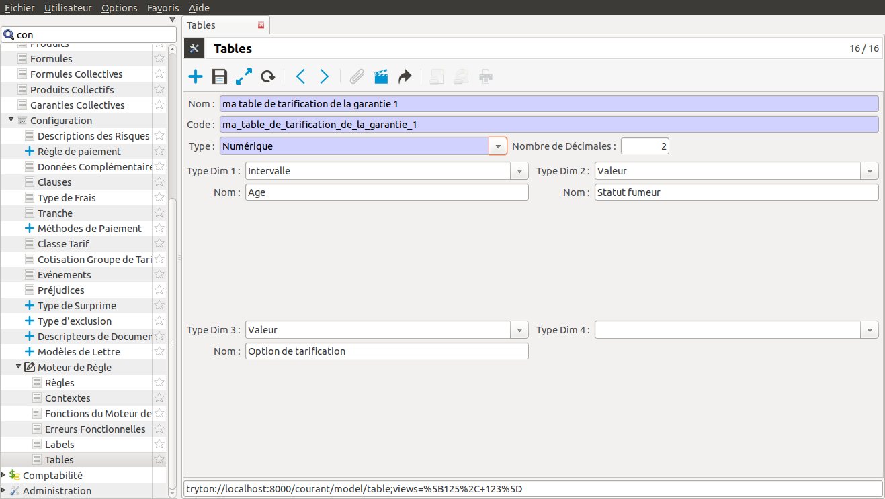

Lorsque l'on définit une table il faut saisir les informations suivantes:
- *le nom*: le nom de la table
- *le code*: identifiant technique qui doit être unique (initialisé automatiquement à partir du nom)
- *le type*: le type de retour de la table. Il peut être de type numérique, alphanumérique, booléen, date, entier. Dans l'exemple, le tarif est de type numérique. Dans le cas du type numérique, il faut définir le nombre de décimales. Les tarifs de la table sont arrondis à deux chiffres après la virgule donc le nombre de décimales sera 2.
- *les dimensions*: pour chaque dimension d'entrée de la table on définit :

    - *le type*: le type peut être Intervalle, Date, Intervalle de date,  Valeur
    - *le nom*: le nom de la dimension

    .. note:: Le nombre de dimensions possibles est fixé dans l'application pour toutes les tables. Il est cependant possible de l'accroître, si besoin, en modifiant les fichiers de configuration de l'application. Dans l'exemple il est configuré à 4.

    Dans notre exemple, trois dimensions doivent être paramétrées:
        - l'âge: il s'agit d'un intervalle (ex: de 0 ans à 30 ans, de 30 ans à 40 ans)
        - le statut fumeur: il s'agit d'un choix entre des valeurs prédéfinies: Fumeur et Non Fumeur
        - l'option de tarification: il s'agit d'un choix entre des valeurs prédéfinies: Option 1, Option 2, Option 3

A cette étape la table peut être sauvegardée.

Définition des dimensions
.........................

Les dimensions d'entrée de la table ont été définies dans l'étape précédente mais les valeurs des dimensions, les intervalles, n'ont pas encore été paramétrés.

Pour cela, depuis la table, il est possible d'accéder à la définition des dimensions via le bouton 'Ouvrir les enregistrements liés' puis 'Definition Dimensions'. Sélectionner la dimension et créer les différentes valeurs ou intervalles.

Voici la configuration pour l'exemple:

- sélection du critère

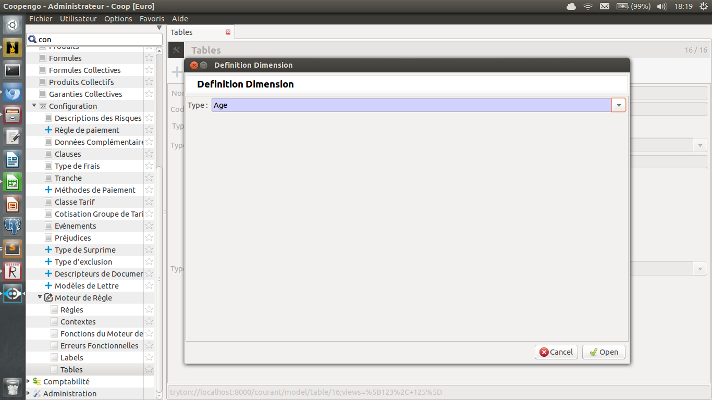

- définition des intervalles pour l'âge

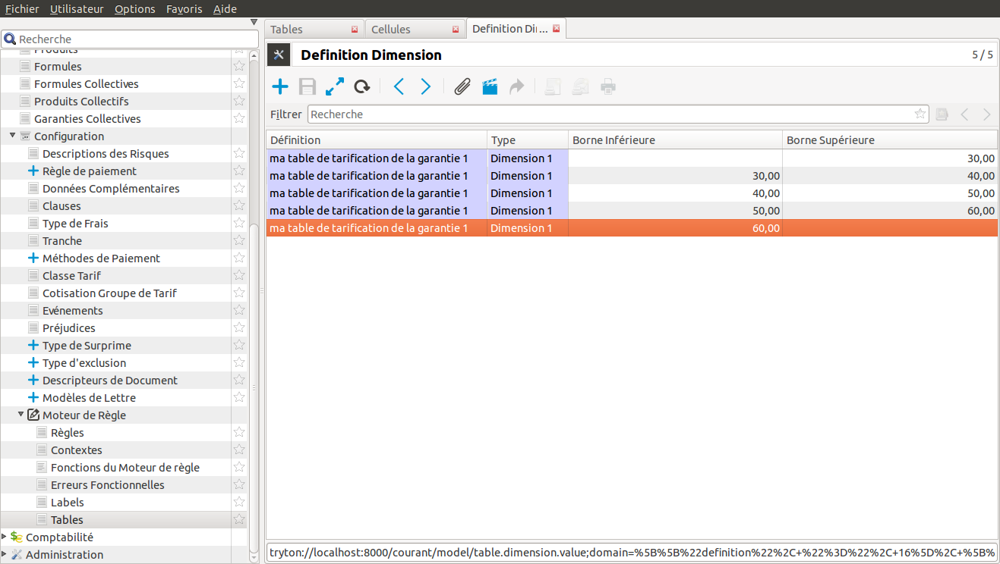

Dans le cas de la définition d'un intervalle, la borne supérieure est toujours exclue. Pour gérer le 'Moins que' ou 'Plus que', il suffit de ne pas définir la borne.

.. note:: Il est possible de copier/coller les valeurs des dimensions depuis un tableur. Pour cela, aller dans la définition d'une dimension. Créer une première valeur. Copier vos données depuis un tableur. Faites un coller (Ctrl-V ou clic droit => Coller) sur la cellule correspondant à la colonne à remplir et sur la première ligne après avoir vérifié que cette cellule n'est pas en édition.

- définition des valeurs pour fumeur

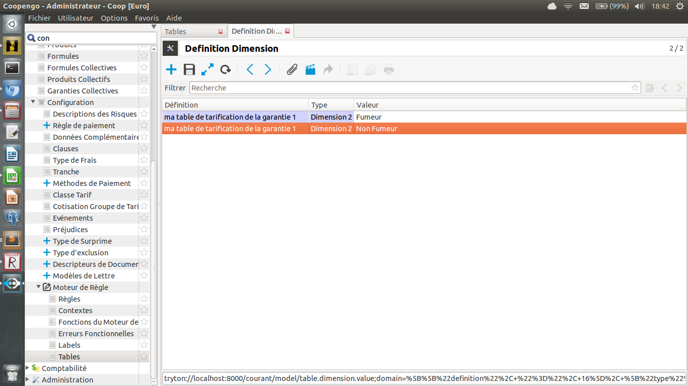

- définition des valeurs pour option

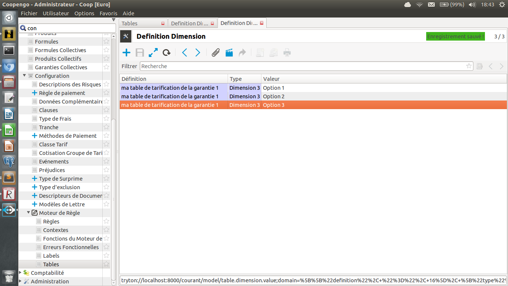

Définition des valeurs de la table
..................................

L'étape suivante est de définir les valeurs de la table. Dans notre exemple il s'agit du tarif. Pour cela il faut dans un premier temps formater la table selon ce qui est attendu par Coog, puis ensuite la copier/coller ou l'importer dans Coog.

Formatage de la table dans un tableur
;;;;;;;;;;;;;;;;;;;;;;;;;;;;;;;;;;;;;

Les intervalles de la dimension Age sont formatés sous la forme [borne_inferieure - borne_superieure[. Les dimensions de type valeur n'ont pas de formatage spécifique et correspondent aux valeurs définies. Dans l'exemple, il faut retravailler la colonne Age de cette façon :

+------------------------+------------------+-------------------------+-------+
| Age                    | Statut fumeur    | Option de tarification  |Valeur |
+========================+==================+=========================+=======+
| [none - 30.0[          | Non Fumeur       | Option 1                | 12.03 |
+------------------------+------------------+-------------------------+-------+
| [30.0 - 40.0[          | Non Fumeur       | Option 1                | 12.04 |
+------------------------+------------------+-------------------------+-------+
| [40.0 - 50.0[          | Non Fumeur       | Option 1                | 12.05 |
+------------------------+------------------+-------------------------+-------+
| [50.0 - 60.0[          | Non Fumeur       | Option 1                | 12.06 |
+------------------------+------------------+-------------------------+-------+
| [60.0 - none[          | Non Fumeur       | Option 1                | 12.07 |
+------------------------+------------------+-------------------------+-------+
|...                     |...               | ...                     | ...   |
+------------------------+------------------+-------------------------+-------+

Le fichier formaté est disponible en suivant ce :download:`lien <ressources/table_exemple_formate.csv>`.

.. note:: Si la méthode *import par copier coller* est utilisée, l'ordre des colonnes a une importance. Par contre le titre de la colonne n'est pas nécessaire. Dans le cas d'un *import par fichier*, l'ordre des colonnes n'a pas d'importance mais par contre le titre des colonnes doit correspondre au nom de la dimension.

Import par copier coller
;;;;;;;;;;;;;;;;;;;;;;;;

Cette méthode peut être utilisée lorsque le nombre de cellule de la table n'est pas trop important (<1000). Dans le cas contraire, le temps de chargement va être long.

Depuis la définition de la table, sélectionner le menu 'Ouvrir les enregistrements liés' puis 'Cellules'. Créer une première cellule. Depuis le fichier formaté, copier les valeurs (sans le titre) puis coller les au niveau de la cellule Age de la première ligne (attention à ce que la cellule ne soit pas en édition).

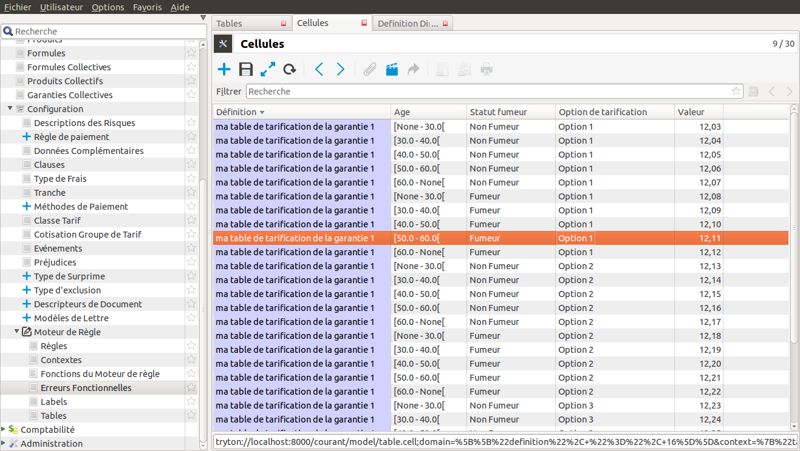

Import par fichier
;;;;;;;;;;;;;;;;;;

Cette méthode peut être utilisée dans tous les cas.

Depuis la définition de la table, sélectionner le menu 'Ouvrir les enregistrements liés' puis 'Cellules'. Aller dans le menu 'Formulaire' puis 'Import de données'. L'écran permet de définir comment sera importé le fichier.

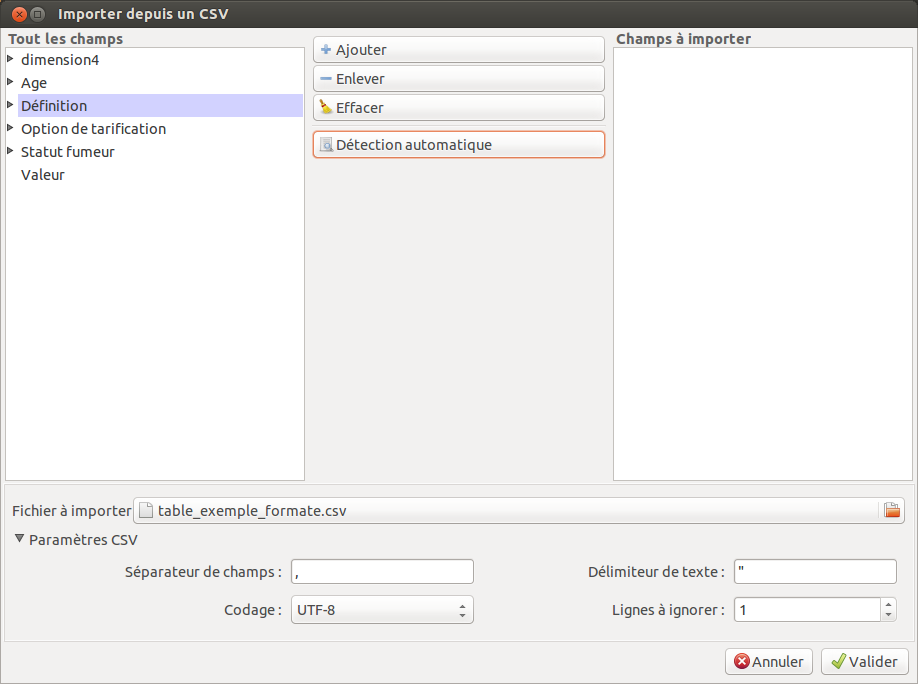

Depuis cet écran il faut:
    - renseigner le fichier à importer (de type CSV)
    - définir les paramètres CSV (séparateur, codage...)
    - appuyer sur 'Selection automatique': si le nom des colonnes du fichier CSV correspond aux dimensions de la table, alors les champs à importer vont être automatiquement initialisés.
    - si la sélection automatique échoue, il faut définir manuellement les colonnes.

.. note:: le fichier à utiliser doit être de type CSV. De plus, le séparateur des décimales doit être une point et non une virgule.

Dans le cas de notre exemple, l'import donne le résultat suivant. On voit que l'ordre d'import est différent du fichier d'entrée.

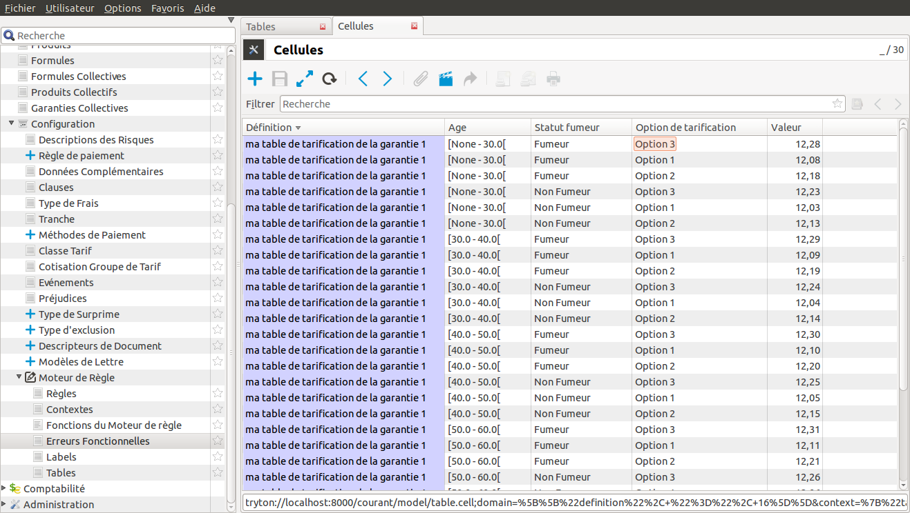

Visualisation de la table
.........................

La table créée peut être visualisée depuis le menu 'Ouvrir les enregistrements liés' puis 'Cellules'.

Une visualisation en 2d est aussi disponible depuis le menu 'Ouvrir les enregistrements liés' puis 'Table 2d'. Dans ce cas, les deux premières dimensions de la table sont fixées et on sélectionne les valeurs des n dimensions suivantes. Dans notre exemple les dimensions 'Age' et 'Statut fumeur' sont fixées. On choisit donc l'option de tarification et on obtient le détail suivant.

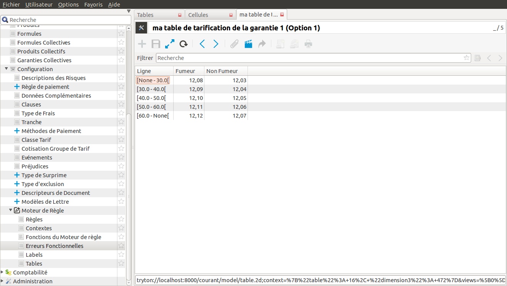

Utilisation de la table depuis le moteur de règle
.................................................

Une fois la table définie, on peut l'utiliser dans une règle métier. Pour cela aller dans le menu règles. Depuis ce menu créer un nouvelle règle.

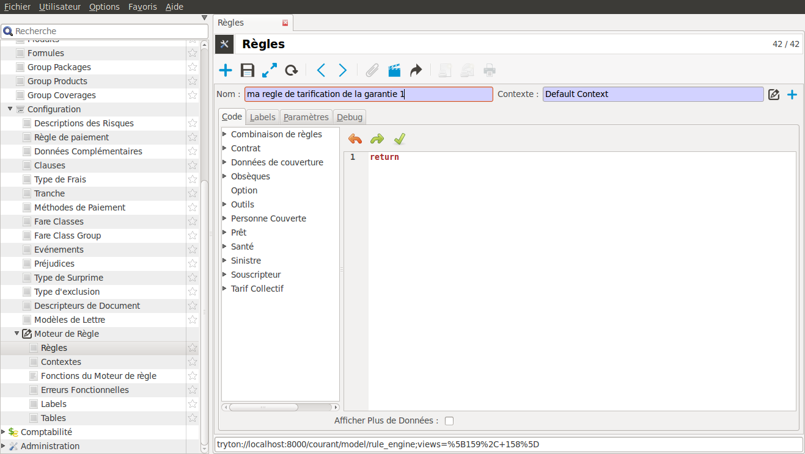

Les informations à saisir sont:
    - *le nom*: nom de la règle
    - *le contexte*: contexte d'éxecution de la règle. Par défaut utiliser 'Default context'.

La saisie du contexte fait apparaître un arbre sur la gauche de la fenêtre. Cet arbre contient la liste des données métiers disponible pour paramétrer la règle.

Dans notre premier exemple, la règle va retourner le montant défini dans la table précédente. On a trois paramètres dans notre règle.
    - *l'âge*: on suppose qu'il s'agit de l'âge du souscripteur à la date du calcul de la règle. La date de naissance existe comme donnée dans Coog et elle est disponible dans 'Souscripteur/Date de naissance'. On peut donc écrire le code suivant dans le texte de la règle. Les fonctions 'annees_entre' et 'date_de_calcul' sont disponibles dans le menu de gauche sous le noeud 'Outils'

        .. code:: py

            age = annees_entre(date_de_naissance(), date_de_calcul())

    - *le statut fumeur*: le statut fumeur est une donnée complémentaire qui n'existe pas dans Coog et qui doit être ajoutée par configuration en enrichissant manuellement l'arbre de gauche. Pour cela, cocher la case 'Afficher plus de données' et sélectionner le type 'Données Complémentaires'. Ajouter une donnée complémentaire. Pour cela, dans la colonne 'Données Complémentaires Externe' entrer fumeur. Coog vous propose les données complémentaires déjà créées. Si le statut fumeur n'existe pas vous pouvez le créer en renseignant les champs de la façon suivante

        .. image:: images/donnee_complementaire_creation.png

    - *l'option de tarification*: l'option de tarification est aussi une donnée complémentaire ajoutée par configuration. De la même façon que pour le statut 'Fumeur', ajouter la donnée complémentaire 'Option de tarification'.

        .. image:: images/donnee_complementaire_option_de_tarification.png

Le code final de la règle est :

    .. code:: py

        age = annees_entre(date_de_naissance(), date_de_calcul())
        return table_ma_table_de_tarification_de_la_garantie_1(age, compl_statut_fumeur(), compl_option_de_tarification())

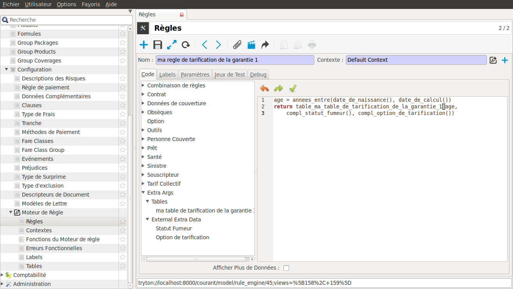
