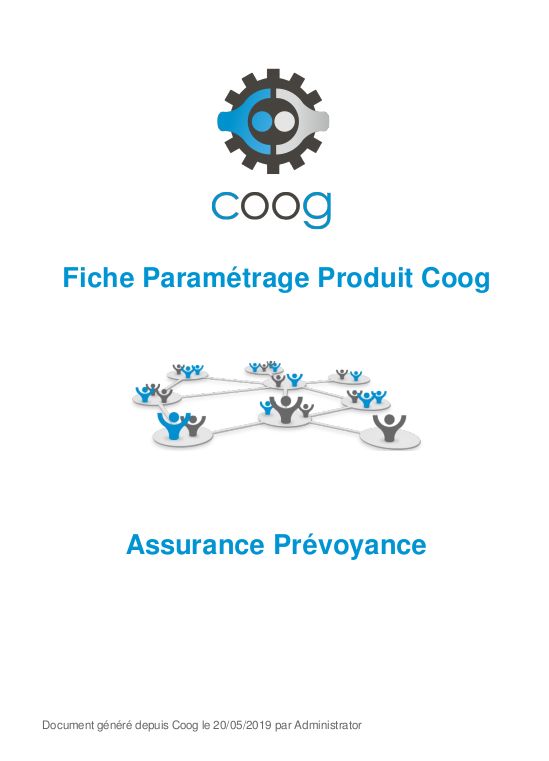

Editer la documentation fonctionnelle d'un produit
==================================================

Coog permet, suite au paramétrage d'un produit dans le laboratoire produit, 
d'éditer une documentation résumant l'ensemble des règles et paramètres 
configurés sur le produit.

Structure de la documentation
-----------------------------

La documentation par défaut est structurée de la façon suivante:

* Architecture du produit: Résume la liste des garanties et prestations du 
  produit et affiche leurs descriptions textuelles.

* Règles de gestion paramétrées au niveau produit

* Règles de gestion paramétrées au niveau de la garantie

Edition de la documentation
---------------------------

Depuis le produit, lancer l'assistant d'impression et choisissez le modèle d'
impression 'Documentation fonctionnelle du produit'.

Un document pdf est alors généré.

