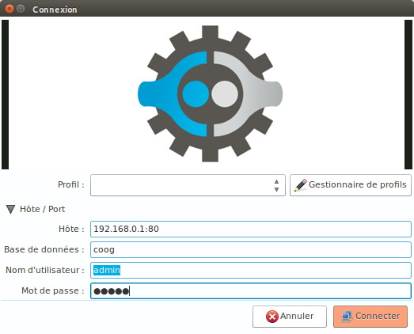
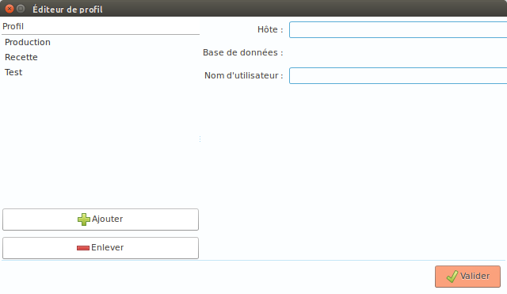
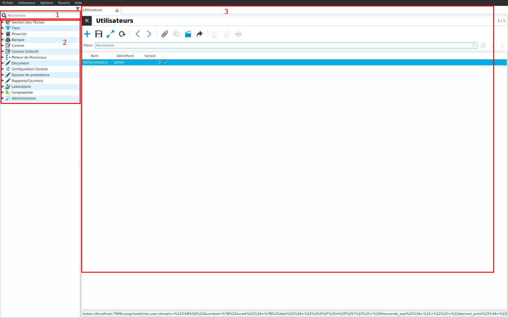
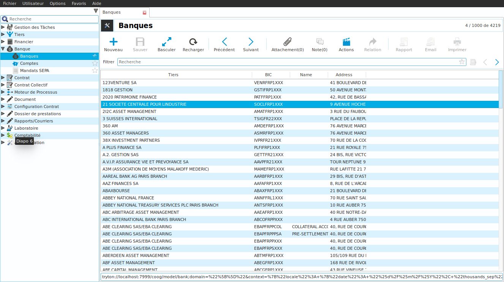
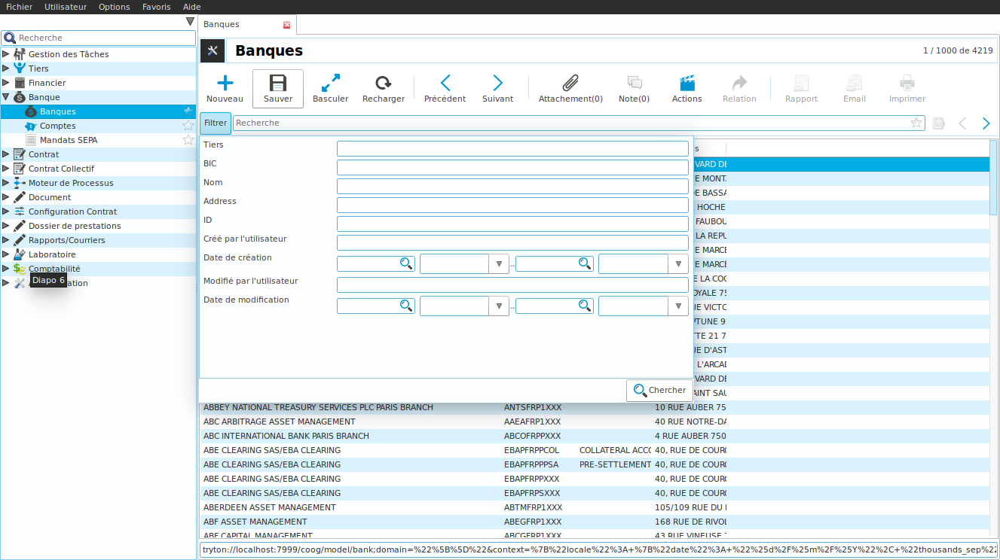
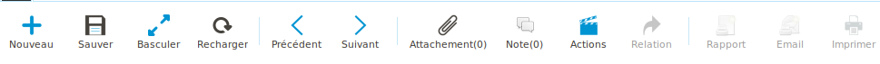
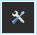
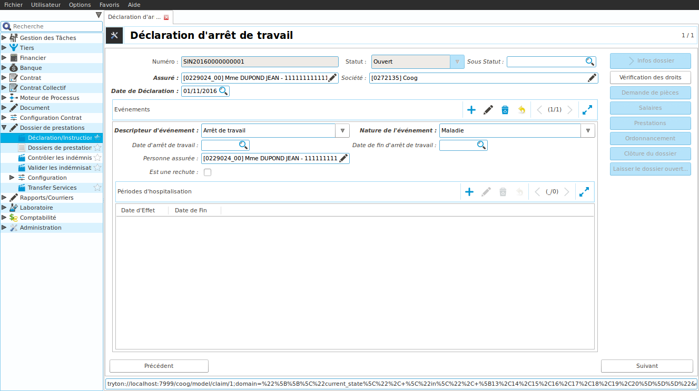
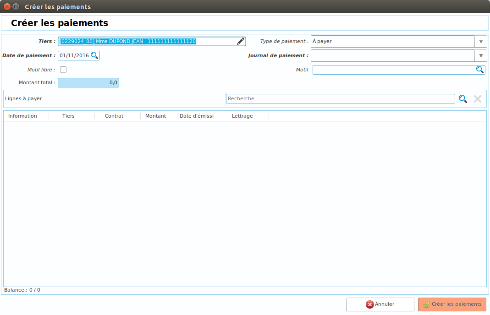

Présentation de l'environnement Coog
====================================

Le but de ce tutoriel est de présenter l'environnement de travail Coog.

1. L'écran d'authentification
-----------------------------

Lorsque vous lancez Coog, l'application vous demande de vous identifier. Voici le détail des informations à saisir:

* Hôte: Adresse du serveur Coog et port. Par défaut le port est 8000
* Base de données: Base de données sur laquelle se connecter
* Nom d'utilisateur: Nom de l'utilisateur
* Mot de passe: Mot de passe de l'utilisateur

Afin de ne pas devoir ressaisir les informations à chaque connexion, Coog permet de définir des profils. Pour cela, il suffit d'ouvrir le *Gestionnaire de Profils*, d'ajouter un nouveau profil, de renseigner le nom du profil et ses informations (Hôte, Base de données et Nom d'utilisateur).

A partir de la fenêtre d'authentification, il est alors possible de sélectionner le profil et les informations vont automatiquement s'initialiser.

2. L'écran principal Coog
-------------------------

Une fois connecté à Coog, l'écran principal s'affiche. Cet écran est divisé en trois partie:

* La barre de recherche globale (zone 1): cette barre permet de rechercher dans Coog parmi les menus, les tiers, les contrats
* Le menu (zone 2): les menus affichés permettent de naviguer dans l'application. Selon les habilitations de l'utilisateur, certains menus peuvent être cachés.
* La zone de travail: cette partie affiche les fenêtres lancées à partir de la zone de navigation. Cette zone est multi onglet ce qui permet d'ouvrir plusieurs fenêtres à la fois.

La barre de menu en haut contient plusieurs actions.

* *Fichier*: Permet de se déconnecter, de se reconnecter ou de quitter l'application
* *Utilisateur/Préférences*: vous pouvez accéder à la description de votre utilisateur (email, langue, mot de passe...)
* *Utilisateur/Recharger le menu*: permet de rafraîchir le menu
* *Utilisateur/Montrer Cacher le menu*: permet de cacher le menu (Ctrl-t) afin d'avoir une zone de travail plus grande.
* *Options*: Liste d'options afin de configurer l'affichage de Coog (affichage de la barre d'outils, limite du nombre d'enregistrement pour une recherche, sauvegarde de la taille des colonnes ...). N'oublier pas de *Sauver les options* dans le menu si vous les modifiez.
* *Favoris*: Ce menu affiche les favoris enregistrés. Pour ajouter un menu en favoris, il suffit de cliquer sur l'étoile en face du menu. En utilisant le raccourci Alt-v, vous accédez rapidement à la liste des favoris.

  .. image:: images/favoris.png

* *Aide*: Ce menu permet de consulter la liste des raccourcis.

3. Les différentes fenêtre de Coog
----------------------------------

Il existe plusieurs types de fenêtre dans Coog.

3.1. Les fenêtres de consultation/modification des enregistrements
++++++++++++++++++++++++++++++++++++++++++++++++++++++++++++++++++
Ces fenêtres permettent de lister un type d'enregistrements (Tiers, Contrats, Sinistres...).

A partir de cette fenêtre, vous pouvez consulter la liste des enregistrements (ex: la liste des banques). En haut à droite, le nombre d'enregistrements est affiché. Une barre de recherche vous permet de rechercher parmi les enregistrements affichés. En cliquant sur le bouton *Filtrer*, vous accédez à la liste des filtres disponibles.

La barre d'outil affiche une liste d'outil pour travailler sur un ou plusieurs enregistrements.

* Nouveau: Créer un nouvel enregistrement (Ctrl-n)
* Sauver: Enregistrer les modifications (Ctrl-s)
* Basculer: Passer de la vue liste à la vue formulaire (Ctrl-l)
* Recharger: Rafraîchir la liste ou la vue formulaire (Ctrl-r)
* Précédent/Suivant: Passer d'un enregistrement à un autre (intéressant depuis la vue formulaire) (Page Haut - Page Bas)
* Pièces jointes: Affiche la liste des pièces jointes d'un enregistrement. L'icône est différente s'il existe ou non une pièce jointe.
* Note: Afficher la liste des notes. Si une note au moins est non lue, l'icône Note change.
* Actions: Lancer des actions sur l'enregistrement.
* Relation: Afficher des enregistrements liés à celui sélectionné (ex: depuis un contrat, la liste des quittances est accessible)
* Impressions: Rapport/Email/Imprimer permettent de lancer une impression, de l'envoyer par email ou de l'imprimer selon le bouton choisi

Dans la barre de titre de l'onglet, un bouton représenté avec l'icône |tool-icone| liste les actions de la barre d'outil. D'autres actions y sont disponibles: export/import de données, Dupliquer/Supprimer un enregistrement, Voir les logs/Afficher les révisions (historique de l'enregistrement).

3.2. Les processus
++++++++++++++++++

Les processus, paramétrés dans l'application, permettent de suivre des étapes afin de modifier un enregistrement. Selon le paramétrage du processus, les étapes sont affichées à droite, ou en bas. Un processus se déroule dans un onglet. Il est possible de fermer la fenêtre à tout moment: le processus restera dans l'état dans lequel on l'a quitté.

3.3. Les assistants
+++++++++++++++++++

Certaines actions requièrent plusieurs étapes et doivent être réalisées en une seule fois. Pour cela, Coog utilise des assistants. Un assistant s'ouvre dans une fenêtre modale, une fenêtre qui s'ouvre par dessus l'onglet courant (ex: Assistant 'Créer les paiements' depuis un tiers).

4. Exercices
------------

* Enregistrer un profil utilisateur
* Ajouter un menu en favoris. Accéder à ce menu via le raccourci Alt-v.
* Faites une recherche globale en accédant à la barre de recherche via le raccourci Ctrl-k
