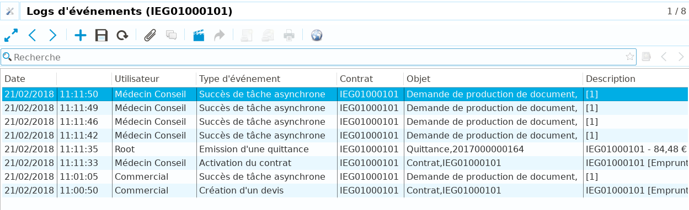
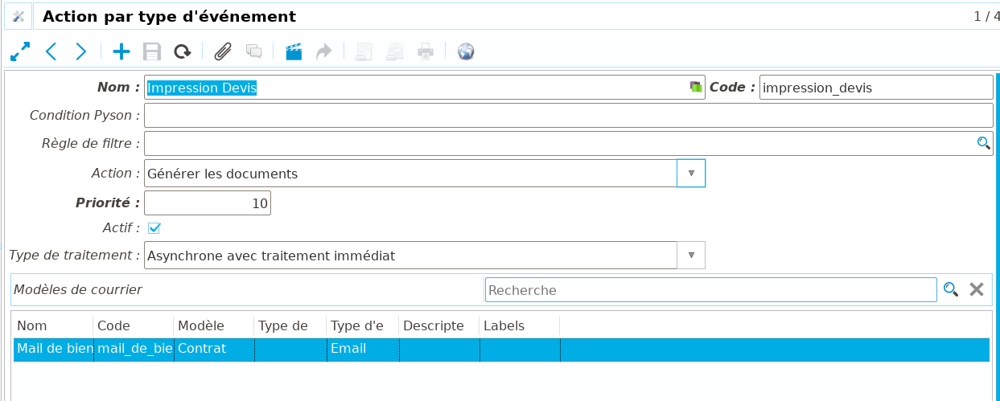
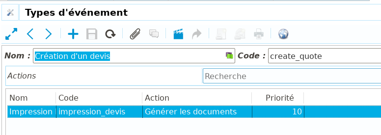

Actions automatisées
====================

**Coog** inclut un moteur d'événements. Lors de l'utilisation de l'application,
que l'on parle d'actions utilisateurs, de traitements batch ou de web-services,
certaines opérations déclenchent des *Événements*. Ces événements sont par
exemple, l'*Activation d'un contrat*, l'*Émission d'une quittance*,
l'*Application d'un avenant*, etc.

Il est possible via paramétrage de déclencher des actions lorsque certaine
événements ont lieu. L'idée générale est de pouvoir contrôler / adapter la
gestion en fonction de ces événements.

Événement
---------

Logs d'événement
~~~~~~~~~~~~~~~~

Un *Événement* est une action notable de l'application. Les événements
permettent de comprendre l'état d'un contrat via une trace des opérations le
concernant, typiquement via l'onglet *« Relations / Logs d'événements »*.

Lors de leur déclenchement, si le module « Logs d'événement » est installé,
chaque événement donne lieu à une trace qui se retrouve dans cet onglet. On
peut y voir notamment la date / heure de l'événement, l'utilisateur à l'origine
de l'événement, Le type d'événément, et l'entité à l'origine de l'événement.

Type d'événement
~~~~~~~~~~~~~~~~

Les *Types d'événements* sont accessibles dans **Coog** via le point d'entrée
*« Administration / Événénement / Type d'événement »*. Ces types sont
uniquement composés d'un *Nom* et d'un *Code*.

La majorité des types sont livrés automatiquement lors de l'installation de
**Coog**. En effet, la majorité des événements sont déclenchés par **Coog** si
nécessaire (autrement dit, depuis l'intérieur de l'application).

Toutefois, il est toujours possible de créer manuellement des types
supplémentaires pour une installation donnée. Ils pourront ensuite être
déclenchés par exemple :

- Via un appel à un *Web-service*
- Depuis un processus avec la configuration appropriée

Actions par type d'événement
----------------------------

Au-delà des traces laissés par les *Logs d'événements*, il est possible de
configurer les événements pour exécuter des *Actions* lorsqu'ils sont
déclenchés.

Création d'une action
~~~~~~~~~~~~~~~~~~~~~

Les *Actions par type d'événement* sont accessibles depuis le point d'entrée
*« Administration / Événement / Action par type d'événement »*. Ces actions
correspondent à une opération qui sera déclenchée lorsqu'un événement donné a
lieu.

Une *Action* est composée, en plus du *Nom* et du *Code*, des donnée
suivantes :

- *Condition Pyson* : Permet de filtrer de façon simplifiée les cas où l'action
  doit être exécutée. Le *Pyson* est un mini-language utilisée par **Coog**
  pour ce genre de choses, et est documenté dans une autre section.
  Concrètement, il est possible par exemple de limiter l'action au cas où le
  souscripteur n'est pas renseigné :

  .. code-block:: python

      Not(Bool(Eval('subsriber', False)))

- *Règle de filtre* : Similaire à la *Condition Pyson*, mais permet d'utiliser
  le *Moteur de règles* pour déterminer plus finement les cas à filtrer
- *Priorité* : Les actions exécutées lors d'un événement le seront dans leur
  ordre de priorité (du plus bas au plus élevé)
- *Actif* : Si cette case est décochée, l'action ne sera plus déclenchée. Cela
  permet de conserver son paramétrage, même si l'on ne souhaite plus l'utiliser

Comportement de l'action
~~~~~~~~~~~~~~~~~~~~~~~~

Le champ *Action* détermine quel sera le comportement de **Coog** lorsque
l'action sera déclenchée. Les valeurs disponibles dépendent des modules
installés.

- *Annuler ou supprimer les quittances non-périodiques* : Sur les contrats
  concernés par l'événement, l'action supprimera les quittances non périodiques
  au statut *Brouillon* ou *Validé*, et annulera les autres
- *Supprimer le processus courant* : Si l'objet de l'action a un processus en
  cours, l'action l'arrêtera
- *Initier un processus* : Commencera un nouveau processus sur l'objet de
  l'action. Le processus en question est à configurer dans le champ *Processus
  à initier*, et il est possible de choisir l'étape de départ parmi celles
  disponibles
- *Créer une notification* : Créera une notification sur le contrat lié à
  l'objet de l'action. Il est possible de sélectionner le processus de la
  notification, ainsi que le délai avant l'apparition de la tâche associée
- *Générer les documents* : Déclenchera une impression. Il s'agit de l'action
  la plus fréquemment utilisée, et offre plusieurs possibilités de
  configuration. Dans tous les cas, il faut alimenter la liste des *Modèles de
  courrier* à imprimer (il peut y en avoir plusieurs dans une seule action). Il
  faut ensuite sélectionner le *Type de traitement* :

  * *Synchrone* : Le cas le plus simple, où la génération a lieu immédiatement
    lors du déclenchement de l'événement
  * *Asynchrone avec traitement immédiat* : Cette configuration déclenche
    également la génération dès l'exécution de l'action. La différence avec le
    mode *Synchrone* est que l'opération a lieu en arrière plan, autrement dit
    elle ne bloque pas l'utilisateur. Typiquement, dans le cas de l'envoi d'un
    mail suite à la souscription d'un contrat, on souhaite l'envoyer le plus
    vite possible, mais il n'est pas nécessaire (ni a priori souhaitable) que
    l'utilisateur ayant validé le contrat soit bloqué le temps que les
    documents soient générés et l'email envoyé
  * *Asynchrone avec traitement par batch* : Cette option diffère de la
    précédente en cela que la génération aura lieu le soir lors du plan batch.
    Cela permet d'éviter de surcharger la production en journée, et de
    regrouper les générations en fin de journée

Branchement des actions
~~~~~~~~~~~~~~~~~~~~~~~

Les *Actions* possibles sont partagées entre les différents types d'événements.
Pour déclencher une (ou des) action(s) lorsqu'un événement a lieu, il suffit
d'alimenter la liste *Actions* sur le *Type d'événément*.

Dans l'exemple ci-dessus, le déclenchement de l'événément *« Création d'un
devis »* causera l'action *« Impression Devis »*.
