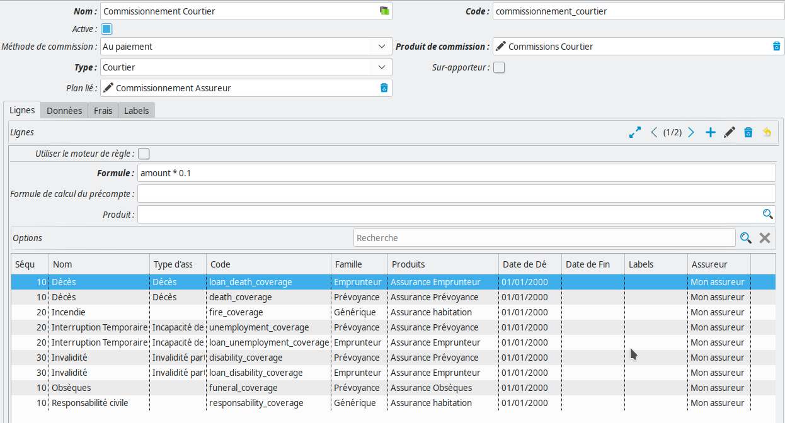
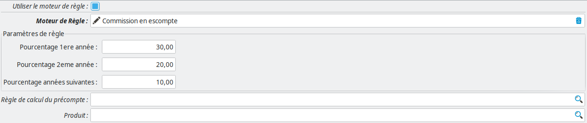
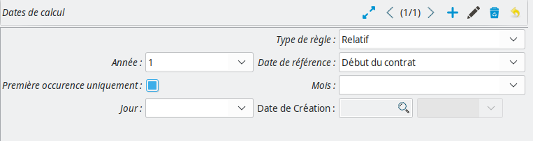
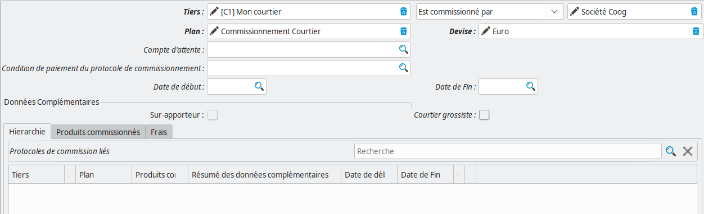

Commissionnement
================

La configuration du commissionnement est l'un des points les plus délicats
(avec l'utilisation du moteur de règles et la mécanique de calcul des
quittances à partir des primes pures) de **Coog**.

Généralités
-----------

La logique de **Coog** pour le commissionnement d'un contrat est la suivante :

- Un contrat est rattaché à un nœud du *Réseau de distribution*
- Ce lien permet de rattacher le contrat à une liste de courtiers potentiels.
  Il s'agit des différents tiers rattachés aux parents du nœud du réseau auquel
  est rattaché le contrat
- Ces courtiers peuvent être rattachés à des *Protocoles de commissionnement*
- Un *Protocole de commissionement* est l'expression d'un accord passé entre le
  courrier et la société utilisant **Coog** (ou bien l'un des assureurs
  proposant les produits disponibles dans **Coog**)
- Les conditions de cet accord sont définies dans le *Plan de commissionnement*
  rattaché au protocole. C'est le plan de commissionnement qui définit la
  majorité des règles rattachées au calcul des commissions
- Lors de la souscription d'un contrat, un protocole de commissionnement peut
  (dans la majorité des cas, devra) être saisi. Ce protocole permettra par la
  suite de calculer les différents montants de commission
- Le plan de commissionnement courtier est rattaché à un plan assureur, qui
  sera du coup utilisé pour calculer les reversements à l'assureur

:Note: Pour davantage d'informations sur la relation entre les contrats, le
       réseau de distribution et les courtiers, se reporter à la documentation
       sur les `réseaux de distribution <reseau_distribution>`_. Ce
       document se concentrera sur la partie paramétrage des plans / protocoles
       de commissionnement

Relation courtier / assureurs
-----------------------------

Le comportement de **Coog** pour les commissions *courtier* et les commissions
*assureur* est assez différent. Il y a toutefois quelques points communs en
termes de paramétrage :

- Dans les deux cas, il y aura un plan de commissionnement et un protocole de
  commissionnement
- Dans les deux cas, sur la base de ces éléments de configurations, les batchs
  (ou actions manuelles de génération) créeront des bordereaux aggrégeant les
  détails des montants à payer à l'assureur ou au courtier

Les points communs s'arrêtent là. Le fonctionnement détaillé est lui assez
différent.

Commissions courtier
~~~~~~~~~~~~~~~~~~~~

Tout d'abord, les commissions courtiers peuvent avoir plusieurs niveaux. Par
exemple, le nœud du réseau de distribution ayant souscrit le contrat peut avoir
plusieurs parents, chacun ayant souscrit un contrat de commissionnement :

.. code::

    Racine
      |
      +--> Courtier Maître (rattaché à un tiers)
             |
             +--> Courtier 1 (rattaché à un tiers)
                     |
                     +--> Agence 1 (rattaché à l'adresse 1 du Tiers 1)
                     |
                     +--> Agence 3 (rattaché à l'adresse 2 du Tiers 1)
                     |
                     +--> Agence 2 (rattaché à l'adresse 3 du Tiers 1)

Avec l'exemple ci-dessus, pour un contrat souscrit par l'*Agence 1*, des
commissions seront payées au *Courtier 1* et au *Courtier Maître* (sous réserve
que les deux aient un contrat de commissionnement).

En outre, il est possible au niveau de la configuration des protocoles de
commissionnement d'ajouter des *Sur-apporteurs*, qui peuvent ajouter
indépendamment du réseau de distribution un niveau de reversement.

Au niveau du mode de calcul, les commissions courtiers sont calculés par
rapport au montant payé par le client. Concrètement, pour une prime de 100 €
sur une garantie commissionnée à 20 %, **Coog** créera (puis reversera) une
ligne de 20 € au courtier.

Commissions assureur
~~~~~~~~~~~~~~~~~~~~

Il n'y a qu'un seul niveau de commissionnement assureur. Lorsqu'une ligne de
quittance est générée sur une garantie, on retrouve l'assureur via la
configuration de la garantie en question. On cherche ensuite le plan de
commissionnement assureur à prendre en compte via le courtier :

- Le contrat est rattaché à un protocole de commissionnement courtier
- Ce protocole a un plan de commissionnement
- Ce plan de commissionnement *courtier* est rattaché à un plan de
  commissionnement *assureur*

Enfin, on recherche un protocole de commissionnement pour l'assureur de la
garantie, qui soit rattaché au plan de commissionnement déterminé par celui du
courtier.

En termes de calculs, la commission assureur est calculée différemment de la
commission courtier. En effet, nous sommes davantage dans une logique de
reversement. Du coup, les lignes de *commission assureur* qui sont générées
lors du paiement d'une quittance représente plutôt ce qui va être conservé par
la *Société* utilisant **Coog**.

Lors des traitements générant les bordereaux assureur, **Coog** effectue les
opérations suivantes :

- Recherche des lignes de prime correspondant aux garanties couvertes par
  l'assureur
- Déduction des lignes de commissionnement assureur qui ont été calculées

Concrètement, pour une ligne de 100 € de prime commissionnée à 30 %, le
bordereau assureur contiendra une ligne de 100 € de *Primes émises*, avec une
ligne de -30 € de *commission assureur* venant en déduction, pour un total
reversé de 70 €.

Plan de commissionnement
------------------------

Données générales
~~~~~~~~~~~~~~~~~

Un *Plan de commissionnement*, qu'il soit *Courtier* ou *Assureur*, comporte un
*Nom*, un *Code*, et des *Libellés*. Il est en outre possible de le supprimer
« logiquement » à l'aide du champ *Actif*.

Il comporte par ailleurs les données suivantes :

- *Méthode de commission* : **Coog** ne supporte (pour l'instant) que la valeur
  *Au paiement*. Concrètement cela signifie que les commissions seront générées
  et marquées pour règlement une fois que la quittance client sera *Payée*. En
  cas d'annulation après paiement, des lignes de commission d'un montant
  inverse seront générées, pour être prises en compte dans le prochain
  bordereau. En cas d'annulation d'une quittance émise non payée, il n'y aura
  aucune trace de la quittance dans les bordereaux. L'autre valeur possible, *À
  l'émission*, correspond à une génération et un paiement des commissions dès
  l'émission de la quittance client. Ce mode de fonctionnement, bien que
  planifié dans **Coog**, n'est pour l'instant pas utilisé et nécessitera des
  ajustements s'il était nécessaire de le mettre en place
- *Produit de commission* : Il s'agit d'un objet comptable utilisé pour
  configurer les différents comptes qui seront utilisés lors de la génération
  des bordereaux. Il sera en général ré-utilisé sur tous les plans d'un même
  type, étant donné que les comptes en question sont de toute façon cloisonnés
  par tiers (donc par courtier / assureur)
- *Type* : Deux valeurs possibles, *Assureur* ou *Courtier*, qui servent à
  indiquer à **Coog** si le plan est destiné à calculer des commissions
  assureur ou des commissions courtier
- *Sur-apporteur* : Si le *Type* est *Courtier*, il est possible de marquer ce
  plan comme destiné à une utilisation en tant que sur-apporteur (donc en sus
  des commissions issues du réseau de distribution)
- *Plan lié* : Dans le cas d'un plan *Courtier*, permet de définir le plan
  *Assureur* rattaché. Un plan *Assureur* peut être partagé par plusieurs plans
  *Courtier*, mais l'inverse est faux
- *Frais* : Permet d'ajouter des frais spécifique à ce plan sur les contrats
  souscrits qui lui sont rattachés. Il s'agira typiquement de frais fixes
  demandés à la souscription
- *Clé du moteur de règle* : Permet de définir un identifiant, qui sera ensuite
  disponible dans le moteur de règle pour déterminer une catgorie de plan de
  commissionnement. Le cas concret d'utilisation est de pouvoir faire varier la
  cotisation en fonction des caractéristiques du plan de commissionnement
- *Données complémentaires* : Il est possible de définir des données
  complémentaires sur le plan de commissionnement, qui pourront ensuite être
  renseignées dans les protocoles de commissionnement rattachés. Cela peut être
  utile pour des reportings, ou bien pour ajouter des critères sur les calculs
  des montants de commissions

Données de calcul
~~~~~~~~~~~~~~~~~

La majorité des données liées au calcul des montants de commission se trouvent
dans les *Lignes*. Concrètement, une *Ligne* contient les informations
permettant de calculer les montants de commission pour un ensemble de
garanties. Il n'y aura en général qu'une seule *Ligne* par plan de
commissionnement, mais pour le cas où l'on voudrait avoir des règles
différentes en fonction des garanties (par exemple, 20 % sur la garantie
« Décès » et 16 % sur la garantie « Incapacité »), il suffirait de créer deux
lignes différentes.

Une ligne est rattachée à une liste de `Garanties <produit/garantie>`_.
Lors du règlement d'une quittance, après avoir retrouvé le plan de
commissionnement via le réseau de distribution et le protocole de
commissionnement, **Coog** va chercher dans les lignes du plan de
commissionnement celles dont les garanties correspondent aux garanties payées
dans la quittance.

Le champ *Produit* permet d'ajouter un niveau de filtre sur le produit
comptable rattaché à la ligne de quittance. Toutefois, dans un contexte normal
d'utilisation de **Coog**, ce champ peut être laissé vide (étant donné que les
lignes de quittance rattachées à des garanties en sont démunies).

Les autres données de la *Ligne* décrivent la façon dont les montants de lignes
vont être calculés.

La façon la plus simple de configurer un calcul de commission consiste à
*Utiliser le moteur de règle*, et à sélectionner une des règles « par défaut »
disponibles dans **Coog**. On y retrouve les règles classiques de
commissionnement :

- *Commission linéaire* : Permet de commissionner à l'aide d'un pourcentage
  fixe
- *Commission en escompte* : Un calcul de commission linéaire, avec des
  pourcentages différents en fonction de l'ancienneté du contrat

Il est également possible de définir une `Règle <moteur_de_regles>`_ qui
retournera le montant de commission correspondant à la ligne commissionnée :

.. code-block:: python

    # Commissionnement à 14 %
    return 0.14 * montant_ligne_quittance()

:Note: Il est également possible d'utiliser le champ *Formule*, accessible en
       décochant la case *Moteur de règle* afin de disposer d'une règle de
       calcul simplifiée. Toutefois, l'intérêt de ce fonctionnement s'est
       considérablement réduit avec la mise à disposition de règles
       pré-configurée

Si l'on souhaite ajouter une règle de calcul de *Précompte* (commissions
appelées en anticipation sur une ou plusieurs années), il est possible de
configurer une *Règle de calcul du précompte*. Cette règle retourne le montant
de précompte qui sera payé dès le règlement de la première échéance sur le
contrat. Il n'y aura pas d'autres versements tant que le montant total de
commissions calculées n'aura pas atteint le montant déjà payé via le précompte.

En outre, **Coog** dispose d'une mécanique de rattrapage du précompte en cas de
résiliation anticipée du contrat, et / ou d'avenants modifiants le tarif.

Comme pour le paramétrage des cotisations sur les `Garanties
<produit/garantie>`_, il est possible de forcer des dates de calcul
d'évolutions du taux de commissionnement. Concrètement, ce taux sera calculé
individuellement pour chaque ligne de quittance à commissionner, en se basant
typiquement sur la date de début de la ligne. Dans certains cas, il peut être
nécessaire de forcer un recalcul du taux (avec éventuellement l'éclatement de
la commission en deux lignes).

Par exemple, soit un contrat annuel souscrit le 04/05/2020, pour lequel les
quittances sont re-calées au 01/01, rattaché à un plan de commission pour
lequel le taux de commission varie au bout d'un an exact, et passe de 20 % à
10 %. La première quittance, du 04/05/2020 au 31/12/2020 sera intégralement
commissionnée à 20 %. En revanche, la seconde quittance du 01/01/2021 au
31/12/2021 doit donner lieu à deux ligne de commissions :

- Une du 01/01/2021 au 03/05/2021, commissionnée à 20 %
- Une autre du 04/05/2021 au 31/12/2021, commissionnée à 10 %

Pour aboutir à ce résultat, il suffit de définir une *Date de calcul* sur le
plan de commissionnement :

Il est possible d'avoir un fonctionnement *Relatif* ou *Absolu*. Dans le cas
*Absolu*, les dates sont fixes (par exemple, tous les 01/01), avec
éventuellement une limitation du nombre d'itérations.

Dans le cas d'un fonctionnement *Relatif*, les dates sont exprimés comme un
écart par rapport à une *Date de référence*, qui peut être la *Date de début du
contrat*, la *Date de signature du contrat*, ou la *Date de début de la
garanite*. L'utilisation de ces dates permet de s'assurer que les commissions
seront bien recalculées conformément aux évolutions prévues par la règle
paramétrée sur les différentes lignes.

Typiquement, si la règle sélectionnée prévoit un changement de taux un an après
la date de souscription du contrat, il faudra ajouter une date de calcul en
*Relatif*, basée sur la *Date de début du contrat*, au bout d'une année.

Protocole de commissionnement
-----------------------------

Le *Protocole de commissionnement* permet, pour rappel, de rattacher un plan de
commissionnement à un courtier ou à un assureur. Il est parfois appelé *Contrat
de commissionnement*, dans le sens où il représente le « Contrat » qui a été
conclut entre l'assureur / le courtier et la *Société*.

Le champ *Tiers* correspond à l'entité ayant souscrit au protocole de
commissionnement. Il s'agira, typiquement, du *Courtier* dans le cas d'un
protocole de commissionnement courtier, et du *Tiers assureur* dans le cas d'un
protocole de commissionnement assureur. Le champ *Type de commissionnement* a
deux valeurs possibles :

- *Est commissionné par*
- *Commissionne*

Il s'agit concrètement d'indiquer s'il s'agit d'un protocole de
commissionnement courtier ou assueur. La première ligne de la vue peut en effet
se lire :

``<Tiers XXXX> Est commissionné par <Société>``

ou bien

``<Tiers XXXX> Commissionne <Société>``

Sachant que *Société* correspond à la *Société* utilisatrice de **Coog**, le
premier cas correspond à un protocole courtier (du point de vue de la société,
le tiers XXXX est un apporteur étant donné que l'on va lui verser des
commissions). Dans le second, c'est la *Société* qui est commissionnée par le
tiers XXXX, on est donc dans le cas d'un commissionnement assureur.

Le champ *Plan* permet de sélectionner le plan de commissionnement, qui sera
filtré en fonction du type de relation entre le tiers et la société.

Les autres champs permettent de gérer la vie du protocole de commissionnement :

- *Compte d'attente* : s'il est renseigné, permettra de comptabiliser les
  commissions à payer avant même que les bordereaux soient générés. Dans ce
  cas, lors du commissionnement, **Coog** ajoutera des lignes correspondants
  aux montants de commission dans ce compte. Lors de la génération du
  bordereau, ces lignes seront déplacées vers le compte à payer de l'assureur /
  du courtier
- *Conditions de paiement* : permet de forcer des conditions de paiement
  particulières pour ce protocole de commissionnement. S'il n'est pas
  renseigné, les conditions de paiement définies par défaut dans la
  configuration générale
- *Date de début* et *Date de fin* : permet d'empêcher la souscription de
  nouveaux contrats utilisant ce protocole si sa date de souscription n'est pas
  compatible
- *Sur-Apporteur* : calculé automatiquement à partir du plan de
  commissionnement (qui lui peut être marqué comme *Sur-apporteur*)
- *Courtier grossiste* : TOOOOOOOOOOOOOOOOOOOOOOOOOOO DOOOOOOOOOOOOOOOOOOOOOOOO

Il est également possible de définir des *Frais* qui seront uniquement ajoutés
aux contrats rattachés à ce protocole de commission. Il s'agira, comme pour le
plan de commissionnement, de frais à la souscription du contrat, négociés
directement entre la *Société* et le courtier / l'assureur (quoi que ce second
cas soit plutôt rare).

Enfin, le champ *Protocoles de commissionnement liés* permet de visualiser
toute la hiérarchie des différents niveaux de commissionnement (pour les
commissionnements courtier). On y retrouvera les *Parents*, dans le *Réseau de
distribution*, du *Tiers* rattaché au protocole de commissionnement, ainsi que
les protocoles de commissionnement que ces parents ont également souscrits
auprès de la *Société*.
