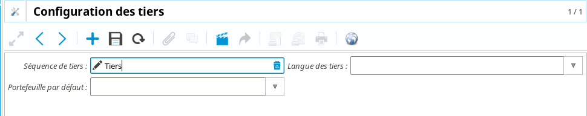
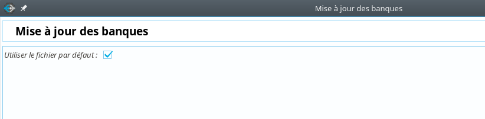
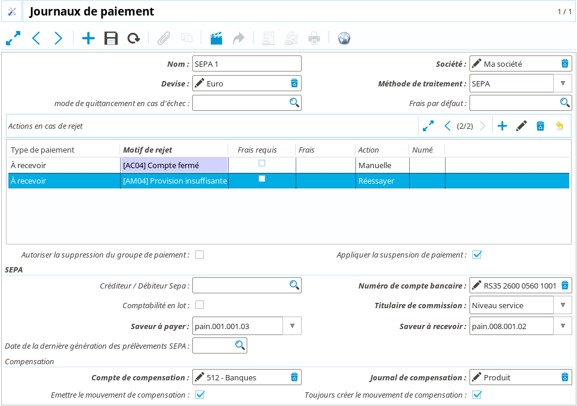

Configuration générale
======================

Cette partie se concentrera sur le point d'entrée « Configuration générale » de
**Coog**, qui centralise les différents éléments de configuration disponibles.
Ces éléments sont classés selon un ordre destiné à faciliter le paramétrage de
l'application (par exemple, la configuration comptable se trouve *avant* la
configuration des moyens de paiement).

Nous allons, partant d'une installation vide sans aucune configuration,
parcourir et expliquer le détail de ces points d'entrée.

:Note: Les points d'entrée disponibles pour une installation donnée dépend des
       modules installés. Par exemple, les points d'entrée liés à la
       configuration des sinistres n'apparaîtra pas pour un client n'ayant pas
       souhaité les utiliser

Initialisation des données
--------------------------

Ces éléments de configuration permettent de définir des valeurs par défaut « 
cohérentes » avec l'usage habituellement fait de **Coog**.

* *Mise à jour de la recherche globale** : Pour rappel, la recherche globale
  permet de faciliter la navigation dans l'application en offrant un point
  d'entrée accessible à n'importe quel moment à l'aide du raccourci **Ctrl +
  k**. Saisir quelque chose dans ce point d'entrée déclenche une recherche dans
  l'application pour les données correspondantes.
  L'activation du point d'entrée *Mise à jour de la recherche globale*
  configure par défaut la recherche globale pour rechercher les contrats et les
  tiers correspondants à la saisie. Il est possible dans un paramétrage plus
  avancé de définir d'autres modèles sur lesquels chercher (sinistres,
  quittances, etc.)

* *Mise à jour des langues traduisibles* : **Coog** est une application
  multi-langue. En particulier, il est possible d'indiquer que certaines
  informations sont « traduisibles ». Il est par exemple possible d'avoir un
  produit avec un nom affiché différent en fonction de la langue de
  l'utilisateur. L'activation de ce point d'entrée active cette fonctionnalité
  pour la langue française

Configuration des Tiers
-----------------------

Ce point d'entrée permet de configurer des données de base des tiers. Les
éléments concernés sont :

- La *Séquence des tiers*, qui permet de définir comment seront numérotés les
  nouveaux tiers dans l'application. Concrètement, lors de sa création,
  **Coog** affecte à chaque tiers un identifiant. Il est possible de le forcer
  manuellement, mais en général on laisse l'application le faire. La *Séquence
  des tiers* permet de contrôler la façon dont cet identifiant est généré

- La *Langue des tiers* est la langue par défaut des tiers nouvellement créés.
  Cette information est modifiable tiers par tiers, mais la configuration
  générale permet de n'avoir à le faire qu'exceptionnellement. Bien sûr, cela
  dépend du portefeuille de clients. La langue du tiers est ensuite utilisée
  dans l'éditique pour déterminer le modèle de courrier à utiliser

- Le *Portefeuille par défaut* permet de définir à quel *portefeuille* les
  tiers seront rattachés par défaut lors de leur création. Cette information
  est juste une initialisation, il est toujours possible de la remplacer lors
  de la saisie du tiers. En outre, elle peut rester vide, auquel cas les
  gestionnaires devront saisir manuellement un portefeuille pour chaque
  nouvelle création de tiers

Sociétés
--------

Comme expliqué précédemment, la *Société* est un élément important, qu'il va
falloir créer très rapidement lors d'une nouvelle installation. Une *Société*
est principalement constituée d'un *Tiers* et d'une monnaie (afin de figer la
comptabilité).

Le *Tiers* de la société n'a pas besoin d'être complet à ce stade, un nom
suffira amplement. D'autant qu'une partie non négligeable de la configuration
n'est pas encore faite (codes postaux, banques, etc.).

La *Devise* est obligatoire car déterminante pour la comptabilité.

La gestion des *Employés* n'est pas à ce stade utilisée dans **Coog**. De même
pour la gestion des *Rapports*, dont les modifications propres (en-tête /
pied-de-page) sont gérées via d'autres outils.

Utilisateurs
------------

À ce stade, il n'y aura normalement qu'un seul utilisateur dans
l'environnement, celui avec lequel vous êtes connecté. Cet utilisateur
(*admin*) est créé automatiquement lors du déploiement d'une nouvelle
installation de **Coog**. Il est recommandé de rapidement créer d'autres
utilisateurs aux droits plus limités afin d'améliorer la sécurité de
l'application.

Lors de la phase d'initialisation, il est fréquent de ne travailler qu'avec
l'utilisateur *admin* pour éviter d'avoir à changer d'utilisateur trop
fréquemment en fonction des domaines fonctionnels à paramétrer.

Un utilisateur est composé des données suivantes :

* *Nom* : Le nom qui sera utilisé lorsqu'il faudra « afficher » l'utilisateur
  dans l'application (par exemple lorsque l'on consulte l'historique des
  actions sur un contrat). Dans cette optique, il doit être suffisament précis
  pour permettre d'identifier précisément la personne concernée
* *Actif* : Décocher cette case rendra l'utilisateur inactif, son compte ne
  pourra plus être utilisé pour se connecter à l'application
* *Identifiant* : Le nom utilisé comme identifiant lors de la connexion à
  **Coog**
* *Mot de passe* : Permet de vérifier l'identité de la personne se connectant.
  Il doit être différent pour tous les utilisateurs, être modifié
  régulièrement, et doit avoir une complexité (longueur, etc..) minimum
  configurée lors du déploiement de l'application. Il est également possible à
  ce moment de définir une liste de mot de passe « bannis » de l'application
* *Email* : Optionnel, il peut être utilisé dans le cas où l'on souhaite mettre
  en place un système de notification par email des utilisateurs
* *Société principale* / *Société actuelle* : Rattache l'utilisateur à une
  *Société* précise. Cela est obligatoire dans les installations standard de
  **Coog**, où l'application fonctionne sur la base d'une unique *Société*
* *Employés* / *Employé actuel* : Non utilisé dans une installation standard de
  **Coog**. Cela permet de gérer la comptabilité liée aux fiches de paies des
  employés avec les modules appropriés
* *Permission d'accès* : Cet onglet est le plus important (hors informations de
  connexion) des utilisateurs. Il définit les droits de l'utilisateur via la
  liste des groupes auxquels il appartient. Ajouter le groupe *Administration
  de la comptabilité* à un utilisateur lui donnera accès aux menus concernés,
  et lèvera les blocages de certaines actions manuelles (création / émission de
  mouvement comptables) auxquels il était précédemment soumis

* *Langue* : Il est impératif que ce champ soit renseigné afin de permettre à
  l'application de fonctionner correctement. Il indique la langue de
  l'utilisateur, donc celle qui sera utilisée pour afficher l'application.
  Concrètement, un utilisateur pour lequel ce champ est à *Anglais* verra
  l'ensemble de l'application en anglais
* *Réseau de distribution* : Si les modules de commissionnement sont installés,
  permet de rattacher un utilisateur à un noeud du réseau de distribution.
  Cette information est indispensable, si elle n'est pas renseignée
  correctement l'utilisateur aura accès à des informations partielles et ne
  s'en rendra pas forcément compte

Les autres données des utilisateurs (*Actions*, *Applications*, *Gestion de
l'équipe*, etc.) ne nécessitent pas d'être approfondis pour le moment.

:Attention: Avant de poursuivre, il est indispensable de lier l'utilisateur
            *admin* à la société créée précédemment. Cela peut se faire
            facilement en renseignant les champs *Société principale* et
            *Société actuelle* de l'utilisateur. Il faut également renseigner
            sa *Langue*, puis sauvegarder. Il faut ensuite se déconnecter de
            **Coog**, puis se reconnecter pour que les opérations soient bien
            prises en compte

Plan Comptable
--------------

Nous avons maintenant suffisament d'informations dans l'application pour
pouvoir créer un *Plan Comptable*. Le faire permettra d'avoir une structure
comptable a minima, cohérente avec les règles comptables classiques.

Vous pouvez le faire en lançant le point d'entrée *Créer un plan comptable
depuis un modèle*. Sélectionnez la société que vous avez créée, ainsi qu'un des
plans comptables proposés. Il est recommandé de partir d'un *Plan Comptable
Simple (PCS)* afin d'éviter le détail de la comptabilité générale qui viendrait
avec le *Plan Comptable Assurance (PCA)*.

L'assistant demande ensuite les comptes à utiliser par défaut pour les
différentes catégories. Il sera toujours possible de les changer par la suite,
voici un exemple de saisi basé sur le *PCS* :

Les comptes les plus important de cette liste sont :

* Le *Compte à recevoir par défaut* correspond au compte des tiers
  souscripteurs. Autrement dit, c'est dans ce compte que tous les dûs /
  règlements liés aux contrats seront enregistrés
* Le *Compte à payer par défaut* correspond au compte des tiers bénéficiaires
  de décaissments. Il s'agit des bénéficiaires sinistres, courtiers, etc. Ce
  compte est un compte par défaut global à l'application, il est toujours de
  choisir un compte différent tiers par tiers

:Note: Le point d'entrée « Mise à jour d'un plan comptable depuis un modèle »
       est utilisé pour synchroniser les comptes du plan comptable avec la
       définition du plan tel que fournie par une nouvelle version de **Coog**

Les comptes ainsi créés sont accessibles depuis le point d'entrée *Financier /
Configuration / Comptes*. Il est possible d'en rajouter manuellement, et de
modifier les comptes existants. À noter qu'une fois le système en production,
il est recommandé d'étudier avec attention les impacts des modifications
éventuelles de la configuration des comptes sur les éventuelles interfaces avec
des systèmes comptables externes.

Mise à jour des banques
-----------------------

**Coog** permet de créer automatiquement, depuis un fichier inclus dans
l'application, un référentiel des banques. Cela permet par la suite de ne pas
avoir à créer les banques au fur-et-à-mesure que de nouveaux comptes bancaires
apparaissent. L'exécution peut prendre un peu de temps, le fichier par défaut
contient plus de 4 000 banques avec leurs adresses et codes BIC.

Il est toujours possible de rajouter / supprimer / modifier des banques dans
l'application depuis le point d'entrée « Banques » mais dans un premier temps
le chargement de ce point d'entrée suffit.

Mise à jour des codes postaux
-----------------------------

De la même façon, **Coog** inclut un référentiel des codes postaux (pour la
France uniquement). L'exécution de ce point d'entrée prendra quelques minutes,
du fait de la quantité (plus de 67 000 codes postaux) des données chargées.

Il est également possible de créer les codes postaux manuellement dans
l'application, pour tous les pays / villes souhaités.

Organismes prêteurs
-------------------

Dans le cas d'une installation de **Coog** dediée à la gestion de contrat
emprunteur, il est possible de créer les organismes prêteurs des prêts
souscrits par les assurés. En fonction de l'activité de la société, il peut ne
s'agir que de quelques entités (contrats groupes de banques précises par
exemple), ou à l'inverse être très variable. Dans le premier cas, une
configuration générale en début de déploiement est à envisager (éventuellement
un chargement automatique à partir d'un fichier pour les adresses). Dans le
second, le fonctionnement habituel est une saisie au fil de l'eau au
fur-et-à-mesure des souscriptions.

Un « Organisme prêteur » est en réalité un tiers qui a été identifié comme tel.
Conséquemment, la seule information d'un organisme prêteur est le tiers
associé. Lors de la saisie de l'organisme prêteur d'un prêt, il sera possible
(et nécessaire) de sélectionner l'adresse concernée. Concrètement, l'organisme
prêteur sera la banque, et l'on pourra sélectionner au niveau du prêt l'agence
concernée via son adresse.

Types de relation des tiers
---------------------------

**Coog** permet de définir des relations entre les tiers. Par exemple, une
relation Parent - Enfant, utilisée dans le cas de la gestion de contrats
Santé / Prévoyance. Les différents types de relation sont configurables
directement dans l'application. **Coog** est livré avec certaines relations
particulières créées par défaut, en fonction des modules installés.

Les champs *Nom* et *Code* sont « habituels », le champ *Relation inverse*
permet de définir les correspondances entre relations. Par exemple, si le Tiers
1 est **Parent** du Tiers 2, le Tiers 2 est **Enfant** du Tiers 1.

Journaux comptables
-------------------

Les *Journaux comptables* permettent de regrouper les opérations comptables
effectuées dans l'application par « famille d'opérations ». **Coog** propose
par défaut un certain nombres de journaux, toutefois cette liste peut être
étendue pour s'adapter aux besoins de reporting (par exemple).

Un journal comptable est composé des éléments suivants :

* *Nom*, *Code*, *Actif* : Il s'agit des champs habituels des éléments de
  paramétrage
* *Type* : Le type fonctionnel du journal, qui permettra de filtrer sa
  disponibilité selon les cas métiers. Cette information est la plus
  importante, dans le sens où elle peut avoir une conséquence directe sur le
  comportement de l'application. Elle est également utilisée pour proposer des
  visions globales par type de journal des différentes opérations comptables
  effectuées dans l'application.

  * *Général* : Pas de comportement particulier
  * *Cash* : Règlements en espèce directement. Devrait être désactivé dans la
    majorité des installations de **Coog**
  * *Charge* / *Produit* : Opérations identifiées comme se rapportant à des
    charges / produits comptables du point de vue de la société
  * *Pertes et profits* : Opérations d'ajustement (ex : règlement d'une
    quittance de 200 € par un chèque de 201 €, équilibrée par un mouvement de
    1 € en sur un journal de *Pertes et profits*)
  * *Relevé* : Corresponds aux mouvements générés dans le cadre de la
    validation d'un relevé de compte bancaire, remise de bordereaux de chèques,
    etc.
  * *Situation* : Non utilisé
  * *Commission* : Utilisé pour les règlements de commissions aux apporteurs /
    assureurs
  * *Découpage* : Utilisé lors des opérations de découpage de primes
    automatiques effectuées par **Coog** dans le cadre de réconciliations
    automatiques suites à avenants
  * *Reprise de prime suite à délettrage* : Utilisé par des mouvements
    comptables générés automatiquement par **Coog** lors de l'annulation de
    quittances ayant déjà été prises en compte dans un bordereau de règlement
    assureur
* *Séquence* : Tous les mouvements comptables générés dans l'application ont un
  numéro attribué automatiquement. Ce numéro est obtenu à partir de la
  *Séquence* définie sur le journal du mouvement
* *Compte de débit / Crédit par défaut* : Permet de définir les comptes
  utilisés par défaut lors de la création d'un mouvement utilisant ce journal.
  Ces champs sont optionnels, et il est dans tous les cas toujours possible de
  choisir les comptes à utiliser manuellement au moment de la création du
  mouvement
* *Agrégat* : Si les fonctionnalités d'agrégation comptable sont activées dans
  **Coog** et que cette case est cochée, le déclenchement des agrégats
  comptables regroupera tous les mouvements de ce journal non encore regroupés
  dans un nouvel agrégat
* *Agréger à l'émission* : Si coché, l'émission de mouvements comptables
  constituera un agrégat. Cela est utile si l'on souhaite, par exemple, que des
  opérations générant « d'un coup » plusieurs mouvements comptables (avenant,
  etc.) ne donnent lieu qu'à un seul agrégat

Années fiscales
---------------

**Coog** accordant une grande importance à l'intégrité des données comptables,
toutes les opérations comptables effectuées doivent être rattachées à une
période fiscale, elle-même faisant partie d'une année fiscale. Cela peut donner
lieu à une configuration potentiellement fastidieuse, c'est pour cela qu'un
assistant facilitant leur création est disponible dans l'application.

Cela est principalement dû au fait que les quittances générées par **Coog** ont
une date de valeur correspondant à la date de couverture associée à la
quittance. Sur certains types de produits (Emprunteur par exemple) les contrats
peuvent avoir une durée de vie très longue (plus de 10 voire 20 ans) et l'on
peut être amené à générer des quittances des années en avance par exemple pour
encaisser un chèque d'acompte. Pour ce faire, il est nécessaire que les années
fiscales aient déjà été créées jusqu'à la date d'effet des quittances générées,
donc il n'est pas rare qu'il faille créer 10 années fiscales d'avance.

Cet assistant requiert les informations suivantes :

* *Date de synchronisation des années fiscales* : La date de début de la
  première année fiscale à créer dans **Coog**. Il s'agira typiquement du
  premier janvier de la première année fiscale contenant des données de
  production de **Coog**
* *Nombre d'années fiscales à créer* : Le nombre d'années fiscales qui seront
  créées automatiquement à partir de la date de synchronisation
* *Fréquence des périodes des années fiscales* : Indique comment seront
  découpées les périodes au sein d'une année fiscale. En général, une
  périodicité annuel est suffisante, l'intérêt d'une périodicité plus fine
  étant de pouvoir effectuer des clôtures intermédiaires

Les années fiscales sont accessibles depuis le point d'entrée *Financier /
Configuration / Années fiscales*. On y retrouve les informations de base
(*Nom*, *Date de début*, *Date de fin*, *Société*, etc.), le statut (*Ouverte*
ou *Fermée*), ainsi que la liste des périodes. On y trouve également :

* *Exporter les mouvements comptables* : Si cochée, les mouvements comptables
  générés sur cette période seront agrégés, en général pour ensuite être
  exportés via une interface dans un outil de comptabilité générale. Ce champ
  permet d'éviter que des mouvements à date d'effet futurs (suite à émission de
  quittance anticipée par exemple) ne soit redescendu dans l'outil comptable
  trop tôt
* *Séquences* : L'année fiscale est utilisée pour stocker les séquences
  utilisées pour générer les numéros de quittance dans l'application.

  .. image:: images/configuration_generale_annee_fiscale_sequences.png
      :align: center

  Parmi ces séquences, les plus importantes sont :

  * *Séquence de facture client* : Les *factures client* dans **Coog** sont
    majoritairement les quittances générées automatiquement sur les contrats
  * *Séquence de facture fournisseur* : Les *factures fournisseur*
    correspondent à tous les décaissements effectués dans **Coog**.
    Typiquement, il s'agit de règlements de sinistres, mais aussi paiement des
    courtiers, reversements des cotisations à l'assureur, factures
    d'honoraires, etc.

Taxes
-----

À part dans certains contextes métiers précis (gestion uniquement de produits
« Décès seul »), certaines actes de gestion courants (facturation des contrats,
règlement des sinistres) nécessiteront le calcul de données de taxes.
Typiquement, la Taxe Assurance pour la facturation des garanties d'Incapacité /
Invalidion, et la CSG / CRDS pour le règlements des indemnités d'arrêt de
travail.

Outre les champs classiques *Nom*, *Actif* et *Société*, on trouve :

* *Description / Mention légale* : Permet de détailler la taxe, à fin
  d'information typiquement dans l'éditique
* *Type* : Sélectionne le type de calcul de la taxe. Dans la très grande
  majorité des cas, il s'agira d'une taxe en pourcentage
* *Taux* : Permet de saisir le taux de la taxe qui sera appliqué sur la base
  taxable
* *Compte de facture / note de crédit* : Les comptes à utiliser pour
  comptabiliser les montants pour cette taxe. Les *Notes de crédit* n'étant pas
  utilisées dans **Coog**, on retrouve en général la même value pour les deux
  champs

  :Attention: Dans le cas d'une installation de **Coog** où l'on collecte des
              taxes qui sont ensuite reversées à l'assureur, et où l'on
              travaille avec plusieurs assureirs, il est nécessaire de créer
              des taxes différentes par assureur afin de pouvoir séparer les
              comptes de taxe par assureur

* *Groupe / Séquence / Code* : Non utilisé
* *Mettre à jour le prix unitaire* : Si coché, cette taxe pourra être utilisée
  dans le cadre d'un calcul « Taxes incluses »

L'utilisation des champs *Date de début* et *Date de fin* n'est pas recommandée
pour la gestion de l'historisation des taux. Le seul cas d'utilisation concret
est lorsqu'une taxe disparaît définitivement. Pour marquer l'évolution du taux
d'une taxe, l'approche recommandée est :

* De créer (ou de modifier) une taxe avec un type *Aucun*
* D'ajouter des *Enfants* à cette taxe, qui aurant eux une *Date de début* et
  une *Date de fin*, ainsi qu'un *Taux*

L'intérêt de ce fonctionnement est qu'en termes de paramétrage dans
l'application, il n'y aura qu'une seule taxe à paramétrer, et pas les
différentes versions de la même taxe. Cela rend également la gestion de
l'évolution des taux plus facile car centralisée dans le paramétrage de la
taxe, et pas répartie aux différents points de paramétrage l'utilisant.

Frais
-----

En plus de la gestion des taxes, **Coog** supporte une mécanique de frais. La
différence entre les deux étant la comptabilité, et le mode de calcul.
Concrètement, dans une quittance contrat, les taxes sont séparées dans une
liste de données à part, et calculées de façon transparente au moment de
l'émission de la quittance.

Les frais en revanche sont configurés au niveau du produit d'assurance, et
offrent davantage de flexibilité. Ils supportent d'être retirés / modifiés sur
certains contrats.

On y retrouve les classiques champs *Nom* et *Code*. Il y a également :

* *Type* : *Fixe* ou *Pourcentage*. Contrairement aux taxes, les deux sont
  utilisées. Un frais *Fixe* permet de choisir un *Montant*, par exemple un
  frais de souscription, ou un frais de fractionnement. Un frais en
  *Pourcentage* correspondra typiquement à un frais de gestion
* *Fréquence* : Par opposition aux taxes, qui sont calculées au moment de
  l'émission de la quittance, l'ajout de frais permet plus de flexibilité (pour
  le cas des frais *Fixes*). La *Fréquence* permet de contrôler en détails
  quand est-ce qu'un frais donné doit être utilisé :

  * *À la signature du contrat* : La signature du contrat donnera lieu à une
    quittance incluant tous les frais ayant cette fréquence. Typiquement
    utilisé pour des frais de souscription à percevoir avant même la première
    quittance
  * *Une fois par contrat* : Les frais de ce type seront inclus dans la
    première quittance de chaque contrat. La différence avec *À la souscription
    du contrat* est qu'ils ne donnent pas lieu à une quittance séparée de
    quittance couvrant la première échéance du contrat
  * *Une fois par an* : Typiquement utilisé pour des frais rattachés au
    renouvellement d'un contrat
  * *Une fois par quittance* : Utilisé pour des frais de fractionnement
* *Permettre la surcharge* : Le fait de cocher cette case permettra aux
  gestionnaires souscripteurs du contrat de désactiver / modifier ce frais
  avant de valider le contrat. Cela permet par exemple de ne prélever le frais
  qu'une seule fois dans le cas d'une souscription conjointe
* *Frais d'apporteur* : Permet d'identifier le frais comme un frais
  d'apporteur, autrement dit destiné à être reversé à l'apporteur du contrat.
  Cette information est utilisée pour filtrer les frais disponibles lors du
  paramétrage (par exemple, un frais d'apporteur n'apparaîtra pas dans les
  frais paramétrables sur un produit)
* *Produit comptable* : Contient les informations décrivant comment le frais
  doit être comptabilisé

Conditions de paiement
----------------------

Les conditions de paiement sont utilisées pour décrire comment les quittances
doivent être réglées. Concrètement, un contrat va donner lieu à des quittances
selon sa périodicité (annuelle / semestrielle / trimestrielle / mensuelle...).
Les conditions de paiement contrôlent les dates d'échéance de chacune de ces
quittances.

La condition de paiement « basique » demande l'intégralité du règlement de la
quittance dès sa date d'effet :

Le *Nom* permet d'identifier la condition de paiement dans l'application. La
*Description* quant à elle permet dans l'éditique d'expliquer au destinataire
de la quittance le détail des conditions pour les cas plus complexe.

Les *Lignes* représentent des échéances de règlement. Dans le cas de la
condition « Basique », il n'y a qu'une seule ligne contenant le *Reste*, donc
l'intégralité du montant.

Voici une condition plus complexe :

L'impact des conditions de paiement est essentiellement comptable. Lors de
l'émission de la quittance, la condition de paiement « complexe » créera deux
lignes comptables, l'une avec une date d'échéance à la date de valeur de la
quittance, l'autre à trois mois plus tard. Cette date sert de base pour
l'identification des retards de paiement (la ligne à trois mois plus tard ne
sera prise en compte dans le solde du tiers qu'à partir de cette date).

Journaux de paiement
--------------------

Les journaux de paiement définissent les différentes façon **automatisées**
d'encaisser/ décaisser de l'argent. Le cas le plus courant concerne les
prélèvements / virements automatique (SEPA). Le journal de paiement décrit le
comportement de l'application lors de la constitution, de la validation, et du
traitement des rejets de ces opérations.

Les champs *Nom*, *Société* et *Devise* sont classiques. Pour les autres :

* *Méthode de traitement* : Les valeurs disponibles dépendent des modules de
  **Coog** activés dans l'environnement. La valeur la plus utilisée est *SEPA*,
  qui permet de gérer toutes les opérations de prélèvements / virements
  utilisant le protocole *SEPA*. Sélectionner ce mode de fonctionnement
  permettra d'automatiser la génération des fichiers SEPA, et de gérer les
  éventuels rejets. Le mode de fonctionnement *Manuel* permet de gérer
  manuellement les protocoles non supportés automatiquement dans **Coog**
* *Mode de quittancement en cas d'échec* : Ce champ est utilisé pour spécifier
  un mode de quittancement alternatif en cas de rejet systématique. Par
  exemple, pour un journal *SEPA*, si un prélèvement est rejeté pour certains
  motifs (Compte fermé par exemple), on peut souhaiter basculer sur un autre
  mode de paiement (chèque...)
* *Frais par défaut* : Il est possible de définir des frais qui seront
  automatiquement appliqués si ce journal est utilisé
* *Actions en cas de rejet* : Cet encart est utilisé pour décrire le
  comportement à adopter lors du retour en échec de certaines opérations
  automatiques. En fonction du motif (sélectionné manuellement ou
  automatiquement lors du rejet en fonction de la méthode de traitement), on
  peut définir les opérations à effectuer :

  * Ajouter un frais
  * Générer un courrier (au bout d'un certain nombre d'échecs)
  * Changer de mode de paiement

  Les actions possibles peuvent être étendues via l'ajout de nouveaux modules
  dans **Coog**
* *Autoriser la supression des groupes de paiement* : Par défaut, et à des fins
  de traçabilité des opérations, les « groupes de paiement » (le contenu d'une
  bande de prélèvement par exemple) ne peuvent être supprimés. Pour certains
  modes de paiement (cartes bancaires via internet par exemple), il peut être
  nécessaire de le permettre pour gérer les cas de transactions annulées
  manuellement par la personne débité
* *Appliquer la suspension de paiement* : Il est possible de définir sur une
  personne / un contrat que l'on souhaite (temporairement) bloquer les
  prélèvements automatiques. Cela peut faire suite à une demande de la
  personne, ou bien à une décision du gestionnaire. Cocher cette case
  appliquera ce blocage pour les opérations réalisées dans le cadre de ce
  journal

Les données supplémentaires liées au *SEPA* concerne la  génération des
différents fichiers de prélèvement / virement. On y retrouve :

* *Créditeur / Débiteur SEPA* : L'entité juridique titulaire du compte à
  créditer / débiter, si différente de la *Société* utilisant **Coog**. Ce cas
  peut se produire si la *Société* est gestionnaire pour le compte du créditeur
  / débiteur, mais que les opérations de prélèvement / virement portent sur un
  compte dont elle n'est pas propriétaire
* *Numéro du compte bancaire* : Le compte bancaire à utiliser pour les
  prélèvements / virement. **Attention** : Si l'on souhaite utiliser des
  comptes bancaires différents pour des prélèvements dans l'application, il
  sera nécessaire de définir des journaux différents
* *Comptabilité en lot* : Permet de définir l'information « BtchBookg » dans
  les fichiers *SEPA*
* *Titulaire de commission* : Permet de définir l'information « ChrgBr » dans
  les fichiers *SEPA*
* *Saveur à payer / à recevoir* : Format des fichiers *SEPA* à utiliser pour la
  génération des fichiers de prélèvements / virements. Différentes variantes
  sont disponibles en fonction des interlocuteurs bancaires
* *Date de la deernière génération des prélèvements SEPA* : Mise à jour
  automatiquement, permet de contrôler la date à laquelle auront lieu les
  prochains prélèvements automatiques

Le bloc *Compensation* permet de contrôler les opérations comptables qui
seront générées lors de la validation ou du rejet des paiements rattachés à
ce journal. Concrètement, si les modules correspondants sont activés dans
**Coog**, la validation d'un paiement sur ce journal donnera lieu à un
mouvement comptable dit « de compensation ». De même, un rejet éventuel
déclenchera un mouvement d'annulation correspondant.

* *Compte de compensation* : Le compte comptable sur lequel on considèrera que
  l'argent « arrivera » suite à la validation d'un prélèvement. Il s'agira
  typiquement d'un compte de banque *512*
* *Journal de compensation* : Le journal comptable auquel les mouvements de
  compensation seront rattachés
* *Émettre le mouvement de compensation* : Si non coché, les mouvements de
  compensation seront créés à l'état « Brouillon » et nécessiteront une
  émission manuelle pour être définitivement validés
* *Toujours créer le mouvement de compensation* : Certains journaux acceptent
  de « refuser » un paiement avant même qu'il ait été traité. Si cette case
  n'est pas cochée, aucune opération comptable ne sera enregistrée. Dans le cas
  contraire, le déclenchement du rejet créera simultanément les opérations
  comptables de validation et d'annulation

Journaux de relevés
-------------------

Les *Journaux de relevés* représentent des opérations de relevés comptables
plutôt que de paiements. La différence concrète est qu'un paiement est à
l'initiative de la *Société* (on décide de déclencher un prélèvement, ou
d'effectuer un virement), alors que les relevés correspondent à des opérations
constatées a posteriori. Typiquement, on parlera de relevés pour le traitement
des chèques encaissés.

Le *Journal de relevé* permet de classifier et de contrôler la saisie de ces
opérations.

.. image:: images/configuration_generale_journaux_de_releves.png
    :align: center

*Nom*, *Devise* et *Société* sont les champs habituels. Pour les autres :

* *Journal* : Le journal comptable qui sera utilisé pour comptabiliser les
  opérations découlant de la validation d'un relevé (i.e. bordereau de chèque)
* *Compte bancaire* : Utilisé dans le cas de relevés « émis », par exemple si
  **Coog** est utilisé pour créer des chèques en masse. Il s'agit du compte
  bancaire qui sera mentionné lors de l'édition des lettre-chèques
* *Type de validation* : Le type de contrôle qui sera demandé lors de la saisie
  d'un relevé. Il peut s'agir :

  * D'une *Balance*, autrement dit, on attend que la somme des montants du
    relevés soit à *0*
  * D'un *Montant*, auquel cas la somme des montants des lignes doit
    correspondre au total saisie par l'utilisateur
  * D'un *Nombre de lignes*, le nombre des lignes saisies doit correspondre au
    total attendu et saisi par l'utilisateur
  * Dans le cas d'une validation *Manuelle*, **Coog** ne peut que faire
    confiance à l'utilisateur

* *Méthode de traitement* : Utilisé uniquement dans le cas de relevés sortants,
  typiquement pour la création de lettre-chèques. Permet de définir la façon
  dont ce types de relevés doit être traitée
* *Émettre automatiquement* : Par défaut, les relevés et les mouvements
  comptables associés nécessitent plusieurs étapes de validation. Cocher cette
  case allège le processus en le limitant à la validation du relevé (qui peut
  être restreinte à certains utilisateurs), le reste découlant automatiquement
* *Séquence des relevés* : La *Séquence* à utiliser pour numéroter les relevés
  saisis dans l'application pour ce journal
* *Motif d'annulation* : La liste des motifs d'annulation disponibles.
  Contrairement aux journaux de paiement, il n'est pas possible de déclencher
  d'actions automatiques, le relevé n'étant pas à l'initiative de la *Société*.
  En revanche, ce motif sera stocké sur la ligne de relevé correspondante, et
  permettra de comprendre a posteriori les opérations comptables effectuées

:Note: Les *Motifs d'annulation* sont partagés entre les différents journaux de
       relevés, et regroupés sous le point d'entrée *Motifs d'annulation de
       relevés*

Procédures de relance
---------------------

Les *Procédures de relance* décrivent le comportement de **Coog** dans le cas
d'impayés client. Ces procédures sont déclenchées automatiquement, et se basent
sur la date de valeur des lignes comptables du client. Dans le cas général,
pour une quittance portant sur la période du 01/01/2020 au 31/01/2020, cette
date sera positionnée au 01/01/2020.

La procédure de relance est composée d'un *Nom* et d'un *Code*. Le champs *Date
d'échéance initialisée avec la date de paiement* est utilisé pour modifier le
comportement défini ci-dessus quant à la date prise en compte pour le calcul de
la date d'impayé. Concrètement, pour les contrats prélevés, il arrive que la
date de prélèvement soit différente de la date de valeur de la quittance (par
exemple, on peut avoir un contrat prélevé le 5 du mois). Dans ce cas, cocher
cette case déclenchera la relance à partir de la date de prélèvement attendue
plutôt que par rapport à la date de valeur de la quittance.

Les *Niveaux* indiquent, à partir de délais définis dans l'application, les
opérations à effectuer si une ligne reste impayée :

* Le *Nom* du niveau permet de l'identifier dans l'application, et sera
  directement affiché sur les contrats conccernés
* Les *Jours* correspondent au délai à partir duquel le niveau est applicable.
  On se base sur le champs *Jours définis par rapport au précédent niveau* pour
  déterminer si le délai est absolu par rapport à la date d'échéance initiale,
  ou relatif par rapport à la date de traitement du niveau précédent.
  Le principe est que l'on ne souhaite pas déclencher le niveau supérieur sans
  qu'un délai ait été accordé au client pour réagir au niveau précédent
* Si le *Niveau est non obligatoire*, on pourra toujours créer manuellement une
  relance de dniveau supérieur même si le niveau précédent n'a pas été traité
* *Appliquer pour* permet de filtrer les lignes concernées. Par exemple, on
  peut souhaiter ignorer certains niveaux dans le cas où l'origine est un
  prélèvement
* *Action sur le contrat* permet d'exécuter des opérations automatiquement sur
  les contrats concernés par l'impayé. Concrètement, on va pouvoir :

  * *Suspendre le quittancement* : Cette action va suspendre le quittancement
    du contrat le temps que l'impayé soit résolu. L'intérêt est d'éviter les
    frais additionnels dus typiquement à des tentatives de prélèvement qui
    risquent de ne pas aboutir
  * *Suspendre le contrat* : Suspend les garanties du contrat tant que le
    contrat reste impayé. Il s'agit en général de la dernière étape avant la
    résiliation du contrat
  * *Résilier le contrat* : Résiliation déclenchée automatiquement. Cette
    résiliation peut intervenir à des moments différents selon le *Mode de
    résiliation* :

    * À la date de fin de la dernière quittance émise (avant suspension donc)
    * À la date de fin de la dernière quittance payée
    * À la date d'effet de la relance, autrement dit à la date à laquelle
      l'étape demandant la résiliation est déclenchée

Il est également possible de définir :

* Des *Frais* à ajouter au montant à recouvrer
* Un événement à déclencher qui apparaîtra dans l'historique des opérations du
  contrat

:Note: **Coog** est livré avec un schéma de relance *par défaut* qui est à la
       fois un exemple pour en configurer d'autres, et un schéma cohérent
       relativement standard et utilisable en l'état dans un certain nombre de
       cas

Configuration comptable
-----------------------

L'écran de *Configuration comptable* permet de définir certains éléments qui
seront utilisés *par défaut* dans l'application. Il sera en général possible de
modifier ces comportements :

* Au niveau du paramétrage produit
* Manuellement directement lors de la création des données

Les données de configuration sont regroupées selon différents axes.

Tiers
~~~~~

Cet encart regroupe les données liées à la configuration des tiers

* *Comptes à recevoir / à payer par défaut* : Cette information est normalement
  déjà saisie si uin plan comptable a été utilisé pour initialiser le schéma
  comptable. Ces deux tiers sont ceux qui seront utilisés par défaut comme
  comptes tiers lors de la création de nouveaux tiers. À noter que ce compte
  reste un compte « par défaut » et peut être manuellement modifié pour un
  tiers donné
* *Journal de paiement automatique* : Ce journal est celui qui va être utilisé
  « par défaut » lors de la création manuelle de virements automatiques. Il
  sera souvent ignoré au profit de journaux définis sur les produits /
  prestations
* *Journal de frais de rejet* : Correspond au journal sur lequel les mouvements
  comptables liés aux frais de rejet (générés automatiquement) seront rattachés

Assureurs
~~~~~~~~~

Ces données touchent aux éléments comptables des interactions entre la
*Société* et les *Assureurs* avec lesquels elle travaille (dans le cas
typiquement d'un délégataire de gestion).

* *Journal de paiement automatique des assureurs* : On retrouvera typiquement
  ici le journal *SEPA* à utiliser pour payer automatiquement les bordereaux
  assureur
* *Journal de paiement par chèque des assureurs* : Le journal à utiliser pour
  les règlements par chèque. En fonction duquel de ce champ et du précédent est
  renseigné, les bordereaux seront payés d'une façon ou de l'autre
* *Conditions de paiement pour les bordereaux assureur* : Les conditions de
  paiements sont (pour rappel) l'échelonnement à appliquer pour les
  encaissements / décaissements. Si l'on souhaite (par exemple) régler les
  assureurs en trois fois, c'est en modifiant ces conditions de paiement que
  cela se fera

Commission
~~~~~~~~~~

Ces données touchent aux éléments comptables des interactions entre la
*Société* et les *Apporteurs d'affaires* avec lesquels elle travaille.

* *Journal de paiement automatique des courtiers* : On retrouvera typiquement
  ici le journal *SEPA* à utiliser pour payer automatiquement les bordereaux
  courtier
* *Journal de paiement par chèque des courtiers* : Le journal à utiliser pour
  les règlements par chèque. En fonction duquel de ce champ et du précédent est
  renseigné, les bordereaux seront payés d'une façon ou de l'autre
* *Conditions de paiement pour les bordereaux de commission* : Les conditionsk
  de paiements sont (pour rappel) l'échelonnement à appliquer pour les
  encaissements / décaissements. Si l'on souhaite (par exemple) régler les
  courtiers en trois fois, c'est en modifiant ces conditions de paiement que
  cela se fera. À noter qu'il est toujours possible de définir un comportement
  différent sur certains courtiers manuellement

Produit / Categorie
~~~~~~~~~~~~~~~~~~~

Ces sections auront normalement été automatiquement alimentées lors de la
saisie du plan comptable. Leur influence est limitée au cas de la création de
quittances manuellement **non rattachées à des contrats / sinistres**, ce qui
ne devrait pas arriver dans le cadre de l'utilisation standard de **Coog**.

Encore une fois, il s'agit de paramètres « par défaut », que l'on peut donc de
toute façon modifier manuellement lors de la création des données (quittances)
associées.

Facture
~~~~~~~

Cette section concerne les données liées au quittancement des contrats /
décaissement des sinistres.

* *Conditions de paiement client par défaut* : La façon dont « par défaut » les
  quittances seront exigées. Cette information sera de toute façon surchargée
  au niveau des contrats, mais il est recommandé de mettre des conditions de
  paiement « basiques », autrement dit l'intégralité du montant dès le début de
  la quittance
* *Arrondi de taxe* : Ce point de paramétrage est **très important**, et il
  n'est pas recommandé de le modifié une fois l'application utilisée en
  production. La valeur sélectionnée ici contrôle la façon dont les taxes sont
  calculées, et arrondies. Afin de bien comprendre les problématiques derrière
  ce champs, nous prendrons l'exemple d'une quittance ayant 10 lignes de
  *0.01 €*, chacune taxée à *20 %*

  * *Par document* : Avec ce mode de fonctionnement, les taxes sont calculées
    « à la fin ». Concrètement, la taxe sera calculée en sommant les lignes, en
    appliquant le taux de la taxe, puis en arrondissant le résultat. Avec notre
    example, nous obtenons un total de *10 x 0.01 = 0.10 €* taxable, soit un
    montant de taxe de *0.10 x 0.20 = 0.02 €*
  * *Par ligne* : Dans ce mode, la taxe est calculée ligne par ligne, arrondie
    ligne par ligne, puis sommée. Dans notre cas, chaque ligne contribue à
    hauteur de *0.01 * 0.20 = 0.002 €*, ce qui est arrondi (à deux décimales,
    étant donné que l'on travaille en euros) à *0.00 €*. Ce montant est ensuite
    sommé sur toutes les lignes, ce qui donne un total de taxes de *0.00 €*

  Il s'agit évidemment d'un cas extrême, choisit expressément pour aboutir à un
  écart maximum entre les résultats, mais cela permet de bien comprendre
  l'enjeu de ce paramétrage. Concrètement, l'arrondi *Par document* est en
  général plus *juste / logique*, toutefois il rend un certain nombre
  d'opérations plus difficiles à effectuer, comme les reportings. Le mode *Par
  ligne* permet en effet de pouvoir déterminer pour chaque ligne de la
  quittance quelle est sa contribution au montant de taxe, ce qui à son
  importance typiquement dans le cas d'un reporting assureur.

Relance
~~~~~~~

La *Procédure de relance par défaut* permet de configurer la procédure de
relance à appliquer dans le cas où aucune configuration « plus prioritaire »
(issue du produit typiquement) ne prend la main.

Paiement
~~~~~~~~

Lors de la constitution des prélèvements (cas typique), les prélèvements
individuels (rattachés à chaque contrats) sont regroupés au sein d'une « bande
de prélèvement ». Cette objet est matérialisé dans **Coog** par un « Groupe de
paiement ». La *Séquence de groupe* est utilisée pour attribuer à chacun de ces
groupes un numéro unique permettant par la suite de l'identifier.

SEPA
~~~~

Cette dernière section regroupe les éléments de configuration liés au
bon fonctionnement des prélèvements / virement *SEPA*. On y retrouve :

* *Séquence de mandat SEPA* : à partir du moment où **Coog** est utilisé pour
  générer des prélèvements en utilisant le protocole *SEPA*, il est nécessaire
  que les personnes débités aient signé un *Mandat SEPA*. Ces mandats ont un
  numéro qui peut ou bien être saisi manuellement par les gestionnaires dans
  l'application, ou bien généré automatiquement par **Coog**. Dans ce second
  cas, cette séquence est utilisée pour la numérotation des mandats
* *Autoriser les amendements SEPA* : la norme *SEPA* autorise les amendements
  de mandat. Autrement dit, en cas de changement de compte bancaire d'un
  assuré, il ne doit pas être nécessaire de lui faire signer un nouveau mandat.
  Ce comportement est le comportement par défaut de **Coog**, il est toutefois
  possible de le désactiver (et donc de demander systématiquement la signature
  d'un nouveau mandat) en décochant cette case

Autres
~~~~~~

* *Séquence des instantanés* : Séquence permettant de numéroter les *Agrégats
  comptables* au fur-et-à-mesure de leur création dans **Coog**

Modes de quittancement
----------------------

Les *Modes de quittancement* contrôlent la façon dont **Coog** génère les
quittances automatiques des contrats. Cela inclut les dates des périodes
générées, la fréquence, le mode de paiement, etc. Les modes disponibles seront
paramétrés sur les produits, et lors de la souscription, on pourra choisir
celui à appliquer sur un contrat donné.

Outre les classiques *Nom* et *Code*, on y retrouve :

* *Fréquence de facturation* : La fréquence à laquelle seront générées les
  quittances sur les contrats. Concrètement, on y retrouve les périodicité
  classiques (*Annuel*, *Semestriel*, *Trimestriel* et *Mensuel*), ainsi que le
  mode *En une fois*, où l'intégralité des primes du contrat sont payées dès le
  début
* *Jour / Mois de synchro* : Pour les fréquences périodiques, il est possible
  de forcer un jour / mois de synchronisation pour les quittances. Si l'on n'en
  mets pas, la date d'effet des quittance sera synchronisée avec la date
  d'effet du contrat (*ex* : un contrat souscrit le 12/02 mensuellement aura sa
  première quittance du 12/02 au 11/03, sa seconde du 12/03 au 11/04, etc.).
  Forcer le *Jour de synchro* va ramener le début des quittances au jour
  demandé (typiquement au premier du mois). Forcer le *Mois de synchro*
  alignera la périodicité des quittances multi-mensuelles sur la mois demandé
  (typiquement une synchronisation sur l'année civile, au premier janvier, ou
  sur l'année fiscale de la *Société*)
* *Prélèvement* : Si cette case est cochée, les contrats utilisant ce mode de
  quittancement seront automatiquement prélevés. Si elle ne l'est pas, les
  règlements des quittances sont considérés à l'initiative du payeur, que ce
  soit par *Chèque*, *Virement bancaire*, *Espèces*, etc.
* *Jour de prélèvement autorisé* : Si le mode de quittancement est un mode de
  prélèvement, on peut forcer une liste de jours de prélèvement possibles
  parmis lesquels le payeur peut choisir. Typiquement, ce champ aura pour
  valeur *« 5,10,15 »*
* *Mode de quittancement en cas d'échec* : Permet de paramétrer le mode de
  quittancement sur lequel basculer automatiquement en cas d'échec d'un
  prélèvement. Ce paramétrage est surtout utile si l'on souhaite modifier la
  fréquence de quittancement, la fonctionnalité de suspension des prélèvements
  permettant de suspendre les prélèvements sans pour autant changer le mode de
  quittancement
* *Conditions de paiement disponibles* : En plus du *Mode de quittancement*, il
  est possible lors de la souscription du contrat de choisir les *Conditions de
  paiement* à appliquer. Les valeurs possibles seront celles de la liste
  *Conditions de paiement disponibles* du mode de quittancement sélectionné
* *Frais* : Permet d'ajouter des frais au contrat spécifiquement si ce mode de
  quittancement est sélectionné. Permet par exemple de « pénaliser » les
  règlements par chèque, qui coûtent plus en termes de gestion

Assureurs
---------

Les *Assureurs* sont un type de tiers particuliers, qui sont seuls autorisés à
assurer des garanties, et couvrir des prestations. Un assureur donne
également des *Délégations*, qui limitent ce que la *Société* peut faire en son
nom. Ce paramétrage peut être fait par ligne métier pour davantage de finesse,
et dépend des modules installés.

Courtiers
---------

Les *Courtiers* (ou *Apporteurs d'affaires*) sont des entités **apportant** des
contrats à la *Société*. Il peut y en avoir beaucoup, en fonction du mode de
fonctionnement de la société. D'ailleurs, pour des raisons de reporting /
organisation interne, il n'est pas rare qu'un réseau d'agence (distribution
interne) soit assimilé à un réseau de courtiers.

Un *Courtier* est avant tout un tiers, avec un numéro *ORIAS* (en France à tous
le moins) l'identifiant. Il a un réseau de distribution, qui correspond à
l'ensemble des entités qui dépendent de lui, mais c'est le *Courtier* qui est
le point de contact de la *Société* avec ces agences.

Réseaux de distribution
-----------------------

Les courtiers sont les « noeuds » les plus importants du *Réseau de
distribution*. Ce réseau est composé des courtiers, et de leurs sous-entités.

On parle de réseau du fait de la hiérarchisation entre les différentes entités,
ainsi que de la complexité potentielle (plusieurs niveaux de profondeurs,
plusieurs milliers de noeuds). Un élément du réseau est ou bien :

* Un courtier (Tiers, numéro *ORIAS*)
* Une entité lié à un courtier via ses parents. Il peut s'agir d'une agence
  (adresse), voire d'une personne (un commercial identifié d'une agence)

En outre, un courtier donné peut lui-même faire partie d'un réseau de
courtiers. L'importance de cette vision hiérarchisée est que lors des calculs
de commissions, il est possible que chaque niveau hiérarchique du réseau touche
une partie des commissions, en fonction des accords négociés.

Sous-statut du contrat
----------------------

La majorité des statuts d'un contrat (*Actif*, *Suspendu*, *Résilié*, etc.)
peuvent être accompagné d'un sous-statut le précisant. La liste fournie par
défaut, qui correspond à des actions automatiques effectuées par **Coog**
(*Résiliation contentieuse*, *Renonciation*, etc.) peut être étendue en créant
de nouvelles entrées.

Outre les *Nom*, *Code* et *Actif*, on y retrouve :

* *Statut* : Le statut pour lequel ce sous-statut sera disponible. Un
  sous-statut rattaché au statut *Résilié* ne sera pas disponible pour un
  contrat au statut *Actif*
* *Suspend la facturation* : Pour les sous-statuts rattachés au statut
  *Suspendu*, cette case à cocher permet de désactiver la facturation tant que
  le contrat est sur ce sous-statut. Concrètement, cela signifie :

  * Qu'aucune nouvelle quittance ne sera générée sur le contrat
  * Que les quittances existantes restent dues
  * Que les quittances existantes seront prélevées automatiquement si tel doit
    être le cas

Configuration des processus
---------------------------

Cette configuration permet de modifier le comportement global du moteur de
processus. Le champ *Partager les tâches* permet de rendre les tâches
automatiquement partagées. Si la case n'est pas cochée, le fait de
« reprendre » une tâche assignée à quelqu'un d'autre est plus complexe.
Concrètement, un double-clic sur la tâche l'ouvrira en lecture seule, et il
faudra manuellement déclencher l'action de « Reprise du processus » pour
effectivement pouvoir travailler dessus.

Configuration des avenants
--------------------------

Le configuration des avenants comporte uniquement la *Séquence de numéros
d'avenant*, qui est utilisée pour numéroter les avenants créés dans
l'application. La configuration détaillée des avenants (contenu, disponibilité
par produit, droits, etc.) dispose d'un point d'entrée dédié.

Administration produit
----------------------

Cette section regroupe un certain nombre de données permettant de contrôler le
comportement de **Coog** dans le cas de certains actions automatiques.

On y retrouve :

* *Utiliser le stype par défaut* : Si cette case est cochée, les courriers
  utiliseront un style fourni par défaut avec l'application **Coog**. Il est
  possible de décocher cette case même après la mise en production. Il est
  également possible de définir un style produit par produit
* *Séquence des numéros de devis par défaut* : Si la numérotation des devis
  n'est pas importante, ou en tout cas n'a pas de raison particulière d'être
  différente en fonction des produits, renseigner cette séquence permettra de
  ne pas avoir à le faire pour chaque nouveau produit
* *Découper les quittances aux dates des avenants* : Par défaut, si un avenant
  tarifant intervient en milieu de période (*ex :* le 15/01 pour une période
  allant du 01/01 au 31/01), **Coog** re-générera **une seule quittance** sur
  la période complète avec des lignes de couvertures correspondants aux
  différentes sous-périodes. Cocher cette case forcera la **séparation en deux
  quittances séparées**. Cette configuration est globale et s'applique dès sa
  modification
* *Proratiser les primes* : Si cette case est cochée (comportement par défaut
  de **Coog**), les montants de prime seront proratisés sur les périodes
  concernées. Autrement dit, pour une prime mensuelle de *10 €*, sur la période
  du 01/01 au 15/01, la ligne de quittance correspondante sera de
  *10 x 16 / 31 = 5.16 €*. Si cette case n'est pas cochée, on considère que
  toute période commencée est due dans son intégralité
* *Date de conditions libre* : Si cette case est cochée, il sera possible à la
  souscription de librement modifier la *Date de conditions* du contrat. Cette
  date est normalement égale à la *Date de signature*, et contrôle :

  * Les produits disponibles à la souscription
  * La version des conditions générales à appliquer pour le contrat
* *Délai d'inactivité* : Il s'agit du délai à partir duquel **Coog**
  considèrera qu'un devis est inactif, et peut donc être décliné. Dans ce cas,
  un traitement automatisé le déclinera avec pour motif la *Raison de
  déclinaison automatique*
* *Avenant de résiliation / résiliation sans effet / réactivation* : Il s'agit
  des modèles d'avenants qui seront utilisés pour enregistrer les opérations de
  résiliation / sans effet / réactivation déclenchées automatiquement (par
  exemple dans le cadre des procédures de mise en demeure)
* *Motifs de résiliation déclenchant la suppression des précomptes non payés* :
  Dans le cas où les modules de gestion du *Précompte* sont activés, si un
  contrat est résilié avec pour motif l'un de ceux de cette liste, les
  précomptes non payés seront automatiquement supprimés
