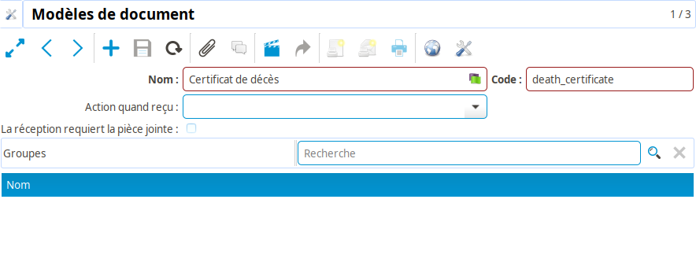
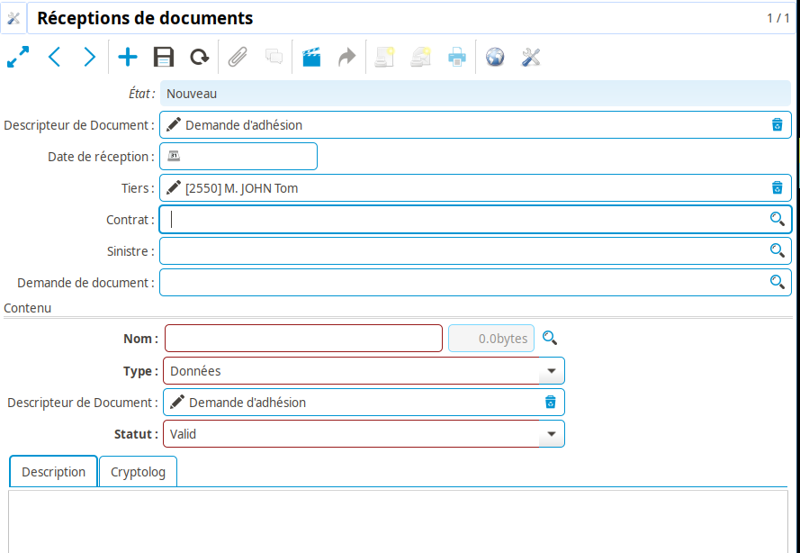

Documents
=========

Types de documents
------------------

**Coog** intègre plusieurs fonctionnalités liées à la gestion de documents.
Qu'il s'agisse de *Gestion électronique de documents*, de *Génération de
courriers*, ou de *Gestion de documents requis*, il est souvent nécessaire de
référencer des *Types de documents*.

La configuration de ces *Types de documents* se fait via le point d'entrée
*Documents > Configuration  > Modèles de documents*.

Un *Type de document* est constitué, en plus de son *Nom* et de son *Code*,
de :

* Une liste de *Groupes* habilités à visualiser les documents rattachés à ce
  type. Par exemple, dans la *GED* interne de **Coog**, un document typé
  « Questionnaire médical », dont l'accès est limité au groupe d'utilisateur
  « Médical » ne sera visible que des utilisateurs faisant parti de ce groupe.
  Les autres utilisateurs ne verront même pas l'existence de ce document, et
  ne seront en aucun cas capable de le consulter
* *La réception requiert la pièce jointe* : Si cette case est cochée, dans le
  cas où ce document est requis dans un processus métier (souscription de
  contrat, déclaration de sinistre), le gestionnaire ne pourra pas marquer le
  document comme reçu tant qu'une pièce jointe n'aura pas été rattachée à la
  demande de document. Cela permet de s'assurer qu'un document de ce type
  existe bien sur le contrat (par exemple) avant de poursuivre la souscription.
  Cette option doit être laissée non-cochée dans le cas où la *GED* interne de
  **Coog** n'est pas utilisée
* *Signature électronique requise* : Visible uniquement si *La réception
  requiert la pièce jointe* et si le module de gestion de la signature
  électronique (« Cryptolog ») est installé, permet d'indiquer que les demandes
  de documents rattachés à ce type doivent être signées électroniquement pour
  que le document soit considéré comme reçu
* *Action quand reçu* : Pour le cas où la saisie des documents dans
  l'application est traité par une équipe dédiée, cet élément de configuration
  permet de décrire quelle action doit être déclenchée lors du traitement de la
  réception. Le détails de ces actions est donné ci-dessous

Le *Type de document* est notamment utilisé :

- Pour typer les documents saisis dans la *GED* interne de **Coog**
- Pour identifier les types de documents attendus par une *Règle de demande de
  documents* en souscription / instruction sinistre
- Pour typer les documents générés par le *Moteur d'éditique* de **Coog**

Réception de documents
----------------------

Pour le cas où les documents entrants sont traités par une équipe spécifique,
**Coog** mets à disposition un point d'entrée permettant d'enregistrer un
document (et les informations correspondantes), puis de traiter automatiquement
le document en fonction de son type.

Saisie des données
~~~~~~~~~~~~~~~~~~

Pour *Recevoir un document*, il faut passer par le point d'entrée « Documents >
Réception de documents » :

Les informations demandées lors de la création sont les suivantes :

* *Descripteur de document* : il s'agit de l'information la plus structurante.
  Il s'agit du *Type de document* définit ci-dessus, et correspond concrètement
  au « type métier » du document. L'objet de ce champ est d'informer **Coog**
  de la nature fonctionnelle du document, ce qui permettra d'ensuite adapter
  les actions proposées lors du traitement
* *Date de réception* : permet d'enregistrer la date à laquelle le document a
  été reçu par la société. Il ne s'agit pas forcément de la date de la saisie
  dans **Coog**, mais de la date qui servira par la suite à déterminer, par
  exemple, si un document est toujours valide lors de la souscription
* *Tiers* : En général cette information sera toujours saisie, étant donné
  qu'il est quasiment toujours possible d'identifier la personne ayant envoyé
  un document via son contenu. L'exception notable concerne les demandes
  d'adhésion, pour lesquelles ce point d'entrée est une façon potentielle de
  permettre à l'équipe d'enregistrement des documents de facilement saisir les
  données de la personne, afin d'alléger la charge des équipes de gestion
  contrat. Le *Tiers* est indispensable à la majorité des traitements
  automatiques (il est par exemple difficile d'initier un avenant si l'on ne
  connaît même pas le tiers concerné)
* *Contrat* / *Sinistre* : Ces informations, disponibles à la saisie à partir
  du moment où le *Tiers* a été saisi, permettent d'affiner davantage le
  rattachement du document. Si l'un des deux champs est saisi, le document lui
  sera automatiquement rattaché lors du traitement
* *Demande de document* : Si, par exemple, un *Contrat* a été renseigné, et que
  ce contrat a des demandes de documents en attente, et que l'une d'entre elles
  à un *Descripteur de document* correspondant à celui du document reçu, il est
  possible de l'indiquer à cet endroit

La section *Contenu* correspond à la pièce jointe qui sera générée dans
**Coog**. En fonction du *Type*, on peut saisir directement les *Données* ou le
*Lien* contenant l'information.

L'information du *Descripteur de document* sera elle automatiquement renseignée
en fonction de ce qui aura été saisi précédemment.

Il est également possible, via le *Statut*, d'indiquer qu'un document, bien que
reçu, est *Invalide*. Par exemple, une carte d'identité incomplète. Il est
possible de donner plus de détails via le champ *Description*.

Enfin, l'onglet « Cryptolog », disponible si le module correspondant a été
installé, permet de gérer la signature électronique de la pièce jointe. En
général cette information ne sera pas saisie dans le cas d'une document reçu
par courrier.

Traitement des données
~~~~~~~~~~~~~~~~~~~~~~

Les documents saisis dans **Coog** de cette façon peuvent être au choix :

* *Mettre en attente* : Le document passera au statut « En attente ». Il
  restera dans cet état jusqu'à ce qu'un gestionnaire puisse le traiter
* *Rejeter* : Le document ne donnera lieu à aucun acte de gestion, mais restera
  toutefois enregistré dans **Coog**
* *Traiter* : **Coog** executera les actions appropriées en fonction des
  caractéristiques du document

Les deux premières actions ne nécessitent pas beaucoup plus
d'approfondissements.

Le *Traitement* d'un document reçu dépend de la configuration renseignée sur le
*Type de document*, dans le champ *Action quand reçu*.

Dans tous les cas, dès lors qu'un contrat ou un sinistre est renseigné, le
document lui sera rattaché automatiquement. En outre, si une demande de
document a été indiquée, le document lui sera également rattaché, ce qui en
général marquera le document comme reçu dans le processus.

L'action « principale » sera l'une des suivantes, en fonction de l'action
paramétrée sur le *Descripteur de document* :

* *Rattachement libre* : Lors du traitement, l'utilisateur aura la possibilité
  de *Rattacher* le document, par exemple au contrat sélectionné. Si l'élément
  auquel il est rattaché est actuellement dans un processus, l'utilisateur aura
  la possibilité de reprendre ce processus directement suite au rattachement.
  Dans le cas où **Coog** ne dispose pas d'assez d'informations pour effectuer
  un rattachement, l'utilisateur en sera informé
* *Nouvel avenant / Nouveau processus d'avenant* : Dans le cas où un contrat a
  été saisi, le traitement déclenchera le démarrage d'un processus d'avenant
  pour le gestionnaire sur le contrat en question
* *Démarrer une souscription (collective)* : Typiquement utilisé pour un
  document de type « Demande d'adhésion » ou équivalent. Le traitement
  déclenchera l'initialisation d'une souscription pour le Tiers rattaché au
  document
* *Nouvelle déclaration de sinistre* : Permet d'initialiser une nouvelle
  déclaration de sinistre pour le tiers concerné par le document

:Attention: La liste des paramétrages possibles dépend des modules installés.
            Certains d'entre eux peuvent donc être indisponibles en fonction de
            l'environnement sur lequel vous travaillez
