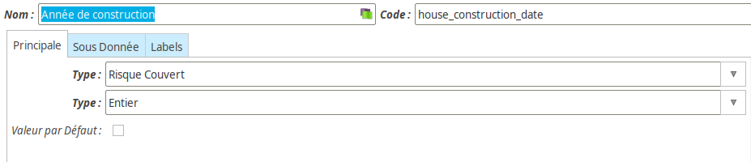
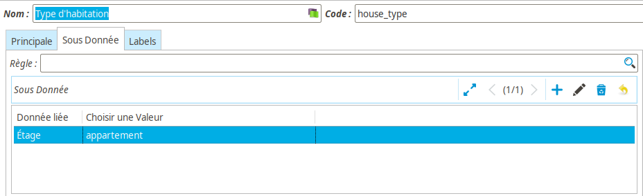

Données complémentaires
=======================

Les *Données complémentaires* sont la fonctionnalité de **Coog** permettant de
facilement adapter le paramétrage aux demandes métier. Concrètement, elles
permettent d'ajouter de nouvelles données aux objets métier, en fonction d'un
paramétrage.

Définition d'une donnée complémentaire
--------------------------------------

Les *Données complémentaires* sont définies dans le point d'entrée
*« Laboratoire / Configuration / Données complémentaires »*. Elles sont
globales à l'application, donc partagées / partageables entre les différents
éléments de paramétrage **de même nature**.

Les données complémentaires ont un *Nom*, un *Code*, et des *Libellés*.

**Le *Code* est extrêmement important pour les données complémentaires, étant
donné que c'est ce qui permettra de l'utiliser par la suite dans le reste du
paramétrage (Moteur de règles)**

En plus de ces champs, on trouve :

* *Type métier* : Les *Données complémentaires* sont rattaché à un type
  d'entité métier. Concrètement, il s'agit de facilement pouvoir filtrer les
  données disponibles dans les différents paramétrage. On va y trouver
  principalement :

  * *Contrat* : Ces données seront demandées à la souscription une fois par
    contrat. Elles sont paramétrées au niveau du produit
  * *Risque couvert* : Ces données seront demandées une fois par risque
    couvert, à la souscription ou lors d'un ajout. Elles sont paramétrées au
    niveau du descripteur de risques
  * *Option* : Ces données seront demandées lors de la souscription d'une
    garantie. Elles sont paramétrées au niveau du paramétrage des garanties
  * *Préjudice* : Ces données seront demandées lors de la déclaration d'un
    nouveau sinistre. Le paramétrage se fait dans la définition des préjudices
  * *Prestation* : Ces données seront demandées lors de l'exercice d'une
    prestation, au cours de l'instruction d'un sinistre. Elles sont paramétrées
    dans la configuration de la prestation. À noter qu'elles peuvent être
    modifiées lors de la création des indemnisations
  * *Protocole de commissionnement* : Ces données permettent de personnaliser
    les protocoles de commissionnement, afin que les règles utilisées dans les
    plans de commissionnement associés puissent en dépendre
  * *Produit* : Ces données permettent d'ajouter des propriétés (principalement
    utilisées en éditique) sur les produits / définitions de garanties

  Il existe d'autre types de données, mais qui sont réservées dans leur usage à
  des cas particuliers qui seront détaillés dans la documentation associée.

* *Type technique* : Le *Type technique* de la donnée correspond au format
  attendu. Concrètement, les valeurs possibles sont les suivantes :

  * *Alphanumérique* : Un texte libre, typiquement pour des données de type
    métier *Produit*
  * *Booléen* : Une case à cocher. Par exemple, pour un préjudice *Décès*,
    « Était-ce un accident »
  * *Date* : Une date, souvent utilisée pour des questions d'éligibilité
  * *Date-heure* : Rarement utilisé, permet de saisir une date avec l'heure
    associée
  * *Entier* : Un entier (positif ou négatif). Peut être utilisé pour parler
    d'un *Nombre* (exemple : nombre d'enfants)
  * *Numérique* : Une valeur numérique (avec décimales). Le nombre de décimales
    peut être paramétrés
  * *Numérique (virgule flottante)* : **NE PAS UTILISER**
  * *Sélection* : Une valeur textuelle, à choisir parmi une liste de valeurs
    possibles :

    .. image:: images/donnees_complementaires_selection.png
        :align: center

    Les valeurs possibles sont définies comme dans l'exemple ci-dessus, avec la
    partie à gauche du ``:`` étant la clé de la valeur (autrement dit ce qui
    sera enregistré), et celle de droite le libellé qui sera affiché aux
    utilisateurs. On peut y penser comme à un couple *Code* / *Nom* sur les
    éléments de paramétrage.

    Le champ *Sélection triée* permet de contrôler l'affichage de la liste de
    valeurs à l'utilisateur. Si la case est cochée, la liste sera triée
    alphabétiquement automatiquement. Sinon, l'ordre sera celui définit dans la
    liste des données.

* *Valeur par défaut* : Si cette case est cochée, lors de l'utilisation de la
  donnée, une valeur par défaut sera renseignée correspondant à celle choisie

Sous-données
------------

Il est possible de définir des *Sous-données* complémentaires. L'objectif de
cette fonctionnalité est de pouvoir cacher ou afficher des données en fonction
de la valeur d'autres données.

Le principe est d'indiquer dans *Choisir une valeur* la valeur « filtre », et
dans le champ *Donnée liée* la donnée complémentaire à ajouter dans le cas où
la valeur de la donnée « parente » correpond à la valeur « filtre ».

L'exemple ci-dessus revient à dire :

*Si la valeur saisie pour la donnée « Type d'habitation » est « Appartement »,
il faut demander en plus une valeur pour la donnée « Étage »*

En général, ce type de paramétrage a lieu sur des données de type *Sélection*,
l'idée étant de compléter les données en fonction d'une catégorisation. Il est
toutefois possible de le faire avec tous les types de données. En revanche
cette saisie simplifiée n'est pas forcément adaptée à toutes les données (par
exemple, il n'est pas possible d'afficher une donnée si un entier est compris
entre 1 et 10, sauf à saisir les 10 cas).

Pour ces cas-là, il est possible de définir une *Règle*. Cette règle aura accès
aux données complémentaires déjà renseignées, et pourra retourner un
dictionnaire avec les nouvelles clés et une éventuelle valeur par défaut.

.. code-block:: python

    if compl_montant_assure() > 1000000:
        return {
            'patrimoine_artistique': True,
            }
    else:
        return {}

L'exemple ci-dessus demandera la donnée complémentaire « Patrimoine
artistique » si la donnée « Montant assuré » a une valeur saisie supérieure à
1 000 000.

:Attention: Les données complémentaires « liées » doivent faire partie des
            données *à afficher* pour être prises en compte. Par exemple, dans
            le cas donné en exemple, si la donnée « Patrimoine artistique » ne
            fait pas partie des données complémentaires de la garantie, elle ne
            sera pas demandée même si la donnée « Montant assuré » est
            renseignée

Données similaires
------------------

Il existe un certain nombre de données techniquement similaires aux *Données
complémentaires*. Autrement dit, il s'agit d'éléments de paramétrage ayant un
nom / code et un type technique permettant de décrire la donnée.

Par exemple, les paramètres de règles ou bien les « détails » sur les
garanties.

Ces données sont des versions simplifiées des données complémentaires, par
conséquent leur documentation (pour la saisie) se contente de reprendre
celle-ci.
