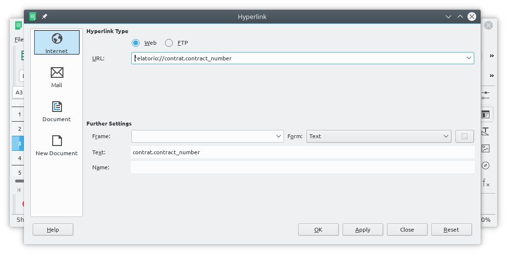

Éditique
========

**Coog** embarque un moteur de génération de documents. Ces documents peuvent
être de différents types (texte plat, texte formatté, tableaux...), et être
générés à l'aide de différents outils (LibreOffice, eMail, etc.).

La génération des documents est entièrement configurée depuis **Coog**, et est
facile à intégrer dans les processus de gestion. Il est possible d'imprimer
manuellement un document à tout moment depuis (par exemple) un contrat, mais
également de déclencher automatiquement une impression / envoi de mail lors de
certains évènements.

Enfin, il est possible sous certains conditions de générer « en masse » des
documents à l'aide de traitements batchs.

.. image:: images/editique_menu.png
    :align: center

La première partie (*Définition d'un modèle*) détaille les éléments de
configuration généraux des modèles de courriers. La seconde (*Dynamicité des
modèles*) explique les différentes façon possibles d'introduire de la
dynamicité. Il s'agit (par exemple) de définir automatiquement le destinataire
d'un email depuis un contrat / le répertoire d'export à partir du produit, mais
également le détail de l'écriture de modèles dynamiques à l'aide de
*LibreOffice*.

Définition d'un modèle
----------------------

Données générales
~~~~~~~~~~~~~~~~~

L'élément central de l'éditique de **Coog** est le *Modèle de courrier*. Il
s'agit du descripteur utilisé pour définir le type, le contenu, et les
modalités de génération d'un document.

La première partie des données d'un modèle de courrier contient des
informations générales. On y retrouve les classiques *Nom*, *Code* et *Label*,
mais surtout :

* *Modèle* : Un *Modèle de courrier* est conçu pour un type de donnée
  particulier. Concrètement, un modèle destiné à être généré à partir d'un
  contrat ne peut pas être utilisé depuis un tiers. Le *Modèle* permet de
  choisir parmi la liste des différents types de données « imprimables » celui
  qui sera concerné par le modèle
* *Type de donnée* : Selon les modèles, il est possible de sélectionner un
  « sous-ensemble » d'entrées pour lesquelles le modèle sera disponible. Les
  valeurs possibles sont définies directement dans **Coog**, autrement dit
  elles ne sont pas accessibles via le paramétrage. Cela permet par exemple de
  limiter la disponibilité d'un modèle de courrier aux contrats actifs
  uniquement (et donc qu'il ne soit pas disponible pour les devis)
* *Type d'entrée* : Il s'agit d'un des champs les plus importants lors du
  paramétrage, il définit la façon dont le document sera généré. En fonction de
  sa valeur, les données à saisir par la suite seront différentes. Les valeurs
  possibles lors de la saisie dépendent des modules qui sont installés. Les
  valeurs habituellement utilisées sont :

  * *LibreOffice Writer* : Documents texte de type « Microsoft Word™ »
  * *LibreOffice Calc* : Documents texte de type « Microsoft Excel™ »
  * *Document plat* : Documents « fixes », non dépendant des données de
    l'entité (contrat...) sélectionné lors de la génération. Utilisé
    principalement dans le cas de pièces jointes sur les e-mails, typiquement
    pour les conditions générales d'un contrat
  * *Email* : Génération et envoi d'e-mails dynamiques, avec possibilité
    d'ajout de pièces jointes
  * *Variable de flux* : Utilisé principalement dans le cadre du développement
    d'interfaces. Permet de générer des fichiers formattés à partir des données
    des records sélectionnés lors de la génération
* *Format pour la GED interne* : Ce champ est utilisé pour activer et
  configurer le stockage automatique des documents générés dans la GED interne
  de **Coog**. Les valeurs possibles sont :

  * *Vide* : Si rien n'est sélectionné, le document ne sera pas stocké dans la
    GED
  * *Originel* : Le document sera stocké dans le format de sa génération
    (typiquement au format *LibreOffice*)
  * *Microsoft Office™* : Les documents générés seront automatiquement
    convertis aux formats compatibles « Microsoft Office™ » avant
    enregistrement en GED
  * *Pdf* : Les documents seront convertis en fichiers *Portable Document File
    (pdf)* avant la sauvegarde en GED
* *Format de sortie* : Ce champ a les mêmes valeurs possibles que le *Format
  pour la GED interne*, et permet de contrôler le format de sortie du document.
  Il s'agit concrètement du document qui sera affiché à l'utilisateur / envoyé
  en pièce jointe d'un e-mail, stocké dans un fichier, etc.
* *Descripteur de document* : Si un type de document est sélectionné et que le
  modèle est configuré pour être enregistré dans la GED interne, il le sera
  rattaché à ce type de document
* *Éditable* : Si cette case est coché, lors de la génération manuelle par un
  utilisateur du document, il aura la possibilité de le modifier avant
  enregistrement. Cela suppose :

  * Qu'un répertoire partagé ait été mis à disposition entre les postes
    utilisateur et le serveur applicatif **Coog**
  * Que **Coog** ait été configuré pour cela
  * Que les postes utilisateur disposent de *LibreOffice* afin d'être en mesure
    d'éditer les documents générés

Stockage des documents
~~~~~~~~~~~~~~~~~~~~~~

Indépendament du reste de la configuration, il est possible de forcer **Coog**
à stocker les documents générés sur le serveur. Cela est particulièrement utile
pour les documents destinés à être utilisés automatiquement par d'autres
systèmes.

.. image:: images/editique_naming.png
    :align: center

Le *Répertoire d'export* permet de « ranger » les documents générés par modèle
au sein du dossier configuré lors de l'installation de **Coog**. Typiquement,
la valeur de ce champ sera quelque chose comme ``/mon_modele``.

De la même façon, le champ *Nom du fichier en sortie* permet de modifier le
nom du fichier généré. Par défaut, ce nom concatène le nom du modèle, le nom de
l'entité sur lequel il est généré (par exemple, pour un contrat, le numéro du
contrat), ainsi que la date et l'heure de génération.

Ces deux champs sont des **champs dynamiques**, dans le sens où leur valeur
peut dépendre des caractéristiques de l'entité à partir de laquelle le courrier
est généré. Ce point et l'utilisation de ces champs sera abordée
ultérieurement.

Options de génération
~~~~~~~~~~~~~~~~~~~~~

Les options de génération permettent de mieux contrôler la façon dont sont
générés les documents. En particulier, la possibilité de générer le modèle sur
plusieurs entités simultanément.

.. image:: images/editique_generation_options.png
    :align: center

* *Scinder les documents* : À partir du moment où plusieurs documents sont
  générés (typiquement, si l'on sélectionne plusieurs contrats pour envoyer un
  courrier de groupe), deux possibilités sont envisageables :

  * Générer un seul document pour l'ensemble des éléments sélectionnés.
    Concrètement, si le document généré pour un élément prend deux pages, et
    qu'il y a 10 éléments, on obtiendra un document de 20 pages contenant
    l'agrégation des 10 documents
  * Générer un document distinct par entité

  En général, le comportement attendu est de scinder les documents. Le cas des
  regroupements est à envisager si les données à inclure dans le document
  dépendent de l'ensemble des documents sélectionnés (ex : on souhaite faire
  apparaître le nombre de contrats sélectionnés dans le document).

* *Destinataire requis* : Lors de la *génération manuelle* des documents, il
  est possible de forcer le destinataire / l'adresse / l'e-mail à utiliser dans
  le document. En général, ces informations peuvent être calculées
  automatiquement par **Coog** à partir de l'objet métier sur lequel s'appuie
  la génération, mais pour certains cas il peut être souhaitable de laisser
  davantage de latitude au gestionnaire. Cocher cette case permet d'activer ce
  comportement

:Attention: À partir du moment où la case *Destinataire requis* est cochée, le
            document ne peut plus être généré sur plusieurs entités
            simultanément. En effet, une génération en masse suppose que le
            document est « tout seul » capable de déterminer l'adresse à
            utiliser à partir, par exemple, du contrat en cours de traitement

Contenu du document
~~~~~~~~~~~~~~~~~~~

La configuration détaillée du contenu des documents générés dépend
(logiquement) du mode de génération sélectionné.

Document Plat
"""""""""""""

Le cas du document plat est le plus simple. La seule information a saisir est
un document (format au choix) qui sera retransmis en l'état (typiquement en
pièce jointe d'un e-mail).

:Note: La configuration pour les documents plats et pour les modèles
       *LibreOffice* est identique, la différence étant que dans le cas d'un
       modèle *LibreOffice* le document saisi n'est qu'un intermédiaire utilisé
       pour la génération

Le document est en fait une liste de versions, qui permettent de sélectionner
des modèles différents en fonction d'un certain nombre de critères. Les
informations indispensables sur ces versions sont :

* *Date de début* : Permet de faire évoluer fonctionnellement le document. Par
  exemple, on peut décider qu'à partir d'une date donnée, on souhaite utiliser
  une nouvelle version du document
* *Langue* : La langue du document. Elle sera utilisée pour filtrer le document
  à utiliser en fonction de la langue du destinataire. Un modèle de document
  donné peut donc servir à la fois pour un destinataire francophone, et un
  destinataire québecois
* *Données* : Il s'agit du document proprement dit

Dans le cas d'un *Document plat*, le document contenu dans le champ *Données*
correspondant aux critères de sélection (*Date*, *Langue*...) sera retransmis
en l'état.

LibreOffice (Write)
""""""""""""""""""""

Dans le cas d'un modèle de type *LibreOffice (Write*), la saisie est identique
à celle d'un *Document plat*. La différence est que le type de document attendu
est un fichier au format *OpenDocument Text (.odt)* ou *Flat OpenDocument Text
(.fodt)*. Il s'agit concrètement de « templates » *LibreOffice* destinés à la
génération de documents de type « Microsoft Word™ ». La façon d'écrire ces
documents est détaillé plus loin.

LibreOffice (Calc)
""""""""""""""""""

De même, les documents *LibreOffice (Calc)* acceptent des fichiers au format
*OpenDocument Sheet (.ods)* qui sont utilisés pour générer des documents de
type « Microsoft Excel™ ». La façon de saisir ces documents est également
détaillée dans la partie suivante du document.

Email
"""""

La saisie d'un e-mail utilise la mécanique de *Champs dynamiques* évoquée plus
haut (pour la configuration des *Options de génération*). Le détail de
l'utilisation « avancée » de ces champs sera donné ultérieurement, dans un
premier temps voici leur usage.

Les champs à saisir sont relativement clairs :

* *Émetteur de l'email* : L'adresse e-mail qui sera utilisé comme émetteur de
  l'e-mail
* *Destinataires de l'email* : La liste des adresses e-mail destinataires de
  l'e-mail. Ce champ fera classiquement parti des champs calculés dynamiquement
  à partir de la donnée servant de base au document
* *CC* : Similaire aux *Destinataires de l'email*, permet d'ajouter des
  adresses e-mail en *copie* du mail
* *CCi* : Similaire aux *Destinataires de l'email*, permet d'ajouter des
  adresses e-mail en *copie cachée* du mail
* *Sujet de l'email* : Le *sujet* qui sera utilisé dans le e-mail,
  potentiellement calculé dynamiquement
* *Corps en html* : Dans le cas où cette case est cochée, le corps de l'e-mail
  pourra utiliser des balises *HTML* pour le formatage
* *Corps de l'email* : Le contenu de l'email, en général calculé dynamiquement
* *Email bloquant* : Si coché, l'utilisateur sera bloqué tant que l'e-mail
  n'aura pas été envoyé. Cela permet d'éviter que l'utilisateur croit que
  l'e-mail est parti alors qu'il ne l'est pas. L'inconvénient principal est que
  la génération d'un e-mail, en particulier s'il est accompagné de pièces
  jointes complexes à générer, peut être relativement longue

Lors de la configuration d'un e-mail, il est possible :

* d'y ajouter des pièces jointes. Ces pièces jointes sont d'autres modèles de
  courriers (classiquement des documents de type *LibreOfficce* ou *Document
  plat*) qui seront générés lors de l'envoi du mail et ajoutés en pièces
  jointes
* de définir des images qui sont ensuite utilisables dans le corps du mail dans
  le cas d'un email ayant la cas *Corps en HTML* cochée

Paramètres
~~~~~~~~~~

En plus des données des entités à partir duquel un modèle est généré, il est
fréquent que d'autres informations soient nécessaires à la génération d'un
document. Typiquement, on peut vouloir laisser la main au gestionnaire pour
inclure certaines parties du document. Pour ce faire, l'approche « simple » est
d'activer l'option *Éditable* du modèle, et de faire la modification
manuellement. Toutefois, **Coog** permet également l'ajout de paramètres
dynamiques qui seront demandés à l'utilisateur lors de la génération du
document.

Les *Paramètres* sont utilisés pour cela. Les données ajoutées dans cette liste
seront automatiquement affichées à l'utilisateur, et les valeurs saisies seront
disponibles lors de la génération finale du document. Les *Paramètres*
ressemblent beaucoup aux *Données complémentaires* utilisées dans le
paramétrage produit.

On retrouve *Nom* et *Code*, le *Type* permet d'indiquer le type de donné
attendu lors de la saisie. Se référer à la documentation des *Données
complémentaires* pour davantage de détails sur les différents types.

Actions automatiques
~~~~~~~~~~~~~~~~~~~~

Comme évoqué précédemment, il est possible de déclencher des impressions /
envois d'e-mails automatiquement lors de certains événemenets. Cela est
possible via le champs *Actions par types d'événements*. Le détail de cette
configuration fait l'objet d'une documentation dédiée, la génération de
documents n'étant qu'une des possibilité de ce type de paramétrages.

Paramétrage des produits
~~~~~~~~~~~~~~~~~~~~~~~~

Il est possible de filtrer les documents disponibles à l'impression en fonction
du produit (d'assurance) auquel l'entité à imprimer est rattaché. Le produit
est en général retrouvé à partir du contrat concerné. Par exemple, pour une
entité de type *Prélèvement*, on retrouvera le produit à partir de la *Ligne
comptable* auquel ce prélèvement est adossé, et à partir de là via le *Contrat*
concerné.

Il est aussi possible à cet endroit de définir un *Style* pour les modèles de
type *LibreOffice*, qui sera ajouté par-dessus le document généré (utile pour
gérer des en-têtes / logos par exemple).

Dynamicité des modèles
----------------------

L'élément clé de la génération de courriers dans **Coog** est la flexibilité
qui est offerte à l'aide des *Champs dynamiques* et des templates
*LibreOffice*.

Dans un premier temps, nous verrons comment utiliser concrètement les données
des entités imprimées dans les modèles de courrier, puis nous détaillerons les
outils disponibles pour les non-développeurs permettant  de faciliter
l'identification des données à récupérer.

Templates LibreOffice
~~~~~~~~~~~~~~~~~~~~~

**Coog** utilise pour la génération de documents dynamiques (ou de tableaux)
les possibilités offertes par *LibreOffice*. Un template *LibreOffice* est un
document « normal », à l'exception du fait qu'il a accès à un certain nombre de
données issues de **Coog**. Il dispose également d'outils algorithmiques
basiques lui permettant de manipuler la structure du document en fonction des
caractéristiques de l'entité générant le rapport.

Bases
"""""

Le document ci-dessus utilise les possibilités de templating de **Coog**
combinées à *LibreOffice* pour générer un document contenant le numéro d'un
contrat.

L'élément « grisé » ``<objects[0].contract_number>`` est une instruction
destiné à **Coog**, qui permet (dans ce cas précis) d'afficher le numéro du
contrat.

Ces éléments sont ce qui permettent aux documents générés par **Coog**
d'afficher n'importe quelle donnée d'un contrat (par exemple) sans avoir besoin
de réaliser des développements. L'avantage est une meilleure réactivité en cas
de nécessité d'évolutions (pas besoin de livrer une nouvelle version), mais
également une plus grande flexibilité dans le contenu des documents.
L'inconvénient est que la maîtrise de ces éléments demande un minimum de
connaissances en algorithmique, une bonne compréhension du modèle de **Coog**
(des outils existent et seront expliqués par la suite), et idéalement une
connaissance a minima du langage *Python* qui est utilisé dans **Coog**.

Avant d'aller plus loin, quelques notions de base :

* Les données de **Coog** (contrat, tiers, quittance, etc.) sont constitués de
  *champs*. Un champ est une propriété de la donnée, et correspond en général à
  une information affichée dans l'application
* Le symbole ``.`` dans les éléments de templating (entre ``objects[0]`` et
  ``contract_number`` dans le cas ci-dessus) permettent d'*accéder* aux champs.
  Ici, on **accède** au champ ``contract_number`` (*Numéro de contrat*) de
  l'entité ``objects[0]`` (que l'on suppose être un contrat)
* **Coog** étant développé en anglais, les noms des champs sont
  quasi-systématiquement en anglais
* Les données « au pluriel » (i.e. en général se terminant par un « s » en
  anglais) sont des *listes* des données. Ici, ``objects`` est la liste des
  objets sélectionnés lors de l'impression
* On peut travailler sur un élément d'une liste en utilisant les crochets
  (``[]``) : ``ma_liste[0]`` est le premier élément de la liste,
  ``ma_liste[1]`` le second, etc. ``ma_liste[-1]`` est le dernier élément

Ici, ``objects[0].contract_number`` est donc *« Le champ "contract_number"
(numéro de contrat) du premier élément de la liste "objects" »*.

Les éléments de contrôle sont créés via le menu *« Insertion > Champ > Autres
champs »* (Raccourci *Ctrl + F2*), puis en sélectionnant le type *Substituant*,
format *Texte* :

En général, afin d'éviter cette manipulation, la majorité des données sont
saisies en copiant / collant une donnée existante, puis en modifiant la copie.

:Attention: Le texte affiché dans le document pour représenter les données est
            écrit en *petites capitales*. Autrement dit, il s'agit de
            minuscules, qui sont affichés sous forme de lettres capitales. Il
            est important de faire attention à cela, car la casse (majuscules /
            minuscules) est **très importante**

Conditions
""""""""""

Au-delà de la saisie de données, il est intéressant dans les modèles de pouvoir
conditionner l'apparation d'une partie du document. Dans le cas ci-dessus, on
souhaite n'afficher le texte (au milieu) que dans le cas où le numéro du
contrat vaut « CTR0000001 ». On utilise pour cela l'opérateur ``if``, qui est
systématiquement écrit ``if test="........"``. Si la condition définie entre
les ``"`` est vraie, le contenu du document situé entre les éléments ``<if
test...>`` et ``</if>`` sera affichée.

La définition des conditions utilise les opérateurs *Python* pour déterminer la
nature (vraie / fausse) :

* ``==`` signifie l'égalité
* ``!=`` signifie la différence
* ``a < b`` / ``a <= b`` est vrai si ``a`` est plus petit (strictement ou pas)
  que ``b``
* ``a > b`` / ``a >= b`` est vrai si ``a`` est plus grand (strictement ou pas)
  que ``b``

Il est également possible de combiner des conditions à l'aide des opérateurs
``or`` et ``and``, en regroupant à l'aide de parenthèses :

``if test="((a < b) and (c < d)) or (d >= a)"``

Boucles
"""""""

Il est également possible d'itérer en utilisant la directive ``for each``.

Le principe d'une boucle est que le contenu (entre les éléments ``for
each="variable in <liste>"`` et ``/for``) sera répété autant de fois qu'il y a
d'éléments dans la liste. Ici, la ``variable`` s'appelle ``line``, et la liste
est ``invoice.invoice_address.full_address.split('\n')[:-1]``.

*Invoice* signifie *Quittance* en anglais. En suivant les ``.``, on regarde :

* L'*adresse* (``.invoice_address``) de la *quittance*
* La *version formattée* de cette adresse (``.full_address``)
* Que l'on *découpe ligne à ligne* (``.split('\n')``)
* En *excluant la dernière ligne*, qui contient le pays et qui n'est pas
  nécessaire en général (``[:-1]``)

Le contenu de la boucle, ici, est juste ``<line>``, soit la variable utilisée
dans la boucle. Le résultat de cet exemple est donc d'afficher les différentes
lignes de l'adresse formatée de la quittance, à l'exception de la dernière.

:Note: Les différents champs (``invoice_address`` et ``full_address``) sont des
       données métiers de **Coog**. La façon de les retrouver sera détaillée
       plus loin. Les éléments ``split('\n')`` et ``[:-1]`` sont des éléments
       syntaxiques de *Python* non couverts par ce document

Tableaux
""""""""

Il est possible de générer des tableaux ayant un nombre de ligne variables à
l'aide de boucles. Il faut toutefois faire attention à la structure.

L'exemple ci-dessus affichera une ligne par garantie sur le contrat
(``contract.covered_element_options``), avec deux colonnes dans chaque ligne
contenant le nom (``garantie.coverage.name``) de la garantie, et sa date
d'effet (``garantie.start_date``).

Le plus important lors de l'écriture d'un tableau dynamique est :

* De bien séparer les éléments de contrôle (``for each...`` et ``/for``) sur
  des lignes à part
* De fusionner les cellules les contenants

On constate ici que l'on peut utiliser la ``variable`` (ici il s'agit de
``garantie``) dans des cellules différentes.

Il est également possible de faire des boucles *horizontales*, même si cela est
en général moins utilisé.

Le tableau ci-dessus affichera une colonne par garantie du contrat.

Variables
"""""""""

Il est possible de définir des variables que l'on peut réutiliser plus tard.
Cela peut être utile si certaines données vont être réutilisées plusieurs fois,
ou dans le cas de données résultant d'un calcul lourd que l'on souhaite éviter
de recalculer plusieurs fois.

Il s'agit principalement d'une aide à l'organisation et à la lecture du
document plutôt qu'autre chose.

La fonction ``setVar(cle, valeur)`` permet d'associer une valeur à une clé. Par
convention, la clé est souvent préfixée d'un caractère « souligné » (``_``).

La fonction ``getVar(cle)`` permet ensuite d'accéder à la valeur facilement.

Calc
""""

Pour les documents de type *tableur*, le fonctionnement est identique, à une
exception notable près, qui est la saisie des éléments. Les « Substituants » ne
sont pas disponibles dans *LibreOffice Calc*, le mode de saisie des éléments
est donc différent.

En terme de structure, le comportement est le même que pour les tableaux des
documents normaux, la différence étant que le maillage existe déja (et qu'il
n'y a pas besoin de fusionner les cellules).

Pour insérer un nouvel élément, il faut passer par « Insertion > Hyperlien »
(ou utiliser le raccourcis ``Ctrl + K``) et saisir les caractéristiques
comme présenté ci-dessous :

L'*URL* est la partie importante (dans le sens où c'est elle qui contient
l'information qui indique à quoi correspond l'élément). Elle doit être préfixée
du texte ``relatorio://`` pour fonctionner correctement (*Relatorio* est le nom
du moteur de templating utilisé par **Coog**).

Pour des raisons de lisibilité, il est recommandé de renseigner le champ
*Texte* avec le contenu de l'*URL* (sans le préfixe), mais cela n'est pas
obligatoire pour le bon fonctionnement du template.

Autres
""""""

Quelques informations utiles :

* Il est possible d'utiliser les éléments présentés dans les en-têtes /
  pieds-de-page
* Pour les éléments ``if``, les lignes les contenant seront supprimées lors de
  la génération. Concrètement, ces lignes ne doivent contenir que le ``if`` /
  ``/if``
* *Python* permet de faire des *mini-ifs* dans un élément :

  ``contrat.contract_number if contrat.product.code == 'mon_produit' else
  'autre'``

  affichera le numéro du contrat (``contract_number``) si le code du
  produit (``contrat.product.code``) vaut ``'mon_produit'``, sinon (``else``)
  il affichera ``'autre'``

Champs dynamiques
~~~~~~~~~~~~~~~~~

Nous avons mentionné plusieurs fois dans la partie *Données générales* des
champs « dynamiques » (*Répertoire d'export*, *Nom du fichier*, la majorité
des champs du type *Email*, etc.). Ces champs obéissent à la même logique que
pour les templates *LibreOffice*, à l'exception du fait que leur saisie a lieu
directement dans **Coog**. On accède aux données en utilisant la syntaxe
``${...}``.

Par exemple, pour « ranger » les documents générés par code produit, on
pourrait écrire :

Données de bases
~~~~~~~~~~~~~~~~

Par défaut, un certain nombre de données sont « disponibles » pour être
utilisées dans les modèles de courriers :

* ``objects`` contient la liste des entités sur lesquelles le modèle est
  généré
* ``Sender`` contient le tiers duquel est originaire le document. Il s'agira
  typiquement de la société utilisant **Coog**
* ``SenderAddress`` est l'adresse par défaut du ``Sender``
* ``Company`` est la société utilisant **Coog**. Il s'agit souvent du même
  tiers que le ``Sender``
* ``Today`` est la date du jour
* ``user`` est l'utilisateur générant le document (utile pour une signature par
  exemple)

Les données suivantes ne sont **fiables** que dans le cas où la case
*Destinataire requis* est cochée, et que le courrier est généré manuellement
par un utilisateur :

* ``Party`` est le tiers destinataire du courrier
* ``Address`` est l'adresse sélectionnée
* ``Lang`` est la langue du ``Party``, utilisée principalement lors du
  formatage des dates / montants

Enfin, un certain nombre de fonctions sont disponibles permettant de faciliter
le formattage (les paramètres sont entre parenthèses) :

* ``format_number(valeur, langue, decimale)`` permet d'afficher un nombre en
  fonction d'une langue (les symboles utilisées pour indiquer les décimales
  dépendant de la langue). Exemple :

  ``format_number(10.12345, Lang, 3)`` donnera ``10,123`` (si on considère que
  la langue est le français)
* ``format_currency(valeur, langue, monnaie, symbole)`` affiche un montant avec
  éventuellement le symbole de la monnaie (si le paramètre ``symbole`` vaut
  ``True`` (*Vrai*)) :

  ``format_currency(10.12345, Lang, quittance.currency, True)``
  aura pour valeur ``10,12 €`` (virgule parce que ``Lang`` est le français,
  deux décimales parce que l'on est en euros, et symbole affiché parce que
  ``symbole`` vaut ``True``)
* ``FDate(date, langue)`` formate une date en fonction de la langue passée en
  paramètre :

  ``FDate(contrat.start_date, Lang)`` retournera une date au format
  ``jour/mois/année`` (*01/01/2020*) si la langue est le français
* ``round(valeur, nombre)`` arrondi la valeur au nombre de décimale. La
  différence avec ``format_number`` est que le résultat est une valeur et pas
  du texte (peut être utile lors de calculs effectués à la volée dans le
  document)
* ``Decimal(valeur)`` permet de « créer » des nombres pour faire des calculs.
  Concrètement, il ne faut jamais écrire ``quittance.total_amount * 0.09``
  (pour des raisons techniques), mais plutôt ``quittance.total_amount *
  Decimal('0.09')``
* ``ConvertFrequency(frequence_source, frequence_dest)`` permet de connaître le
  facteur entre deux fréquences. Par exemple :

  ``ConvertFrequency('yearly', 'month')`` vaut ``12`` (il y a 12 *mois* dans
  une *année*)

Il existe une fonction particulière utilisable dans le cas de reportings, qui
permet de créer un tableau sur la base des résultats d'une recherche. Il s'agit
de la fonction ``Search(criteres)``. Les ``criteres`` définissent le périmètre
de la recherche, mais nécessitent une formation de développeur pour pouvoir
être écrits.

Récupération des données
~~~~~~~~~~~~~~~~~~~~~~~~

L'élément restant afin de maîtriser la génération de documents consiste en la
capacité à déterminer les champs à utiliser pour retrouver telle ou telle
donnée.

Idéalement, ce travail est celui d'un développeur qui, disposant des accès au
code source de **Coog**, peut facilement retrouver ces informations. À défaut,
**Coog** embarque un certain nombre de fonctionnalités permettant à un
utilisateur confirmé de s'y retrouver.

La première chose à faire est de vérifier que le module de *Debug* est installé
dans un environnement de test (**pas en production**). Cela peut être vérifié
en se rendant dans le point d'entrée *Administration / Modules*, et en
consultant le statut de ce module.

Pour utiliser le module sur une entité (par exemple un contrat), il faut :

* Retrouver l'*id* et le *modèle* du contrat, via le *Menu du contrat / Voir
  les logs* :

    .. image:: images/editique_debug_logs.png
        :align: center

    .. image:: images/editique_debug_id.pngj
        :align: center

  Ici l'*id* du contrat est ``6694``, et son *modèle* est ``contract``. Le
  *Modèle* représente techniquement le type d'information de l'entité
  sélectionnée, et l'*Id* est son identifiant technique dans la base de données
* Lancer le point d'entrée *Administration / Debug / Déboguer une instance*
* Renseigner l'*id* du contrat dans le champ *Id à calculer*
* Saisir le *Modèle* dans le champ *Nom du modèle*

:Note: la majorité des données sont cachées ici pour des raisons de
       confidentialité

On voit à cet endroit la liste des champs du contrat avec leur valeur. Les
champs affichés dépendent des modules disponibles sur cette installation de
**Coog**.

Les valeurs du type ``Pool().get('xxxxx')(yyy)`` correspondent à d'autres
entités de **Coog**. Par exemple, ``Pool().get('party.party')(10935)``
correspond à l'entité ayant pour *Modèle* ``party.party`` (*Tiers*) et pour
*Id* ``10935``.

C'est de cette façon que l'on peut retrouver les données « intéressantes » à
inclure dans les documents.

Afin de faciliter les vérifications, il est possible d'évaluer directement
depuis cet écran les données de l'entité :

.. image:: images/editique_debug_evaluation.png
    :align: center

Ce champs texte permet d'accéder directement aux données de l'entité
sélectionnée, un peu de la même façon que ce qui est fait dans les templates de
document :

Ce point d'entrée permet de tester même les expressions plus complexes
(*mini-ifs*), les boucles, etc.

Pour aller plus loin
--------------------

* Avancer demande une bonne connaissance du modèle sous-jacent de **Coog** pour
  retrouver les données attendues. Il est quasi-indispensable de disposer du
  module de *Debug* pour pouvoir créer des
  modèles de façon efficace.
* De même, apprendre à utiliser *LibreOffice* pour la mise en page est
  indispensable
* Ne pas hésiter à s'inspirer des modèles existants (fournis par défaut dans
  **Coog** ou bien déjà configurés)
* En cas de blocage demander à un développeur (interne, ou via le support de
  **Coog** dans la limite du raisonnable)
* La cerise sur le gâteau : suivre une petite formation *Python* en ligne par
  exemple peut grandement faciliter la compréhension
