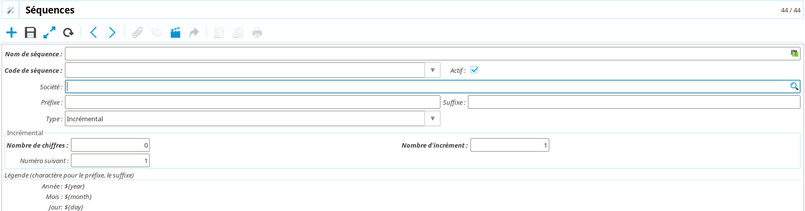

Elements clés
=============

**Coog** est construit autour d'un certain nombre de concepts structurants, qui
se retrouvent dans l'ensemble de l'application. Cette partie a pour but de les
présenter, et d'expliquer leur utilisation et les contraintes qu'ils imposent.

.. _elements_cles_companie:

La Compagnie
------------

Toute installation de **Coog** doit définir une *Société*. La compagnie
représente la société qui utilise **Coog**. Il est possible de créer autant de
sociétés (au sens « Personne morale ») que l'on souhaite dans **Coog**, mais il
n'y a qu'une seule *Société*.

La *Société* est accessible (et requise) à de nombreux endroits dans
l'application. Par exemple, tous les comptes comptables qui sont créés doivent
être rattachés à une *Société*. De même, les utilisateurs sont et doivent
être rattachés à une *Société*, et **Coog** s'assure que cet utilisateur ne
verra que les informations liés à **sa** *Société*. Par exemple, les soldes
des clients seront différents en fonction de la *Société* de l'utilisateur,
étant donné que les comptes concernés sont nécessairement différents du fait de
la contrainte forte entre les comptes comptables et la *Société*.

:Note: La *Société* est parfois appelée *Compagnie* dans **Coog**, les deux noms
       sont interchangeables

Le Portefeuille
---------------

Par défaut, **Coog** ne propose pas de mécanique permettant de cloisonner les
*Tiers* entre les différents utilisateurs. Concrètement, cela signifie que tous
les *Tiers* de l'application sont visibles, modifiables, etc. par tous les
utilisateurs.

Pour certains contexte (réseau de distribution étendus, etc.), il est
souhaitable que chaque utilisateur n'ait accès qu'à un nombre restreint de
*Tiers*, typiquement on souhaite qu'un commercial, ou responsable d'une agence,
ne puisse avoir accès qu'aux soucripteurs des contrats qu'il a apporté.

La notion de *Portefeuille* est ajoutée par les modules gérant le
commissionnement afin de répondre à ce besoin. Pour ce faire, chaque
utilisateur / *Tiers* devient rattaché à un noeud du réseau de distribution de
la *Compagnie*. Le cloisonnement des tiers (et des contrats, sinistres,
etc...) intervient alors automatiquement. A noter qu'il est possible (et
souhaitable) de conserver des utilisateurs ayant accès à tous les portefeuilles
afin d'avoir une vision d'ensemble.

Outillage
---------

Actif
~~~~~

Certains modèles ont un champs appelé « Actif ». Ce champs a un comportement un
peu particulier qu'il convient de détailler. De façon générale, *désactiver*
une donnée la rendra **invisible** lors des recherches dans l'application.
Autrement dit, on ne pourra plus créer de lien vers un élément *inactif*. En
revanche, cela n'affecte pas le comportement des liens existants. Le fait de
*désactiver* a uniquement une influence sur la création de nouveaux liens (en
bloquant la recherche), et ne perturbe pas le comportement de données
existantes l'utilisant.

Libellés
~~~~~~~~

La majorité des objets de paramétrage de **Coog** peuvent se voir attribuer
des *Labels*. Il s'agit simplement de clés permettant de plus facilement
retrouver les différents éléments liés (par exemple) à un produit donné.

On peut consulter depuis un *Label* la liste des objets qui lui sont rattachés.

Code
~~~~

Le champ « Code » apparaît également fréquemment dans l'application, **en
particulier sur les modèles liés au paramétrage**. Ce champ est utilisé lors
des opérations d'export / import de données pour les mises à jour de
paramétrage, il est **fortement recommandé** de ne pas le modifier une fois
l'entité concernée utilisée en production. Les risques de ces modifications
sont :

* Un comportement inattendu lors d'une mise à jour de paramétrage. Si on
  modifie le code d'un produit de *aaa* en *bbb*, la mise à jour via export /
  import de données du produit ne se fera pas. À la place, un nouveau produit
  sera créé, car lors de la mise à jour on chercher dans la base de destination
  un produit avec le code *bbb*, qui n'existera pas encore
* Il est courant que le code de certaines entités (typiquement : produits,
  garanties, règles, tables, etc.) soient utilisés dans les différentes règles
  (tarification, éligibilité, etc.) pour modifier leur comportement
  spécifiquement
* Dans le cas où des développements spécifiques ont été effectués, typiquement
  dans le cas d'interfaces avec des outils externes (comptables par exemple),
  il est possible que ces codes aient été utilisés directement dans le code de
  l'application pour identifier ces éléments. Modifier ce code risque donc
  d'introduire des anomalies liées à un mauvais paramétrage dans ces
  développements

La conséquence de cela est qu'il est recommandé de prendre le temps de
réfléchir au *Code* avant une mise en production, et de ne plus le modifier par
la suite. Il est en revanche toujours possible de modifier le *Nom* de
l'entité, qui est lui utilisé pour et uniquement pour l'affichage.

Séquences
~~~~~~~~~

Il sera nécessaire à certains endroits dans l'application de définir des
*Séquences*. Une *Séquence* est un paramétrage définissant une numérotation
automatique dans l'application. Par exemple, numérotation des tiers, numéros de
contrats, de quittance, etc.

Les *Séquences* sont accessibles depuis le point d'entrée *Séquences* du menu
*Administration*. Il existe deux types de séquences :

* Les séquences *normales* n'ont pas de contrainte particulière, et sont celles
  utilisées le plus souvent dans l'application
* Les séquences *strictes* ont une garantie de continuité. Autrement dit, il ne
  peut pas y avoir de « trous » dans les numéros résultant de l'utilisation
  d'une séquence stricte. Cette garantie a un coût élevé en termes de
  performances, et est limitée dans **Coog** au cas de la numérotation des
  quittances

Une séquence est composée des champs suivants :

* *Nom* : Le nom qui permettra d'identifier la séquence dans l'application. Il
  est indispensable que ce nom soit suffisament explicite pour pouvoir
  reconnaître précisément la séquence ailleurs dans l'application
* *Code de séquence* : Correspond au type de la séquence, et est utilisé
  ailleurs dans l'application pour filtrer les séquences disponibles.
* *Actif* : cf super
* *Société* : cf *Compagnie*
* *Préfixe* / *Suffixe* : Il est possible de préfixer et suffixer les numéros
  générés. Ces éléments sont un texte libre, qui accepte quelques éléments
  spéciaux permettant un peu de flexibilité :

  * ``${year}`` contient l'année en cours
  * ``${month}`` contient le mois en cours
  * ``${jour}`` contient le jour

* *Type* : Permet de contrôler la façon dont la séquence est générée. De façon
  générale, la seule valeur utilisée est « Incrémental », qui consiste à
  retourner une série de nombres incrémentés à chaque itération. Les autres
  valeurs possibles (« Éstampilles ») se basent sur le moment d'appel à la
  séquence pour générer un numéro
* *Nombre de chiffres* : Permet de contrôler le nombre de chiffres utilisés par
  la partie incrémentale. Concrètement, une séquence avec ce champ à 4 aura
  pour valeurs 0001, 0002, 0003, etc. La même séquence avec ce champ à 6 aura
  comme valeurs 000001, 000002, 000003, etc.
* *Nombre d'incréments* : Correspond à la différence entre des valeurs
  successives de la séquence. Par exemple, avec cette valeur à 2, la séquence
  ressemblera à 0001, 0003, 0005, etc.
* *Numéro suivant* : Permet de forcer la prochaine valeur. **À utiliser avec
  beaucoups de précautions, en particulier pour les séquences strictes**.
  Forcer la valeur peux causer des doublons, et est rarement utile en dehors
  des phases d'initialisation de l'application
