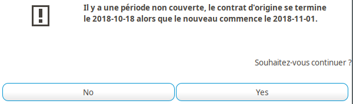

Gestion des contrats collectifs
===============================

Introduction
------------

Cette section a pour objectif de présenter les spécificités de la gestion des
contrats collectifs par rapport à celle des contrats individuels.

Transferts d'assureur
---------------------

Une des problématiques à gérer dès lors que l'on traite de contrats collectifs
est le transfert des risques portés par un contrat sur un autre. Un cas concret
donnant lieu à cette opération est la souscription par le souscripteur du
contrat initial d'un nouveau contrat, portant sur un produit différent, ayant
vocation à remplacer le contrat d'origine.

Dans ces cas là, on souhaite en général transférer l'ensemble des données du
contrat (filiales et affiliés en prévoyance, flottes et véhicules en flotte
auto, etc...) de l'ancien vers le nouveau.

Pour ce faire, **Coog** met à disposition des assistants de « Transfert de
risques » et de « Transfert de services »

Transfert de risques
~~~~~~~~~~~~~~~~~~~~

Principe
""""""""

L'objet du *Transfert de risques* est de :

- Sortir les affiliés du contrat passé
- Les re-créer sur le nouveau contrat

Lors de l'exécution de l'assistant, l'utilisateur va, après avoir saisi les
contrats concernés, faire correspondre les différentes catégories de risque.
Concrètement, **Coog** ne peut pas avec certitude déterminer la correspondance
du transfert entre les différentes populations assurées (par exemple) dans le
cadre d'un contrat prévoyance. Cette tâche est donc laissée à l'utilisateur.

Une fois cette correspondance effectuée, l'assistant va :

- Renseigner la date de fin des affiliations du contrat résilié à la date de
  fin du contrat
- Indiquer un motif de sortie « Transfert de contrat » sur ces mêmes
  affiliations
- Créer de nouvelles affiliations pour le nouveau contrat, en se basant sur les
  informations saisies par le gestionnaire pour le regroupement

**L'assistant de transfert de risques ne permet pas de retour arrière. Il est
fortement conseillé d'effectuer cette opération « à blanc » sur un
environnement de test avant l'application réelle**

Utilisation
"""""""""""

Le point d'entrée permettant de démarrer le *Transfert de risques* est situé à
« Contrat Collectif / Transférer des Risques ». Une fois lancé, l'utilisateur
doit renseigner les contrats concernés :

Le *Contrat d'origine* correspond à l'ancien contrat. **Coog** va le rechercher
parmi les contrats **Résiliés**. Le transfert ne peut avoir lieu qu'une fois ce
contrat effectivement résilié (autrement dit, la date de résiliation doit être
passée).

Le *Contrat cible* est le nouveau contrat, sur lequel les risques de l'ancien
contrat seront déplacés. Ce contrat-ci doit impérativement être actif pour que
l'opération se passe correctement.

Une fois les contrats sélectionnés, on peut passer à l'étape de vérification
des risques. À ce moment, un contrôle de cohérence est effectué, quant au fait
que les contrats se suivent (pas de coupure dans la couverture). Ce contrôle
est non-bloquant :

L'étape suivante permet d'effectuer la correspondance entre les différents
risques :

L'objet de cette étape est de faire correspondre les catégories du contrat
source avec celles du contrat de destination. Celles du contrat source
apparaissent dans la colonne de gauche, et celles du contrat destination dans
celle de droite, au gestionnaire de les renseigner.

Le transfert sera effectué une fois les données de correspondance saisies, et
l'assistant terminé.

Si l'on consulte les affiliations du contrat source, on constate que les
risques qui n'étaient pas déjà résiliés à la date sortie l'ont été, avec le
motif « Transfert de contrat » :

De même, ils ont été re-créés dans le contrat destination, commençant le
lendemain de la date de résiliation du contrat source :

Transfert de services
~~~~~~~~~~~~~~~~~~~~~

Au-delà du transfert des risques entre les différents contrats, il est
également nécessaire, dans **Coog**, de rattacher les dossiers de sinistres au
nouveau contrat.

Étant donné qu'il n'y a aucune garantie quant au fait que les contrats soient
équivalents, cette opération va se contenter de créer, sur les dossiers
existants, une copie des prestations existantes portant sur les garanties du
nouveau contrat. Il restera du ressort du gestionnaire de générer correctement
les périodes de prestation (i.e. de créer les périodes sur la « bonne »
prestation en fonction de leurs dates, et des caractéristiques du transfert).

**De même que pour le transfert de risques, le transfert de service ne permet
pas de retour arrière, il est donc recommandé de tester l'opération sur un
environnement de recette afin de s'assurer que les paramètres saisis
correspondent bien à ce qui est souhaité**

Principe
""""""""

Le principe de fonctionnement du *Transfert de services* est très similaire à
celui du *Transfert de risques*. L'utilisateur va dans un premier temps
sélectionner les contrats concernés. **Coog** proposera ensuite la liste des
sinistres en cours sur l'ancien contrat, et permettra au gestionnaire de faire
correspondre les prestations de l'ancien et du nouveau contrat.

Une fois cette saisie effectuée, **Coog** pourra automatiquement créer les
services correspondants aux prestations du nouveau contrat sur les dossier en
cours.

Utilisation
"""""""""""

Le *Transfert de services* se présente sous la forme d'un assistant, disponible
dans le point d'entrée « Sinistres / Transférer des sinistres ». La première
étape est identique que celle du *Transfert de risques*, il s'agit de saisir
les contrats concernés par l'opération :

Les contraintes portant sur les contrats sont les mêmes que pour le *Transfert
de risques* : le contrat source doit être résilié, et le contrat destination
actif.

L'étape suivante va permettre de saisir les correspondances entre prestations.

Conformément à l'architecture de **Coog**, la correspondance des prestations
correspond à :

- Une correspondance des *Risques*, comme cela a été fait dans le *Transfert de
  risques*
- Une correspondance des *Garanties*
- Une correspondance de *Prestations*

Le raisonnement derrière ce fonctionnement est de pouvoir gérer le cas où, par
exemple, une prestation de rente conjoint suite à un Décès sur l'ancien contrat
était gérée comme une garantie séparée, alors que dans le nouveau contrat il
s'agit d'une simple prestation rattachée à la garantie Décès.

Dans le cas général, les correspondances seront du un pour un, c'est-à-dire que
la structure du contrat de destination sera identique à celle du contrat
d'origine :

Une fois la correspondance saisie, le transfert peut être validé. **Coog** va
alors créer des copies des prestations en cours sur l'ancien contrat, qui
seront rattachées au nouveau.

Sur l'exemple ci-dessus, la seconde prestation d'Arrêt de travail est rattachée
au nouveau contrat. Le comportement lors de la saisie des prestations dépendra
du comportement choisi lors de la résiliation du contrat d'origine
(conservation ou non des prestations en cours) et de celui du nouveau contrat
(reprise des prestations dans leur globalité, ou uniquement des
revalorisations).
