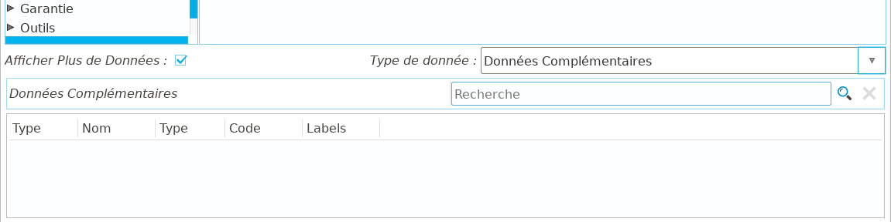
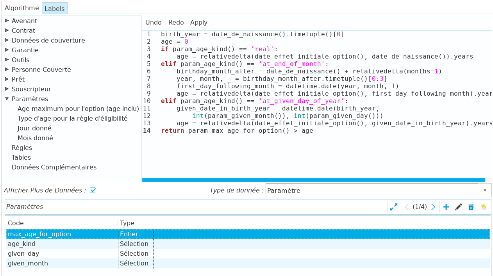
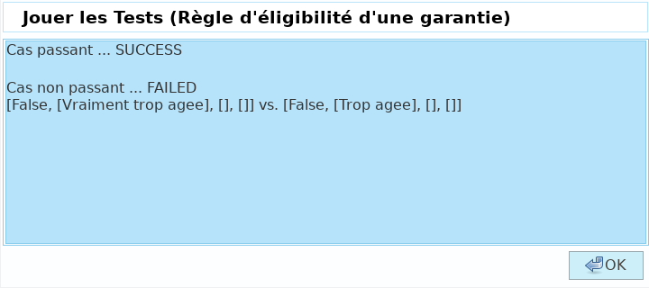

Moteur de règles
================

L'une des fonctionnalités les plus puissantes de **Coog** est sans conteste la
présence d'un *Moteur de règles* dans l'application. Cela permet une
flexibilité maximale de l'application à l'aide de configuration uniquement, une
confidentialité des algorithmes vis-à-vis de l'éditeur, et des temps de
déploiement très réduits pour les nouveaux produits / paramétrages.

Qu'est-ce qu'un moteur de règles ?
----------------------------------

On appelle *Moteur de règles* un outil de configuration intégré à un progiciel,
permettant des de définir directement dans l'application des règles métiers
sans avoir à passer par des modifications de l'application elle-même.
Concrètement, il s'agit de permettre la définition et l'utilisation
d'algorithmes complexes sans nécessiter l'intervention de développeurs et la
mise à jour du logiciel.

Un point de comparaison pourrait être (dans une certaine mesure) un
intermédiaire entre les « formules » avancées et les macros de MS Excel©.

Les avantages de l'utilisation d'un moteur de règles sont :

- *Flexibilité* : Dans **Coog**, la majorité des paramétrages importants
  (tarification, éligibilité, commissionnement, prestations, etc.) peuvent être
  effectuées via l'utilisation du *Moteur de règles*. L'intérêt est de pouvoir
  supporter un panel assez large d'algorithmes sans nécessiter de passer par
  des développements dans le cœur du progiciel. Dans le cas d'un déploiement
  chez un courtier grossiste par exemple, la majorité des algorithmes de
  tarification des produits revendus pourront être gérés indépendamment de leur
  complexité sans nécessiter de repasser par l'éditeur
- *Réactivité* : Le pendant de cette flexibilité est qu'il est très facile de
  prototyper / itérer / tester des modifications algorithmiques dans **Coog**.
  Concrètement, il suffit de modifier une règle et de redéclencher l'action
  métier liée pour constater le résultat des modifications. Cela permet de très
  fortement réduire le « Time-to-market » des nouveaux produits, en réduisant
  au maximum le temps de configuration
- *Confidentialité* : Le contenu des règles (les paramètres et algorithmes)
  fait parti de la base de données du client utilisant l'application. L'éditeur
  du logiciel n'y a pas accès (sauf accord expresse du client, typiquement pour
  les besoins de la maintenance), ni les autres clients utilisants le logiciel

Données de base
---------------

Comme tout objet de paramétrage, le *Moteur de règles* est composé d'un
ensemble de champs décrivant son fonctionnement.

On retrouve les habituels champs *Nom*, *Code* et *Libellés*
pour l'identification de la règle. Les autres champs « basiques » sont :

* *Type* : Ce champ permet de typer la règle afin de faciliter la
  classification et la saisie. Il est utilisé dans les différents champs de
  paramétrage pointants sur des règles pour filtrer en fonction du contexte
  (par exemple, sur le champ *« Règle de tarification »* d'une garantie, seules
  les règles typées « Prime » seront disponibles pour la sélection
* *Type du résultat* : Ce champ est un indicateur pour faciliter l'écriture de
  la règle, et indique, en fonction du *Type* de la règle, le type de donnée
  attendu comme résultat. Pour certains types « techniques » (*Outillage* par
  exemple), le type ne peut pas être déterminé à l'avance et est donc à la main
  de l'utilisateur
* *Statut* : Les règles peuvent être au statut *« Brouillon »* ou *« Validé »*.
  Ce champ est à la main du paramétreur, et peut être utilisé pour avoir un
  suivi des règles testées et validées par rapport à celles en cours de
  construction

Les autre champs affichés seront détaillés ci-dessous.

Fonctionnement
--------------

:Note: Pour faciliter la compréhension, les explications sur le fonctionnement
       se baseront sur le cas d'une règle de tarification sur un contrat. Le
       fonctionnement est le même pour les autres types de règles, les
       différences portant sur les données métiers disponibles dans les règles,
       et le type de résultat

Le *Moteur de règles* de **Coog** permet de combiner des *données métiers* à
l'aide d'un *algorithme* afin de calculer un *résultat*.

Données métiers
~~~~~~~~~~~~~~~

Le *Contexte* du moteur de règle définit les *données métiers* qui seront
disponibles pour écrire la règle. Par défaut, le *Contexte par défaut* présente
toutes les données indépendamment du type de règles. Il est possible de créer
des contextes différents pour affiner les données disponibles et limiter les
risques d'erreur.

Une *Donnée métier* est une information disponible dans **Coog** au moment où
la règle sera executée. Par exemple, lors de l'appel d'une règle de
tarification, la donnée *Date d'effet du contrat* sera pourra être utilisée
afin de, par exemple, prendre en compte une offre commerciale. En revanche, la
donnée *Date de l'événement* d'un sinistre ne pourra pas l'être, car lors du
calcul du tarif d'un contrat **Coog** n'est pas en mesure de la calculer.

Les *Données métiers* sont les « briques » du moteur de règles. Ce sont elles
qui permettent de transformer une simple calculatrice en outil puissant et
complet permettant de fournir à **Coog** sa flexibilité.

:Note: Toutes les données théoriquement disponibles dans **Coog** ne sont pas
       automatiquement mises à disposition. On retrouve dans le *Contexte par
       défaut* les données « habituelles », ainsi que celles qui y ont été
       intégrées suite aux besoins des différents utilisateurs de
       l'application. Si une donnée n'est pas disponible, il est possible de
       passer par des développement pour y rémédier

Les *Données métiers* disponibles pour l'écriture de la règle apparaissent dans
la partie gauche au centre de l'écran.

Certaines données sont davantage détaillées via leur info-bulle (en laissant le
curseur de la souris sur l'élément de la liste).

Cela est particulièrement utile pour les données du groupe *Outils*, qui sont
en général des fonctions utilitaires susceptibles de prendre des paramètres.

Pour utiliser les données métier disponibles dans l'arbre, il suffit des les
« cliquer-déplacer » de l'arbre vers la partie droite de l'écran,
l'*Algorithme*.

Algorithme
~~~~~~~~~~

Le *Moteur de règles* permet de définir un *algorithme* permettant de
transformer les *données métiers* en *résultat*. Cet algorithme est décrit en
utilisant un sous-ensemble simplifié du language de programmation *Python*, qui
est le language utilisé pour écrire **Coog**. Il s'agit d'un language facile
d'accès, qui est de plus en plus utilisé pour les formations d'algorithmiques
dans les écoles / universités.

Idéalement, il est recommandé de suivre une petite formation en ligne sur
python, qui prend quelques heures et permet d'éviter des erreurs simples :

* https://openclassrooms.com/courses/apprenez-a-programmer-en-python
* https://www.codecademy.com/learn/learn-python

Dans tout les cas, les besoins algorithmiques du *Moteur de règles* sont
relativement simples, et il est tout à fait possible de construire des règles
complexes sans pour autant être un expert *Python*.

Bases
"""""
.. image:: images/moteur_de_regle_algo_base.png
    :align: center

L'algorithme ci-dessus correspond au plus simple des calculs de prime. Lorsque
la règle sera appelée, elle va ``return 10``, autrement dit « retourner » 10.
Le mot-clé ``return`` permet d'arrêter l'exécution, et d'indiquer le résultat
de la règle.

Il est possible d'utiliser les opérations suivantes :

* ``+`` : addition
* ``*`` : multiplication
* ``/`` : division (attention, ``5 / 10`` retournera ``0``, il faut utiliser
  ``5.0 / 10.0`` pour avoir des résultats non entiers)

De même, il est possible de faire des comparaisons :

* ``a == b`` : Vrai si ``a`` est égal à ``b``
* ``a != b`` : Vrai si ``a`` est différent de ``b``
* ``a >= b`` : Vrai si ``a`` est supérieur ou égal à ``b``
* ``a > b`` : Vrai si ``a`` est strictement supérieur à ``b``
* ``a <= b`` : Vrai si ``a`` est inférieur ou égal à ``b``
* ``a < b`` : Vrai si ``a`` est strictement inférieur à ``b``

Condition
"""""""""

La règle ci-dessus est un peu plus complexe. Elle a pour objectif de retourner
(``return``) une valeur différente si la personne assurée est mineure ou
majeure. On utilise pour cela le mot-clé ``if`` :

.. code-block:: python

   if condition:
       code_si_vrai
   else:
       code_si_faux

Ou bien, en français :

.. code-block:: python

   si condition:
       code_si_vrai
   sinon:
       code_si_faux

Quelques choses importantes à noter ici :

* *Python* dépend **très fortement** de l'indentation. Autrement dit, le code
  précédent ne fonctionnera pas s'il est écrit comme suit:

  .. code-block:: python

     if condition:
     code_si_vrai
     else:
     code_si_faux

  Dans ces cas-là, **Coog** vous avertira avant même l'exécution de la règle :

  .. image:: images/moteur_de_regle_syntax_error.png
      :align: center

* Les structures de contrôles (``if``, ``else``, etc.) doivent avoir un
  caractère « deux-points » ``:`` en fin de ligne pour être valides

* *Python* est **sensible à la casse**. Autrement dit, le code suivant ne
  fonctionnera pas :

  .. code-block:: python

     If condition:
         code_si_vrai
     Else:
         code_si_faux

Pour finir sur le ``if``, il est possible d'enchaîner les conditions comme
suit :

.. code-block:: python

   if condition1:
       code_si_condition1_vrai
   elif condition2:
       code_si_condition1_faux_et_condition2_vrai
   else:
       code_si_condition1_faux_et_condition2_vrai

Ou bien, en français :

.. code-block:: python

   si condition1:
       code_si_condition1_vrai
   sinon, si condition2:
       code_si_condition1_faux_et_condition2_vrai
   sinon:
       code_si_condition1_faux_et_condition2_vrai

Variables
"""""""""

Afin de rendre le code plus facile à comprendre, il est recommandé d'utiliser
des *Variables*, qui permettent de conserver une valeur calculée pour un usage
ultérieur. Classiquement, l'âge de l'assuré :

.. code-block:: python

   age = annees_entre(date_de_naissance(), date_de_signature())

Il s'agit d'une donnée que l'on sera susceptible de réutiliser plusieurs fois
dans la règle. Stocker sa valeur dans la variable ``age`` permet :

* De centraliser la définition de l'âge. Si a un moment on se rend compte que
  l'on veut calculer l'âge autrement, on n'a à le changer qu'à un seul endroit
* D'éviter les erreurs de recopiage
* Pour certaines données « lourdes » à calculer, de ne faire le calcul qu'une
  seule fois
* De faciliter la lecture

Concrètement, cela permet de passer de :

.. code-block:: python

   if annees_entre(date_de_naissance(), date_de_signature()) > 50:
       return 100
   elif annees_entre(date_de_naissance(), date_de_signature()) > 40:
       return 80
   elif annees_entre(date_de_naissance(), date_de_signature()) > 30:
       return 70
   elif annees_entre(date_de_naissance(), date_de_signature()) > 20:
       return 50
   elif annees_entre(date_de_naissance(), date_de_signature()) > 10:
       return 10

à

.. code-block:: python

   age = annees_entre(date_de_naissance(), date_de_signature())

   if age > 50:
       return 100
   elif age > 40:
       return 80
   elif age > 30:
       return 70
   elif age > 20:
       return 50
   elif age > 10:
       return 10

Il est également recommandé d'utiliser des variables pour stocker des valeurs
« fixes » en début de règle, afin de faciliter la lecture et les modifications
futures (en particulier si ces valeurs sont utilisées plusieurs fois dans la
règle, ce qui cause des risques d'erreur important en cas de modification).

.. code-block:: python

   BASE = 0.02
   REDUCTION = 0.3

   # ...
   # Beaucoup de code
   # ...

   return valeur * BASE * (1 - REDUCTION)

:Attention: Pour le nommage des variables, il faut impérativement :

            * Éviter les lettres accentuées, les « tirets » ( ``-`` )
            * Concrètement, se restreindre aux lettres de base (majuscules /
              minuscules), aux chiffres, et au « souligné » ( ``_`` )

            Il est également recommandé de nommer (par convention) les
            constantes en majuscules (cf ``BASE`` / ``REDUCTION`` ci-dessus)

Commentaires
""""""""""""

Autant que possible, il est conseillé de mettre des commentaires dans la règle,
afin de faciliter la compréhension de l'intention de la règle. On peut ajouter
des commentaires avec le caractère « dièse » ( ``#`` ) :

.. code-block:: python

   # Ceci est un
   # commentaire

Les commentaires peuvent être ajoutés n'importe où (en respectant
l'indentation), et sont indispensable à la maintenance des règles.
Concrètement, lorsque l'on écrit une règle de tarification lors de la création
d'un produit, on n'en a rarement besoin. L'intérêt arrive lorsque, 3 ans plus
tard, quelqu'un d'autre a besoin de comprendre l'algorithme pour corriger une
anomalie, ou pour le faire évoluer.

Évidemment, cela n'est pas forcément pertinent pour toutes les règles (celle
dont le seul contenu était ``return 10`` n'en n'a pas forcément besoin). Mais
dès que l'algorithme n'est pas trivial, il est fortement recommandé d'en
ajouter.

Résultat
~~~~~~~~

Le « résultat » est ce qui est « retourné » par la règle, à l'aide de
l'instruction ``return``. Il y a plusieurs types de résultats, en fonction de
l'utilisation de la règle. Par exemple, une règle d'éligibilité va retourner un
« booléen », autrement dit *Vrai* ( ``True`` ) ou *Faux* ( ``False`` ) :

.. code-block:: python

   age = annees_entre(date_de_naissance(), date_de_signature())

   # La personne est éligible si elle est agée de moins de 85 ans
   if age < 85:
       return True
   else:
       return False

D'autres encore (règles de tarification par exemple) retournent un montant :

.. code-block:: python

   BASE = 100
   age = annees_entre(date_de_naissance(), date_de_signature())

   if age < 30:
       return BASE
   else:
       return BASE * age / 30.0

D'autres enfin retournent des structures plus complexes. Dans ce cas, il y a
en général une aide disponible sur le champ correspondant expliquant le type de
résultat attendu. Par exemple, pour une règle de documents requis pour une
souscription :

.. code-block:: python

   return {
       'questionnaire_medical': {'blocking': True},
       'mandat_sepa': {'blocking': False},
       }

Ici, on retourne une structure de données ( ``{}`` ) qui indique le *Code
métier* (le fameux champ *Code* que l'on voit partout dans les objets de
paramétrage) des documents attendus ( ``'questionnaire_medical'`` ), et pour
chacun de ces documents s'il est bloquant ou pas ( ``{'blocking': True}`` ).

Il s'agit de cas peu fréquents, le plus simple est dans ce cas de se référer à
la documentation, ou de consulter des exemples, afin de bien comprendre les
valeurs de retour attendu.

Erreurs
~~~~~~~

Certaines règles (typiquement des règles d'éligibilité) permettent de retourner
davantage d'informations qu'un simple *Vrai* / *Faux*.

Pour cela, il est possible d'ajouter des *Messages* dans les règles, qui seront
utilisés par **Coog**, typiquement pour être remontés aux utilisateurs. Les
éléments ``ajouter_erreur`` / ``ajouter_avertissement`` sont disponibles à cet
effet dans la partie ``Outils`` des données métiers.

``ajouter_erreur`` remontera une erreur « bloquante », autrement dit il sera
impossible pour l'utilisateur de la contourner (sauf si la possibilité est
explicitement prévue dans **Coog**). À l'inverse, ``ajouter_avertissement``
affiche un message laissant à l'utilisateur la possibilité de continuer son
action. Cela est en général utilisé dans le cas de contrôles de cohérences
(« Attention, il n'y a que 12 ans d'écarts entre le souscripteur et son
enfant »).

:Note: L'affichage de ces messages dépend du type de règle. Par exemple, les
       messages d'avertissement / d'erreur ajoutés dans une règle de
       tarification ne seront pas remontés. Il s'agit d'un comportement normal
       de **Coog**, car ces règles sont potentiellement appelées de nombreuses
       fois lors du calcul des tarifs (en fonction du paramétrage), et risquent
       de noyer l'utilisateur sous les messages. Normalement, ce genre
       d'avertissements doit avoir lieu en amont, via les règles d'éligibilité

Données issues du paramétrage
~~~~~~~~~~~~~~~~~~~~~~~~~~~~~

En plus des données nativement disponibles dans **Coog**, il est possible dans
le moteur de règles d'accéder à certains des éléments qui ont été paramétrés
dans l'application. Cela permet au paramètreur de « faire ce qu'il veut », dans
le sens où une donnée non présente nativement dans l'application peut être
ajoutée par paramétrage, puis être utilisée dans les règles.

Les données issues du paramétrage sont accessibles en cliquant sur le bouton
« Afficher plus de données ».

Le champ *Type de donnée* permet ensuite de choisir le type de donnée à
ajouter.

Données complémentaires
"""""""""""""""""""""""

Les *Données complémentaires* sont une des grandes forces de **Coog**, en cela
qu'elles permettent d'étendre le modèle en ajoutant de nouvelles données sans
pour autant de nécessiter de développements.

:Note: Le paramétrage et la saisie des *Données complémentaires* fait l'objet
       d'un document séparé, l'objectif de cette partie est d'expliquer comment
       s'en servir dans les différentes règles.

Il est possible de rechercher des données complémentaires, pour les ajouter au
contexte de la règle. Autrement dit, à partir du moment où une donnée est
ajoutée dans cette liste, il devient possible de s'en servir dans l'algorithme
pour modifier le résultat.

Par exemple, imaginont que l'on ait configuré sur le produit une donnée
complémentaire « *Réduction commerciale* », on pourra alors l'utiliser dans la
règle pour appliquer une réduction de 10%.

Comme le montre la capture d'écran ci-dessus, la donnée « *Réduction
commerciale* » a dynamiquement été ajoutée à l'arbre des données métier
disponibles. Elle est ensuite utilisable (via « cliquer-déplacer ») dans
l'algorithme, sous le nom ``compl_reduction_commerciale``.

Cette mécanique est un des éléments fondamentaux de **Coog**, sans lequel les
délais de paramétrage / déploiement de nouveaux produits seraient très
supérieurs à ce qu'ils sont. En effet, cela rend l'ajout et l'utilisation de
nouvelles dimensions métiers à la main des paramétreurs, et élimine la
nécessité de potentiels nombreux développements, avec les délais que cela
implique.

Tables
""""""

L'autre élément de paramétrage fréquemment utilisé dans les règles est les
*Tables*. Les tables sont un moyen simple de saisir un tarif sans passer par
des algorithmes d'actuariat. Il s'agit également d'une façon classique pour les
assureurs de mettre à disposition des sociétés de gestion les tarifs à
appliquer sur leurs produits sans pour autant dévoiler les algorithmes
sous-jacents.

:Note: Comme pour les données complémentaires, l'objet de ce document est
       l'utilisation des tables existantes dans des règles. La configuration /
       saisie de nouvelles tables fait l'objet d'un document séparé

L'exemple ci-dessus (ignorer l'erreur pour l'instant) montre ce qu'il se passe
une fois que l'on a ajouté la table « Table de tarif 1 » à la règle. Elle
apparaît dans l'arbre des données disponibles sous le menu « Tables ».
Lorsqu'elle est ajoutée dans l'algorithme, elle apparaît sous le nom
``table_table_de_tarif_1``. En outre, elle insère automatiquement, afin de
faciliter l'utilisation, le nom des différentes dimensions qui la composent.
Ici, la table a trois dimensions, ``Date_de_souscription``, ``Age``, et
``CSP``. On affiche dans l'algorithme les noms des dimensions tels qu'ils ont
été définis lors de la création de la table, qui ne correspondent pas (sauf
coïncidence) à des données métiers disponibles dans le moteur de règle. C'est
au paramétreur de faire correspondre les paramètres de la table avec les
données disponibles.

L'utilisation des tables dans les règles permet de réduire dans certains cas
l'écriture de la règle à une simple correspondance entre les dimensions
« techniques » de la table et les dimensions « métier » disponibles.

Paramètres
""""""""""

Les *Paramètres* d'une règle ressemblent par certains aspects aux *Données
complémentaires*, mais répondent à un besoin différent. L'objectif est de
permettre de **réutiliser** une règle avec de légères modifications. L'exemple
« classique » (et disponible par défaut dans **Coog**) est la règle
d'éligibilité basée sur l'âge de l'assuré.

Concrètement, pour de nombreux produits d'assurance prévoyance, la règle
d'éligibilité se résumera à *« L'assuré doit être agé de moins de Y années à la
souscription du contrat »*. Il serait certes possible d'utiliser des règles
différentes (une règle par produit) avec comme seule différence les valeurs de
la bornes maximum, toutefois cela n'est pas forcément très pratique pour le
paramétreur.

Les *Paramètres* de règles permettent de gérer ce cas de figure de façon
intelligente, en indiquant que la règle nécessite des données supplémentaires
lors de son paramétrage puis en les mettant à disposition de l'algorithme.

La règle ci-dessus est la règle d'éligibilité basée sur l'âge fournie par
défaut dans **Coog**. Cette règle a pour objectif de contrôler que l'âge de
l'assuré est inférieure à un des paramètres (``max_age_for_option``). Les
autres paramètres permettent de contrôler la façon dont l'âge est calculé.

Lors de l'utilisation de cette règle (concrètement, lors du paramétrage de
l'éligibilité sur une garantie), ces paramètres sont automatiquement demandés à
l'utilisateur.

Grâce à l'utilisation de paramètres dans cette règle, la configuration de ce
cas « simple » ne néccessite pas d'aller écrire une règle. Il suffit de la
sélectionner, et de renseigner les valeurs des paramètres.

Règles
""""""

Un autre avantage des *Paramètres* est qu'ils permettent de créer des règles
d'« Outillage », autrement dit des règles permettant de calculer une
information, et de la réutiliser ailleurs.

L'exemple ci-dessus réutilise la règle d'éligibilité proposée par défaut dans
**Coog** pour construire une autre règle, légèrement différente. On souhaite
appliquer la règle par défaut uniquement si le contrat a été souscrit après
2010. Une fois la règle ajoutée dans la liste des règles utilisée, elle
apparaît dans la liste des données disponibles pour utilisation dans
l'algorithme.

Lorsque l'on place la règle dans l'algorithme, elle affiche automatiquement ses
paramètres pour que le paramétreur puisse les modifier.

.. code-block:: python

   rule_option_age_eligibility(max_age_for_option=, age_kind=,
       given_day=, given_month=)

Afin de connaître les types / valeurs possibles pour les différents paramètres,
l'utilisateur peut consulter la règle d'origine et ses paramètres.

Un cas concret d'utilisation de ces règles d'« Outillage » est le calcul
d'éléments qui ne sont pas directement utilisés par **Coog**, mais qui
sont nécessaires pour d'autres règles qui sont elles indispensables. Par
exemple, pour des garanties de type vie entière, il arrive d'avoir une règle de
provisions mathématiques qui soit utilisée dans des contextes différents
(calcul de tarif, de valeur de rachat, etc.).

L'utilisation de règles à paramètres réutilisées par d'autres règles permet de
centraliser cette partie du calcul, et de ne pas avoir à la recopier dans les
règles qui en dépendent. Pour des règles complexes, cela facilite grandement
les itérations (corrections ou évolutions) en évitant le risque d'oubli entre
les différentes utilisation.

Tests
-----

Afin de faciliter la maintenance et de limiter les risques de régression,
**Coog** fournit un outil permettant d'écrire des tests unitaires pour les
règles. Le principe général est d'enregistrer le résultat attendu de la règle à
partir d'un ensemble de paramètres donnés. Il est ensuite possible d'exécuter
ces tests.

Saisie
~~~~~~

Nous prendrons comme exemple le cas de la règle d'éligibilité par défaut de
**Coog**.

Les *Jeux de tests* sont accessibles via les relations du moteur de règles.

L'exemple ci-dessus teste le cas suivant :

*Si la règle est paramétrée pour utiliser l'âge réel avec un âge maximum à 50
ans, une garantie souscrite le 01/04/2020 par un assuré né le 14/10/1990 est
éligible*

Pour créer un cas de test, il faut lui donner une *Description*, qui permet en
cas d'erreur suite à une modification de comprendre qu'est-ce que cherche à
vérifier le test. Ensuite, il faut renseigner les valeurs des différentes
données utilisées par la règle.

Afin de faciliter ce travail, l'algorithme est rappelé dans la partie basse de
la vue. En outre, la colonne ``Nom`` liste lors de la saisie les données qui
ont été détectées dans la règle.

Il y a toutefois plusieurs difficultés lors de la saisie de ces tests :

* Tous les paramètres ne sont pas forcément utilisés dans la règle, cela dépend
  du « chemin » emprunté lors de l'exécution. Ici par exemple, si
  ``param_age_kind`` (*Mode de calcul de l'âge*) vaut ``at_given_day_of_year``
  (*À une date fixe*), typiquement dans le cas où l'on souhaite calculer l'âge
  au premier janvier, il est nécessaire de renseigner des valeurs pour les
  données ``param_given_day`` et ``param_given_month`` pour renseigner les
  jours / mois avec lesquels calculer l'âge. En revanche, cela n'est pas
  nécessaire pour les autres cas
* Certaines données « disponibles » dans le *Nom* ne nécessitent pas d'être
  surchargée (en général les données issues du menu « Outils »). C'est le cas
  ici de ``relativedelta`` (utilisé pour calculer l'écart entre deux dates)
* Certaines données métier peuvent avoir des valeurs différentes si appelées
  plusieurs fois (typiquement si elles acceptent des paramètres, comme par
  exemple *Montant de couverture à une date*). Pour cette raison, si une donnée
  est utilisée plusieurs fois, elle doit être renseignée autant de fois dans la
  liste des valeurs. C'est le cas ici pour la donnée ``date_de_naissance``
* La colonne *Valeur* ne connaît pas le type de la donnée. Il est donc
  nécessaire de saisir les valeur « en Python ». Concrètement, cela signifie
  utiliser :

  * ``datetime.date(annee, mois, jour)`` pour renseigner une date
  * ``123456`` pour les entiers
  * ``'texte'`` pour le texte ou les données à chois multiple
  * ``True`` / ``False`` pour les booléens (*Vrai* / *Faux*)
  * ``Decimal('12.52')`` pour les valeurs numériques

La partie droite de l'écran permet de consulter le résultat obtenu avec les
paramètres sélectionnés lorsque l'on clique sur le bouton **Recalculer** en bas
à gauche. Le champ *Résultat* contient le résultat de la règle, et les champs
en-dessous les éventuels messages d'information, d'avertissement ou d'erreur
qui ont été ajoutés.

Finalement, le champ *Résultat attendu* en bas à droite est la représentation
technique du résultat, qui inclut la valeur, ainsi que les différents messages.

:Note: L'onglet *Information de débogage* sera davantage détaillé plus loin

Pour exemple, un cas avec un message d'erreur (l'âge maximum ayant été rabaissé
à 10 ans :

Le scénario testé ici est donc :

*Si la règle est paramétrée pour utiliser l'âge réel avec un âge maximum à 10
ans, une garantie souscrite le 01/04/2020 par un assuré né le 14/10/1990 n'est
pas éligible, et le message "Trop agee" doit être affiché à l'utilisateur*

Exécution
~~~~~~~~~

Les jeux de tests sont exécutés à l'aide de l'action *Jouer les tests*
(disponible depuis le menu *Actions* de la règle). En reprenant les cas
ci-dessus, on obtiendrait le résultat suivant :

Les deux tests passent, ce qui est logique étant donné qu'ils ont été validés
lors de leur sauvegarde, et que la règle n'a pas été modifiée.

Voici le résultat après une légère modification :

La modification consistait en un changement sur le message d'erreur dans le cas
non passant. Lors de l'exécution des tests sur la règle, l'utilisateur est
averti que sa modification a modifié le comportement attendu par les tests. Il
peut y avoir deux raisons à cela :

* Les tests doivent être mis à jour. C'est le cas ici, la modification de la
  règle entraîne un changement au niveau du résultat attendu pour le cas non
  passant
* La modification a introduit une régression. Par exemple, si la modification
  du texte du message effectuée précédemment avait causé une erreur lors du
  test du cas passant, cela aurait probablement été causé par une mauvaise
  manipulation lors de la modification. Concrètement, la modification n'avait
  pas vocation à changer le résultat du cas passant, donc si elle l'a fait
  c'est une erreur de paramétrage

Débogage
--------

Dans le cas de règles simples, il est (relativement) simple de comprendre les
éventuelles causes d'une erreur simplement en lisant attentivement
l'algorithme. En revanche, pour des règles complexes, ou écrites par d'autres
personnes, ou écrites il y a longtemps, cela peut s'avérer plus délicat.

Il y a deux grandes familles d'erreurs possibles lors de l'exécution d'une
règle :

* La règle s'exécute correctement, mais le résultat n'est pas celui attendu.
  Typiquement, une garantie est éligibile alors que selon les conditions
  générales elle ne devrait pas l'être
* La règle rencontre une erreur lors de son exécution. On parle alors d'erreur
  « technique ». Concrètement, cela signifie qu'une opération demandée n'a pas
  pu être effectuée. Par exemple, si a un moment lors de l'exécution,
  l'algorithme essaye de faire une division par 0 :

  .. code-block:: python

      # Ici, si pour une raison quelconque "age" vaut 0, on aura une
      # erreur technique
      tarif = BASE / age

Il y a plusieurs sources d'erreurs possibles lors de l'exécution d'une règle :

* L'*algorithme* peut comporter une erreur
* Certaines données métier ont des paramètres incohérents (par exemple,
  demander une donnée du contrat à une date antérieure à sa souscription)
* Une donnée métier génère elle-même une erreur

Le troisième cas est en général de l'ordre du bug, et doit être remonté. Pour
les deux autres, **Coog** dispose d'un outil d'analyse de l'exécution du moteur
de règles qui vise à faciliter la compréhension par le paramétreur de
l'exécution, et donc à assister la correction.

Par défaut, lorsqu'une règle a une erreur lors de son exécution, l'utilisateur
final (autrement dit, le gestionnaire contrat qui aura déclenché un calcul de
tarif par exemple) aura un message lui expliquant qu'une erreur critique est
arrivée lors de l'exécution de la règle, et l'invitant à se rapprocher des
équipes de configuration à même de le dépanner.

Le paramétreur peut alors activer le *Mode de debug* sur la règle en question
depuis la vue principale. La règle apparaît alors en rouge dans la liste des
règles.

:Attention: **Le mode de debug a un impact significatif sur les performances,
            il faut donc bien penser à le désactiver une fois la correction
            terminée**

À partir du moment où l'on active ce mode, chaque exécution de la règle va être
enregistrée (qu'elle réussisse ou échoue), avec tous les éléments permettant de
comprendre l'exécution. Ces traces d'exécution apparaissent dans le point
d'entrée *Traces du moteur de règle* du menu *Relations* sur la règle.

On voit sur l'image précédente les traces de l'exécution des jeux de test (les
deux cas de tests, passant et non passant, que l'on a saisi précédemment) de la
règle d'éligibilité d'une garantie présente par défaut dans **Coog**.

Ici, on voit le détail pour le cas *non passant*. Les différents onglets
contiennent normalement la totalité des données nécessaires à l'analyse de
l'exécution :

* *Algorithme de la règle* permet de consulter directement le contenu de
  l'algorithme
* *Debug* contient les différents types de messages générés par l'exécution
* *Contexte* permet de consulter le contexte d'exécution de la règle, autrement
  dit les entités métier de haut niveau (Contrat, Garantie, etc.) qui ont été
  passés en paramètre par **Coog** lors de l'exécution. Cet onglet est surtout
  utile pour vérifier que l'on travaille bien sur le contrat (typiquement) qui
  nous intéresse
* *Trace d'exécution* est l'onglet le plus utile (en général). Il permet de
  visualiser, dans l'ordre d'exécution, les valeurs des différentes données
  métier utilisées par la règle. Par exemple, ici on voit que la donnée
  ``date_de_naissance`` a retourné comme résultat ``1990-10-14``, soit le 14
  octobre 1990. Dans le cas d'un appel à une table, ou a une autre règle, on
  verra le résultat de l'appel. Dans le cas d'un appel à une fonction technique
  (*Ajouter années*, *Entier aléatoire*, etc.), on verra la valeur qui a été
  utilisé pour cette exécution de la règle

Normalement, ce niveau de détail suffit en général à comprendre le problème. Le
cas échéant, il est possible d'ajouter davantage d'informations à l'aide de la
donnée ``message_debug`` directement dans l'algorithme. Par exemple, sur la
règle d'éligibilité, on constate que l'âge n'apparaît pas dans les traces
d'exécutions. En effet, cette donnée est le résultat d'un calcul « interne » à
la règle. Nous pouvons utiliser ``message_debug`` afin de le voir apparaître
(après ré-exécution de la règle).

.. image:: images/moteur_de_regle_message_debug.png
    :align: center

On voit alors dans la trace :

On constate ici que l'âge tel qu'il est calculé avec les paramètres de la règle
est de 29 ans. Cette information apparaît à la fois dans le champ *Debug* à
gauche (où sont regroupés toutes les données appelées dans ``message_debug``),
et également dans la trace à droite.

En règle générale, l'utilisation combinée des cas de tests et du *Mode de bug*
permet de comprendre la cause de toutes les erreurs sur les règles, dans la
mesure où l'on est en mesure de la reproduire. Une fois la cause identifiée, il
faut :

* Corriger l'algorithme s'il est défaillant. Cela peut tout simplement passer
  par l'ajout de contrôles supplémentaire sur les données (par exemple, tester
  qu'une donnée n'est pas égale à 0 avec ``if donnee != 0:``), mais nécessite
  par fois une analyse détaillée des spécifications de la règle
* Corriger les appels aux données métier posant problème
* Dans le cas où l'on constate une incohérence dans les données métier (par
  exemple, le *Montant de couverture* retourné ne semble pas correspondre à
  celui attendu), il peut s'agir d'une anomalie à remonter au support de
  **Coog**

:Attention: **Toujours penser à désactiver le mode de debug d'une règle après
            avoir finit de travailler dessus**

Conclusion
----------

Le *Moteur de règle* est un des outils les plus puissants disponible dans
**Coog**, mais également l'un des plus complexes. Il est utilisé partout dans
le paramétrage : calcul de prime, d'éligibilité, de commissions, détermination
des documents requis à la souscription, contrôles de surface dans les
processus, calcul de prestations, etc... Le maîtriser prend du temps, mais
permet d'exploiter **Coog** au maximum de ses capacités.

La clé est de lire les règles existantes (fournies par défaut avec **Coog**, ou
écrites lors de la mise en place), et d'expérimenter.

Enfin, prendre une journée pour suivre un tutorial sur *Python* ne sera
certainement pas du temps perdu.

:Rappel: **Ne pas laisser le mode debug activé sur les règles plus longtemps que
         nécessaire**
