Garantie
========

Les *Garanties* sont les composants de base du paramétrage de **Coog**. Un
*Produit* n'est pas beaucoup plus qu'un assemblage de garanties. En outre, en
général, la majorité des informations importantes du produit (tarif,
éligibilité, etc.) sont portées par les garanties.

Dans **Coog**, les garanties **existent indépendamment des produits**.
Autrement dit, il est possible de créer les garanties sans les rattacher à un
produit, et surtout de partager des garanties sur des produits différents. Le
*Moteur de règles* peut permettre de gérer de petites différences entre les
produits (en empruntant des branches différentes en fonction du produit
concerné).

:Note: La position des champs dans l'application (l'onglet sur lequel ils
       apparaissent) est susceptible d'évoluer en fonction des versions

Données générales
-----------------

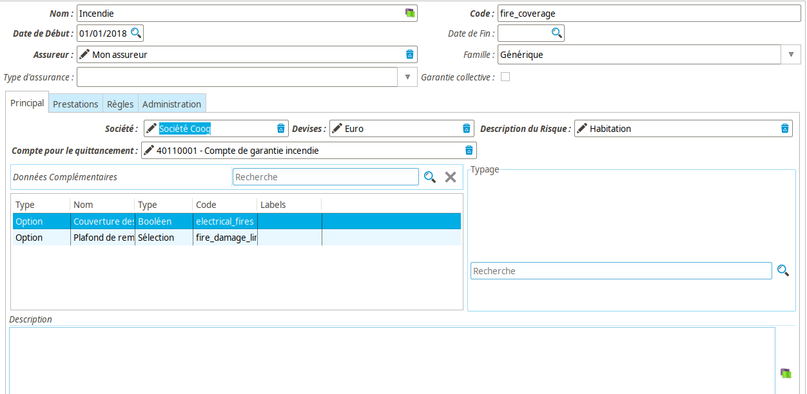

De même que pour le *Produit*, les *Garanties* ont un *Nom*, un *Code*, une
*Société*, ainsi que des *Libellés*.

On retrouve également les champs :

* *Date de début* et *Date de fin* : Permettent de limiter la date à partir de
  laquelle des contrats peuvent souscrire cette garantie
* *Devise* : La monnaie dans laquelle les opérations liées à cette garantie
  auront lieu
* *Description* : Ce champ n'a pas d'utilisation particulière, à part
  éventuellement dans le cas de reportings / d'éditique

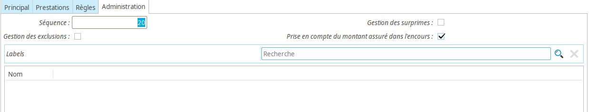

L'onglet *Administration* contient quelques autres informations sur le
fonctionnement de la garantie :

* *Séquence* : Les garanties sont ordonnées globalement dans l'application. Le
  champ *Séquence* permet de contrôler cet ordre. Normalement, une modification
  de cet ordre sera répercutée immédiatement dans toute l'application. Par
  exemple, les garanties déjà souscrites sur les contrats seront
  automatiquement réordonnées (et il n'y a pas de possibilité de contrôler ce
  comportement). L'ordre est ascendant (autrement dit, une garantie avec une
  séquence de 10 sera avant une garantie avec une séquence de 20). Enfin, il
  est possible d'utiliser la même valeur pour plusieurs garanties (afin par
  exemple de mettre l'ordre de toutes les garanties *Décès* à 10).

  :Note: Afin de faciliter les insertions éventuelles, il est recommandé de
         définir ces ordres "avec de l'espace" (utiliser des dizaines). Cela
         permettra par la suite et si nécessaire d'insérer de nouvelles
         garanties sans avoir à tout re-numéroter

* *Gestion des surprimes* : Si cette case est cochée, il sera possible lors de
  la souscription d'ajouter des surprimes sur la garantie
* *Gestion des exclusions* : Si cette case est cochée, il sera possible de
  sélectionner des exclusions lors de la soucription
* *Prise en compte du montant assuré dans l'encours* : Contrôle si le montant
  des prêts assurés (en emprunteur) doit être pris en compte dans le calcul de
  l'encours pour le tiers assuré

Données structurantes
---------------------

Viennent ensuite les données « structurantes » de la garantie. Il s'agit
d'informations critiques quant au fonctionnement de **Coog** pour cette
garantie :

* *Assureur* : En premier lieu, l'*Assureur* de la garantie représente l'entité
  portant le risque. Ce lien est indispensable pour le bon fonctionnement
  notamment des modules de commissionnement assureur.

  :Note: On remarque que l'assureur est une information de la garantie et pas
         du produit. Cela signifie qu'un produit dans Coog peut être composé de
         garanties portées par des assureurs différents

* *Famille* : La *Famille* de la garantie permet de la catégoriser dans les
  grands ensembles de l'assurance. Les familles disponibles sont de façon
  générale les lignes métiers habituelles (Prévoyance, Emprunteur, IARD, etc.).
  À noter que **Coog** permet de définir des garanties *Génériques*, pour
  lesquelles aucun comportement particulier n'est appliqué. Le cas typique
  d'utilisation concerne des garanties non liées à des risques (Assistance par
  exemple), ou bien des garanties couvrant des entités inhabituelles, définies
  par leurs données complémentaires.
* *Type d'assurance* : Ce champ n'est pas vraiment structurant, mais fortement
  lié à la *Famille*. Il permet d'indiquer le type de garantie parmi les types
  « classiques » de l'assurance (Décès, Incapacité, etc.)
* *Prestations* : À partir du moment où les modules de gestion sinistre sont
  installés, il est possible via ce champ de définir la liste des prestations
  proposées par cette garantie. Le paramétrage des prestations fait l'objet
  d'une autre partie de la documentation, l'important est de se rappeler qu'il
  est nécessaire de rattacher les prestations à la garantie afin qu'elles
  soient proposées lors de la déclaration d'un sinistre

Le *Descripteur de risque* est également une donnée structurante, et est
détaillé ci-dessous.

Descripteur de risques
----------------------

L'objet de la garantie est de façon générale la couverture d'un risque. Le
*Descripteur de risque* permet de définir précisément le risque en question.

Tout d'abord, il faut noter que ce champ n'est pas obligatoire. Pour certains
cas (classiquement celui d'une garantie *Assistance* sur des contrats
prévoyance), la garantie ne couvre pas un risque particulier, mais offre juste
des prestations du fait de la seule souscription du contrat. Pour ces cas-là,
le descripteur de risques n'a pas réellement de sens, et **doit** être laissé
vide.

Pour les cas « habituels », le descripteur de risque décrit de façon générale
l'objet assuré, ou *Élément couvert* dans **Coog**. Typiquement, pour de
l'assurance prévoyance, il s'agira d'une personne. Mais il est également
possible de définir soi-même un descripteur de risque uniquement à partir de
données complémentaires.

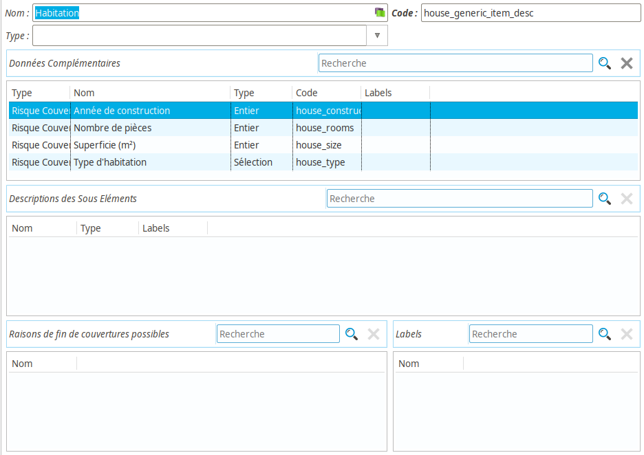

De la même façon que pour les garanties, les *Descripteurs de risque* sont
partagés dans le paramétrage. Autrement dit, un même descripteur de risque peut
être utilisé par plusieurs garanties différentes. Il s'agira d'ailleurs de la
configuration « habituelles », étant donné que de façon générale il sera
partagé a minima sur les différentes garanties d'un même produit.

:Attention: **Coog** supporte théoriquement le fait de mêler des garanties
            ayant des descripteurs de risque différent au sein d'un même
            produit, mais il s'agit en l'état actuel des choses d'une
            fonctionnalité très peu testée / utilisée

Un descripteur de risque est avant tout définit par des *Nom* et *Code*, et
peut être lié à des *Labels*. Il y a également :

* *Type* : Ce champ permet d'indiquer à **Coog** la famille générale du risque.
  On y retrouve typiquement (dépend des modules installés) :

  * *Personne* : Le risque assuré est une personne physique
  * *Société* : Le risque assuré est une personne morale
  * *Tiers* : Le risque assuré est une personne physique ou morale
  * *<vide>* : Le risque assuré est *« Générique »*, il ne sera définit que par
    ses données complémentaires (et un nom)

  Cette liste évoluera au fur-et-à-mesure que de nouveaux modules seront
  intégrés à **Coog**. Par exemple, une fois l'assurance auto intégrée, il sera
  possible de sélectionner le type *Véhicule*
* *Données complémentaires* : Permet de définir les donnée complémentaires qui
  seront demandées à la souscription pour ce type de risques. Pour les
  descripteurs de risque génériques, il s'agira des seules données permettant
  de décrire le risque. Pour les autres cas, il s'agira simplement de
  personnaliser le risque. Un exemple classique sera l'ajout d'une donnée
  complémentaire *Catégorie socio-professionnelle* sur un type *Personne
  physique*
* *Description des sous-éléments* : Pour les contrats collectifs (ou flotte
  auto), on a en général deux niveaux de couverture. Un niveau « Population »
  (une catégorie de personnes / de véhicules) et un niveau « Détail » (les
  assurés / les véhicules). Ce champ permet de définir les « sous-éléments »
  que peut avoir un descripteur de risque
* *Raisons de fin de couverture possible* : Dans le cas de la gestion des
  sinistres, ce champ permet de définir les motifs disponibles lors de la
  sortie d'un élément couvert d'un contrat. Par exemple, dans le cas d'un
  contrat collectif prévoyance assurant des populations de salariés, ces
  raisons seront les différents motifs de sortie d'un salarié de la population
  à laquelle il était rattaché

Données complémentaires
-----------------------

De même que pour le *Produit*, la garantie est à la fois un *Configurateur* de
*Données complémentaires* pour les garanties souscrites sur les contrats, ainsi
qu'un *Porteur* pour les données de type *Produit*.

Ajouter des données dans le champ *Données complémentaires* permettra de
demander des informations complémentaires lors de la souscription de cette
garantie sur des contrats.

Le champ *Typage* permet de renseigner des valeurs pour cette garantie. Le cas
typique d'utilisation consiste à rajouter des données à ressortir dans des
courriers ou des extractions.

Données liées au quittancement
------------------------------

Étant donné que les produits sont potentiellement multi-assureurs,
l'information des comptes comptables à utiliser lors du quittancement doit être
portée par les garanties. Le champ *Compte pour le quittancement* est à ce
titre obligatoire, et correspond au compte sur lequel seront comptabilisées les
primes émises pour cette garantie. Les primes « liées » (surprimes, etc.) y
seront également rattachées.

Règles
------

La majorité des informations « intéressantes » sur les garanties sont des
« Règles ». On appelle *Règle* dans **Coog** un élément de paramétrage
décrivant le comportement attendu à la souscription d'un contrat (pour les
données liées au contrat telles que produit / garantie) ou à la déclaration
d'un sinistre (prestations). Assez souvent, un nouveau module ajoutant une
fonctionnalité (par exemple la possibilité de *Racheter* un contrat) va ajouter
un onglet dans un élément de paramétrage permettant de le configurer. Cette
section décrit les différentes *Règles* que l'on retrouver sur les garanties.

Souscription
~~~~~~~~~~~~

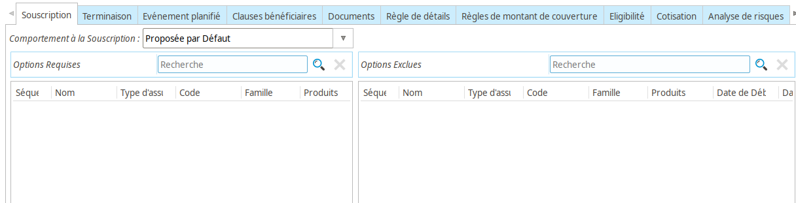

Cette règle permet de contrôler la façon dont se comporte à la souscription.
L'élément le plus important est le champ *Comportement à la souscription*. Les
valeurs possibles sont :

* *Obligatoire* : la garantie sera souscrite par défaut. Il sera impossible de
  la « dé-sélectionner », et **Coog** s'assurera que quelle que soit la façon
  dont se passe la souscription (gestionnaire, web-service, portail web...) le
  contrat ne pourra pas être activé si cette garantie n'est pas soucrite
* *Proposée par défaut* : La garantie sera souscrite par défaut, mais restera
  optionnelle. Autrement dit, il sera possible de la dé-cocher sans rencontrer
  de blocage particulier
* *Optionnelle* : La garantie ne sera pas cochée par défaut, et sa
  non-souscription ne bloquera évidemment pas la validation du contrat

Par ailleurs, il est possible de définir des :

* *Options requises* : La garantie ne pourra pas être souscrite si ces autres
  garanties ne sont pas également souscrites
* *Options exclues* : Il sera impossible de souscrire cette garantie si une de
  ces garanties l'est également

De façon générale, ces paramétrages sont surtout utilisés dans le cas où la
saisie des contrats ne se fait pas par formules de garanties, mais où les
utilisateurs vont manuellement sélectionner les garanties demandées par le
souscripteur.

Résiliation
~~~~~~~~~~~

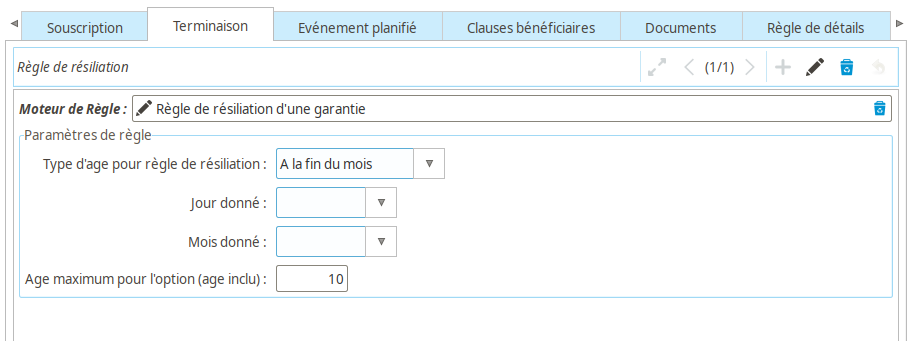

Cette règle contrôle la date de fin **automatique** des garanties. Elle permet
de fixer une limite maximum à la date de fin de la garantie, qui sera ensuite
prise en compte lors du calcul de la date de fin automatique du contrat.

Par ailleurs, pour le cas des contrats renouvellés, ces dates servent de maxima
pour le renouvellement. Autrement dit, si toutes les garanties d'un contrat
ont une date de fin antérieure à la date de début de la nouvelle période du
renouvellement, le contrat ne sera pas renouvellé.

**Coog** fournit par défaut une règle de résiliation automatique basée sur
l'âge de l'assuré (pour les contrats prévoyance / emprunteur), pour laquelle il
est possible de choisir un âge maximum, ainsi que la façon dont l'âge doit être
calculé.

Cotisation
~~~~~~~~~~

Données
"""""""

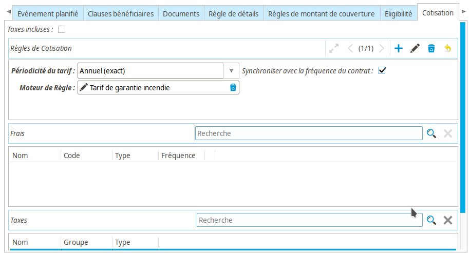

Il s'agit de la règle probablement la plus importante pour les installations de
**Coog** destinées à gérer le quittancement de contrats d'assurance. Elle est
composée des éléments suivants :

* *Règle* : Cette règle est utilisé pour calculer le *Tarif* de la garantie. Le
  détail du fonctionnement est expliqué ci-dessous. L'important est qu'elle
  retourne un nombre décimal$
* *Périodicité du tarif* : La *Règle* retourne un montant, la *Périodicté* en
  fait un *Tarif*. Concrètement, la périodicité permet de définir la durée à
  laquelle correspond le montant retourné à la règle. Pour un résultat (de la
  règle) de 10 €, un tarif :

  * *Annuel* (avec ces variations) correspondra à une prime annuelle de 10 €
  * *Mensuel* donnera une prime annuelle de 120 €

  etc.

  Cette distinction est **extrêmement importante** dans **Coog**. Un tarif
  *Annuel* de 120 € **N'EST PAS** identique à un tarif *Mensuel*. La différence
  porte sur la façon dont les prorata de prime sont calculés lors de la
  génération de quittances. Plus de détails sur ce sujet seront donnés plus
  loin
* *Synchroniser avec la fréquence du contrat* : Ce champ est difficile à
  expliquer, mais a des impacts importants sur le fonctionnement du
  quittancement, notamment (encore) sur le sujet des proratas. Concrètement,
  cocher cette case va transformer « à la volée » la fréquence de la prime lors
  de la souscription d'un contrat donnée, pour la faire correspondre à la
  fréquence de quittancement du contrat. L'idée est que, pour un *Tarif*
  calculé de 120 € sur une *Périodicité* annuelle, si le contrat est quittancé
  trimestriellement, le *Tarif* qui sera stocké sera de 30 € **trimestriel**
* *Frais* : Il est possible d'ajouter des frais sur une garantie, qui seront
  ensuite ajoutés aux frais définit sur le produit lors de la souscription du
  contrat
* *Taxes* : Les taxes sont portées par les garanties. Autrement dit, elles
  s'appliquent aux montants de prime générés pour la garantie sur laquelle
  elles sont paramétrées
* *Taxes incluses* : Si cochée, le montant retourné par la règle sera considéré
  comme incluant les éventuelles taxes. **Coog** utilise un algorithme complexe
  pour la répartition de ces taxes (notamment pour les problématiques
  d'arrondi) sur les différentes lignes de quittance, l'objectif étant de
  n'avoir aucun écart « au global » entre la somme des montants TTC calculés et
  la somme des montants HT + les montants des taxes. Il y a des cas (et c'est
  mathématiquement normal du fait des différents arrondis) où le montant HT *
  le taux de taxe sera différent du montant de taxes d'un ou deux centimes

Algorithme
""""""""""

Lors de la souscription du contrat (ainsi que lors des opérations et avenants
tarifants), **Coog** va calculer des tarigs à toutes les dates
« intéressantes » :

* Date d'effet du contrat
* Dates d'effet / de fin des différentes garanties
* Dates de modification de ces garanties
* Dates d'avenants tarifants
* Dates de recalcul définies dans le paramétrage du *Produit*
* Dates de renouvellement

Ces calculs se font pour chaque combinaison de Risque assuré / Garantie
souscrite. On va donc avoir, par exemple pour une garantie :

+----------------+------------+
| Date de calcul | Tarif      |
+----------------+------------+
| 01/01/2020     | 120 € / an |
+----------------+------------+
| 01/04/2020     | 120 € / an |
+----------------+------------+
| 01/07/2020     | 240 € / an |
+----------------+------------+

**Coog** va éliminer les doublons pour arriver au résultat suivant :

+---------------+-------------+------------+
| Date de début | Date de fin | Tarif      |
+---------------+-------------+------------+
| 01/01/2020    | 30/06/2020  | 120 € / an |
+---------------+-------------+------------+
| 01/06/2020    |             | 240 € / an |
+---------------+-------------+------------+

À ce stade, on parle toujours de *Tarif*, autrement dit de montant **par an**
(dans ce cas d'exemple).

**Coog** stocke *uniquement* ces éléments de tarif « a priori ». Autrement dit,
lorsque l'on souscrit un contrat, les tarifs vont être calculés pour la durée
du contrat (terme en cours pour les contrats renouvelables, jusqu'à la date de
fin pour les autres). Ces *Tarifs* sont un intermédiaire de calcul pour le
calcul des *quittances*, qui correspondent elles aux échéances qui seront
effectivement demandées au client.

Le calcul effectué par **Coog** est le suivant : pour une période donnée, pour
chaque « ligne de tarif » correspondant à cette période (ayant un recouvrement
de période), on calcule le prorata du tarif correspondant.

Ci-dessous quelques exemples de calcul.

Cas simple
''''''''''

+---------------+-------------+-------------+
| Date de début | Date de fin | Tarif       |
+---------------+-------------+-------------+
| 01/01/2020    |             | 10 € / mois |
+---------------+-------------+-------------+

Dans ce cas, pour une quittance allant du 01/01/2020 au 31/01/2020, **Coog**
calcule qu'il y a un mois complet, donc le montant de la quittance sera de
10 €.

Pour une quittance allant du 01/01/2020 au 31/12/2020, **Coog** calcule qu'il y
a exactement douze mois. Le montant de la quittance sera donc 12 * 10 = 120 €.

Lignes multiples
''''''''''''''''

+---------------+-------------+-------------+
| Date de début | Date de fin | Tarif       |
+---------------+-------------+-------------+
| 01/01/2020    | 30/06/2020  | 10 € / mois |
+---------------+-------------+-------------+
| 01/07/2020    |             | 20 € / mois |
+---------------+-------------+-------------+

Dans ce cas, pour une quittance allant du 01/01/2020 au 31/01/2020, **Coog**
calcule qu'il y a un mois complet, donc le montant de la quittance sera de
10 €. En effet, seule la première ligne correspond à la période quittancée.

Pour une quittance allant du 01/01/2020 au 31/12/2020, **Coog** se rend compte
que les deux lignes de *Tarif* sont concernées. Pour la première, il trouve
exactement 6 mois, donc 60 €. Pour la seconde également, donc 120 €, pour un
total de 180 €.

Prorata
'''''''

La complexité intervient lorsque les périodes sont incomplètes. La règle
générale appliquée par **Coog** est :

* À partir de la date de début de la période quittancée, ou de la ligne de
  tarif si celle-si arrive en cours de période, ou de la date correspondant à
  la fin de la dernière période entière
* ajouter la *fréquence* de la ligne
* calculer l'écart (en nombre de jours) entre les deux dates
* appliquer une « règle de trois » sur le montant pour retrouver le montant de
  la ligne de quittance

+---------------+-------------+-------------+
| Date de début | Date de fin | Tarif       |
+---------------+-------------+-------------+
| 01/01/2020    |             | 10 € / mois |
+---------------+-------------+-------------+

Pour une quittance allant du 01/01/2020 au 15/01/2020 :

* date de début = 01/01/2020
* ajout de la fréquence = 01/02/2020
* nombre de jours = 31
* nombre de jours couverts = 16 (du 01/01 au 15/01 **inclus**)
* résultat = 10 * 16 / 31 = 5.16

Pour une quittance allant du 01/01/2020 au 15/02/2020 :

Il y a une période entière (un mois), donc le tarif du 01/01/2020 au 31/01/2020
est de 10 €. Pour le reste, on calcule le prorata :

* date de début = 01/02/2020
* ajout de la fréquence = 01/03/2020
* nombre de jours = 28
* nombre de jours couverts = 16 (du 01/02 au 15/02 **inclus**)
* résultat = 10 * 16 / 28 = 5.71

Cette règle de calcul est la raison pour laquelle la case *Synchroniser la
fréquence de quittancement* existe. En effet, si le tarif est laissé en
*Annuel*, pour un contrat *Mensuel*, chaque échéance est considérée comme un
prorata (puisque le nombre de jours varie). Cocher la case permet de
transformer le tarif annuel en tarif mensuel, ce qui évite des quittances ayant
un montant différent tous les mois.

Événements planifiés
~~~~~~~~~~~~~~~~~~~~

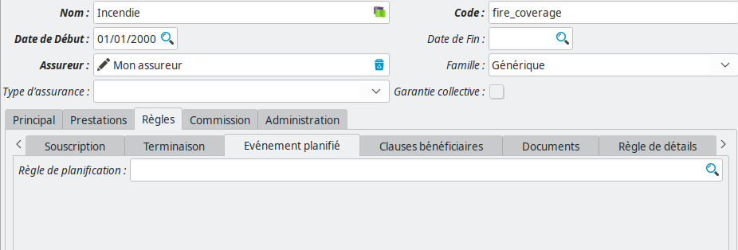

Les *Événements planifiés* sont une fonctionnalité de **Coog** permettant de
prévoir à l'avance le déclenchement d'actions particulières. Par exemple, lors
de la souscription d'un contrat, prévoir d'envoyer un rappel à un utilisateur 6
mois plus tards.

La mécanique générale des *Actions par type d'évènement* est hors du périmètre
de cette partie de la documentation. En revanche, la configuration d'évènements
automatiques lors de la souscription, si.

La *Règle de planification* est un lien vers une instance du *Moteur de
règles*. Lors de l'activation du contrat (et des événements majeurs qui lui
sont rattachés), cette règle sera appelée. Son résultat sera utilisé pour
planifier (ou supprimer des planifications précédentes) d'actions dans le
futur.

Un exemple de règle serait par exemple :

.. code-block:: python

    return [{
            'event': 'code_evenement',
            'planned_date': ajouter_jours(date_effet_initiale_contrat(), 63),
            }]

L'exemple ci-dessus déclenchera l'événement « `code_evenement` », correspondant
à un type d'événement créé manuellement dans **Coog**, 63 jours après la date
d'effet initiale du contrat.

Les possibilités sont assez vastes, étant donné que le déclenchement de
l'événement peut être rattaché à des actions assez variées, comme par exemple
l'envoi de documents, ou bien via les outils appropriés à des appels à des
web-services externes.

Clauses Bénéficiaires
~~~~~~~~~~~~~~~~~~~~~

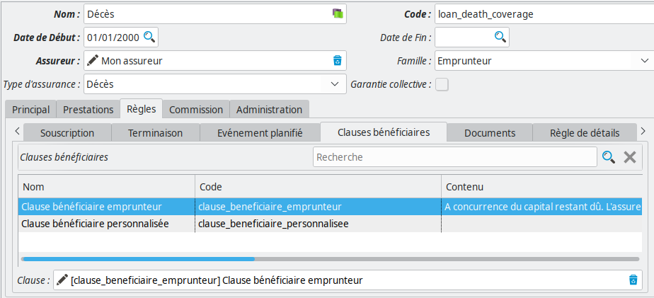

Certaines garanties nécessitent la saisie de clauses bénéficiaires lors de leur
souscription dans des contrats. Il s'agit typiquement de garanties de type
« Décès », où, malheureusement, la personne assurée ne peut plus bénéficier
directement des prestations associées.

Le fait d'alimenter la liste des clauses bénéficiaires possibles sur une
garantie rendra **obligatoire** leur saisie lors de la souscription. Le champ
*Clause* (en bas sur la capture d'écran) correspond à l'une des clauses de la
liste, et correspond à la clause qui sera sélectionnée par défaut pour les
nouvelles garanties.

Les clauses peuvent être ajoutées depuis le point d'entrée « Configuration
contrat / Clause / Clauses ». Il y a deux types de clauses, celles qui nous
intéressent ici étant les *Clauses bénéficiaire*.

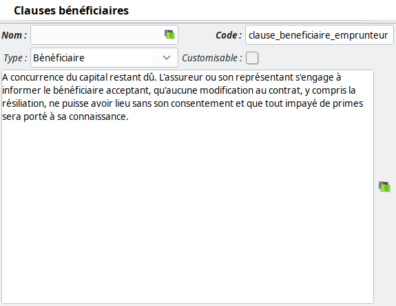

Une clause est constituée d'un *Nom* et d'un *Code*. On trouve également :

* *Type* : vide, ou *Bénéficiaire*, afin de séparer les clauses particulières
  du contrat des clauses bénéficiaires, qui répondent à un besoin précis
* *Customisable* : si cochée, lors de la souscription du contrat, il sera
  possible de modifier le texte de la clause
* Le texte de la clause, principalement utilisé en éditique

:Attention: Comme la majorité des éléments de configuration, les clauses
            (bénéficiaires ou pas) sont **partagées** entre les différents
            produits / garanties qui les utilisent. En modifier une la
            modifiera pour toutes les garanties l'utilisant

Documents
~~~~~~~~~

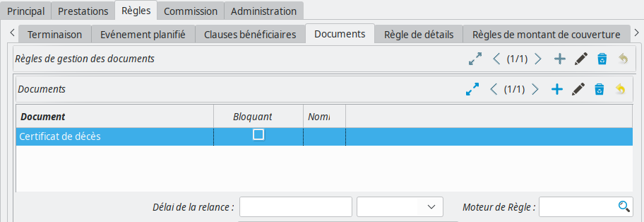

La configuration des *Documents requis* au niveau des garanties est identique à
celle au niveau des produits. La différence principale est que si, sur un
contrat, la même garantie est souscrite plusieurs fois (par des assurés
différents par exemple), le document sera demandés en autant d'exemplaires
qu'il y a d'assurés. En outre, lors de l'exécution de la règle (s'il y en a une
de définie), le *contexte d'exécution* sera celui de chaque garantie. Cela peut
permettre, par exemple, de ne demander un document que dans le cas où l'assuré
répond à certains critères (âge, données complémentaires, etc...)

Pour le détail de la configuration des documents (manuellement, ou via la
règle), merci de consulter la documentation au niveau du *Produit*.

Règle de détails
~~~~~~~~~~~~~~~~

Cette règle a plusieurs usages. Son intérêt premier est d'afficher aux
utilisateurs des données calculées via le moteur de règle au niveau d'une
garantie.

Par exemple :

* Le taux de prime, ou tout autre intermédiaire de calcul de la prime
* La valeur de rachat (pour des contrats vie)
* La date du dernier avenant
* Globalement, toute donnée « calculable » à partir du moteur de règles

En outre, cette règle est également appelée aux moments *importants* de la vie
du contrat (souscription, avenants, etc...) et sous certaines condition, le
résultat de cet appel sera stockée dans les versions de la garantie. Cela
permet de *figer* la valeur de certaines informations dans le temps, afin par
exemple de faciliter des extractions.

Enfin, il est possible d'appeler dynamiquement ces règles lors de la génération
de courriers d'éditique.

Prenons comme exemple la règle suivante :

.. code-block:: python

    reduit = date_de_reduction()

    rachat = rule_rachat_obseques()
    if not reduit or reduit < date_de_calcul():
        reduction = rule_reduction_obseques()
    else:
        reduction = 0.0

    return {
        'valeur_rachat': arrondir(rachat, 0.01),
        'valeur_reduction': arrondir(reduction, 0.01),
        }

Cette règle, issue d'un paramétrage de garantie *Obsèques*, retourne les
informations de la valeur de rachat, et de la valeur de réduction de la
garantie.

Les clés `valeur_rachat` et `valeur_reduction` correspondent à des données
*assimilées à* des données complémentaires, qui sont configurées dans le point
d'entrée « Administration / Configuration des détails » avec le *Nom de modèle*
« ``contract.option.version`` » (qui correspond aux versions de garanties) :

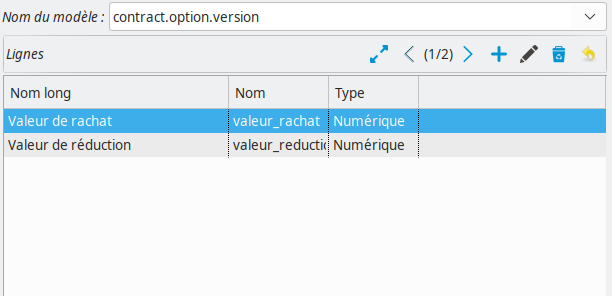

Le rendu lors de la souscription correspond à :

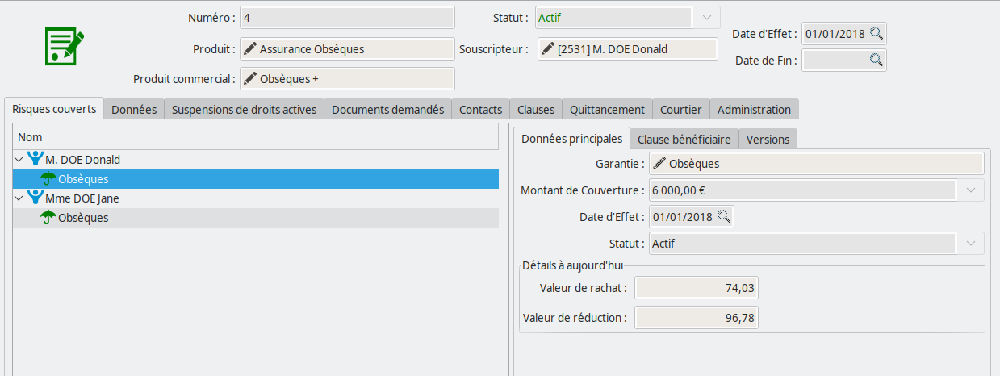

La donnée ``mode_de_calcul_des_details()`` dans le moteur de règle permet de
détecter le contexte d'évaluation de la règle. Les valeurs possibles sont :

- *current* : Le cas présenté ci-dessus, qui correspond aux données calculées
  pour l'affichage des garanties
- *normal*: Correspond au cas où l'on souhaite stocker les données lors des
  événements importants du contrat (avenants, etc...)
- Les autres valeurs correspondent aux cas définis par le paramétrage. Par
  exemple, si vous souhaitez utiliser cette règle pour de l'éditique, vous
  appellerez depuis le courrier la méthode ``_get_extra_details_at_date`` avec
  en premier paramètre un identifiant (``bulletin_adhesion``) qui sera
  accessible dans le moteur de règle via ``mode_de_calcul_des_details``

Règle de montants de couverture
~~~~~~~~~~~~~~~~~~~~~~~~~~~~~~~

Pour certains types de garanties, le risque sera assuré à hauteur d'un certain
*Montant de couverture*. Par exemple, en prévoyance, le capital qui sera
reversé en cas de décès, ou bien les montants d'indemnisation journalière en
cas d'arrêt de travail.

Cette règle permet de définir les valeurs qu'il sera possible de choisir pour
cette garantie lors de la souscription.

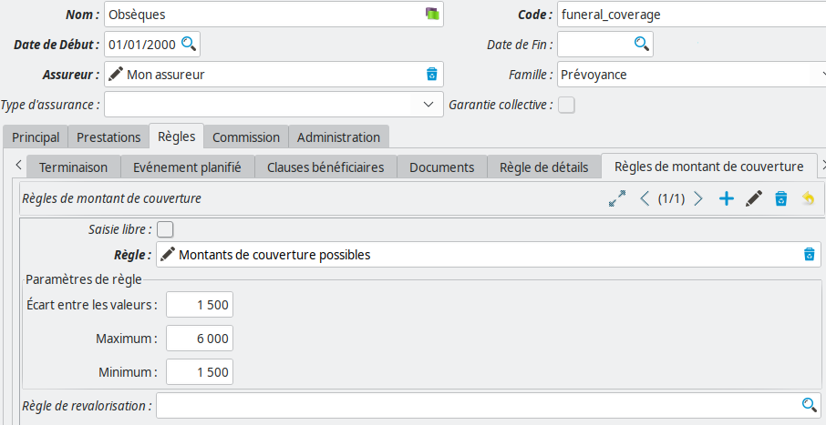

Il est possible de permettre une *Saisie libre*, auquel cas le montant ne sera
pas contraint (à part par d'éventuelles règles d'éligibilités). Dans le cas
contraire, la règle retourne une liste de montants possibles :

.. code-block:: python

    return [100, 200, 300]

Il est également possible de définir une *Règle de revalorisation*, qui
permettra la mise à jour du montant de couverture lors des renouvellements, ou
bien lors de l'exécution d'un batch annuel.

Ces règles servent uniquement à la saisie et aux contrôles lors de la
souscription ou des avenants sur les contrats.

:Note: Dans la majorité des cas, il est possible de remplacer l'utilisation de
       cette règle par une donnée complémentaire dédiée. L'intérêt de la règle
       consiste dans la possibilité de faire varier les valeurs possibles en
       fonction des autres caractéristiques de la garantie / du contrat

Éligibilité
~~~~~~~~~~~

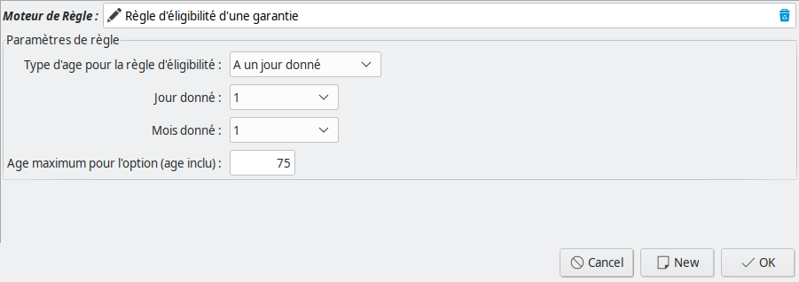

Les règles d'éligibilité sont exécutées lors de la souscription, et des
avenants de modification / souscription de garanties afin de valider le fait
que la garantie soit souscriptible pour le risque assuré.

La règle d'éligibilité doit retourner ``True`` (« Vrai ») ou ``False``
(« Faux »), et permet de définir des messages d'erreurs qui seront affichés à
l'utilisateur :

- ``ajouter_erreur("mon message d'erreur")`` correspond à une erreur bloquante,
  impossible à contourner
- ``ajouter_avertissement("mon avertissement")`` sera un avertissement non
  bloquant, laissant la possibilité à l'utilisateur de continuer la
  souscription

**Coog** fournit des règles d'éligibilité par défaut correspondant aux cas
« classiques » (éligibilité en fonction de l'âge d'une personne assurée...),
mais la moteur de règle laisse toute la souplesse nécessaire pour affiner en
fonction des besoins des produits paramétrés.

Exonération
~~~~~~~~~~~

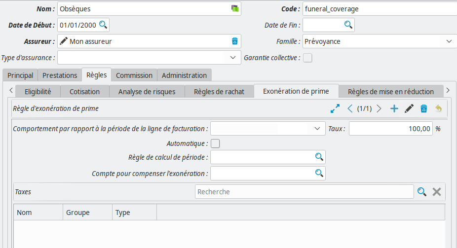

**Coog** inclut une mécanique d'exonération, totale ou partielle, des
cotisations. Ces exonérations peuvent ensuite être créées :

- *Automatiquement* à partir d'une règle
- *Automatiquement* à partir d'un batch
- *Manuellement*, directement depuis les contrats concernés

Le paramétrage au niveau de la garantie contient les éléments suivants :

- *Comportement par rapport à la ligne de facturation* : Permet de définir si
  l'exonération doit s'appliquer sur une ligne de quittance. Les valeurs
  possibles sont :

  - *Chevauchement d'un jour* : Si la ligne de quittance a au moins un jour en
    commun avec la période exonérée, la ligne sera exonérée. Par exemple, pour
    une ligne de quittance du 01/01 au 31/01, et une exonération du 28/01 au
    15/02, la ligne sera exonérée en totalité
  - *Chevauchement total* : La ligne de quittance ne sera exonérée que dans le
    cas où elle est entièrement comprise dans la période d'exonération. Par
    exemple, pour une ligne de quittance du 01/01 au 31/01 et une exonération
    du 28/01 au 15/02, la ligne ne sera pas exonérée. En revanche, pour une
    exonération du 01/01 au 16/02 elle sera exonérée en totalité
  - *Prorata* : La ligne de quittance sera exonérée sur la période commune avec
    la période d'exonération. Par exemple pour une ligne de quittance du 01/01
    au 31/01 et une exonération du 15/01 au 04/02, la ligne sera uniquement
    exonérée sur la période du 15/01 au 31/01
- *Taux* : Le pourcentage de l'exonération. Une exonération de 100 % signifiera
  que l'intégralité de la cotisation sera exonérée
- *Automatique* : Si cochée, la *Règle de calcul de période* sera utilisée lors
  de la souscription pour automatiquement créer une / des périodes
  d'exonérations sur la garantie. La *Règle* doit retourner une liste de
  périodes à exonérer :

  .. code-block:: python

      return [[date_effet_initiale_contrat(),
              ajouter_mois(date_effet_initiale_contrat(), 1)]]
- *Compte pour compenser l'exonération* : Indique le compte qui sera utilisé
  pour comptabiliser l'exonération. En effet, le fonctionnement de **Coog**
  pour les quittances exonérées (au moins partiellement) est de conserver les
  lignes originales (la ventilation sur les comptes de garantie), et de les
  compenser à auteur du *Taux* via ce compte. Concrètement, cela revient à dire
  que l'exonération est « payée par » ce compte
- *Taxes* : Les taxes à appliquer sur la / les ligne(s) d'exonération dans les
  quittances

Mise en réduction
~~~~~~~~~~~~~~~~~

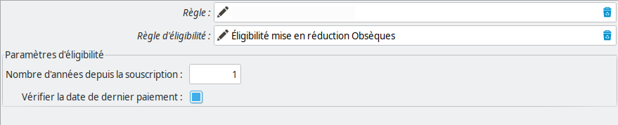

Pour certaines garanties, en partie les garanties *vie entière* qui ne sont pas
à fonds perdus, il est en général possible de *Mettre en réduction* le contrat.
Cela signifie arrêter les cotisations, et abaisser le montant de couverture à
un montant calculé en fonction de la durée du contrat, des primes encaissées,
et du montant de couverture initial.

Ce comportement est en général substitué aux résiliations dans le cas
d'impayés.

Le paramétrage se comporte :

- D'une *Règle*, utilisée pour calculer le montant réduit en fonction de la
  date de réduction
- D'une *Règle d'éligibilité*, qui est utilisée pour déterminer si la mise en
  réduction est possible ou pas. Si un contrat devant être résilié n'est pas
  éligible pour une mise en réduction, il le sera. Typiquement, l'exemple
  ci-dessus est celui d'une règle où il n'est pas possible de mettre en
  réduction moins d'un an après la souscription, et où l'on vérifie que la mise
  en réduction n'a pas lieu sur une période impayée

Rachat
~~~~~~

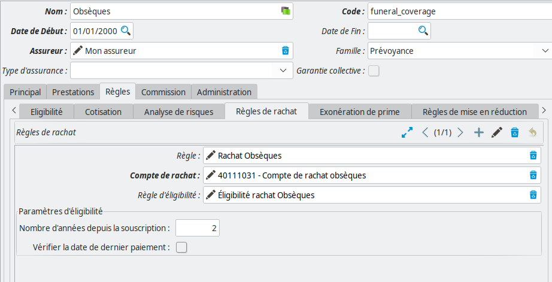

Dans les mêmes cas (en général) que pour les mises en réduction, il est
possible de demander le *Rachat* d'un contrat qui n'est pas à fonds perdus.
Dans ce cas, le contrat doit être résilié, et une partie des cotisations payées
par l'assuré lui seront reversées.

Comme pour la mise en réduction, les rachats sont configurés à l'aide :

- D'une *Règle* retournant la valeur du rachat à la date de calcul
- D'une *Règle d'éligibilité* retournant ``True`` ou ``False`` selon que le
  rachat est possible ou pas. Cette règle peut comporter des messages d'erreurs
  ou d'avertissement (bloquant / non-bloquant)
- D'un *Compte de rachat*, pour compenser le paiement de la valeur de rachat à
  l'assuré

Analyse de risques
~~~~~~~~~~~~~~~~~~

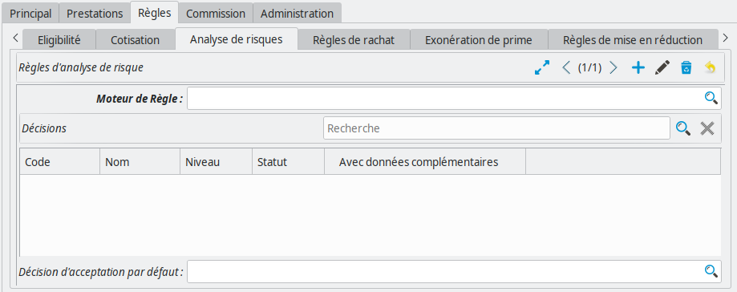

**Coog** supporte lors de la souscription d'un contrat la possibilité de passer
en *Analyse de risques*. Il n'y a pas à proprement parler de gestion de
l'analyse de risque (pas de secret médical, etc...), mais il est possible de :

- Déterminer qu'une analyse de risque est nécessaire à partir des éléments « de
  base » du contrat
- Saisir les résultats de l'analyse, en fonction typiquement des retours du
  médecin

Le *Moteur de règle* doit retourner ``True`` (« Vrai ») ou ``False``
(« Faux »). Dans le premier cas, la garantie sera acceptée sans conditions,
autrement dit il ne sera pas nécessaire de demander l'avis d'un médecin pour
cette garantie. Dans le second, la souscription du contrat sera bloquée tant
que l'analyse ne sera pas terminée.

Le champ *Décisions* permet de définir les différentes décisions qu'il sera
possible de prendre pour la garantie. Ces décisions sont éventuellement
partagées entre les garanties, et spécifient le comportement à adopter pour la
suite de la souscription (Accepter, Refuser, Demander des pièces
complémentaires, etc.).

La *Décision d'acceptation par défaut* sera celle qui sera renseignée dans le
cas où la *Règle* n'a pas jugé utile de déclencher une analyse plus poussée.
