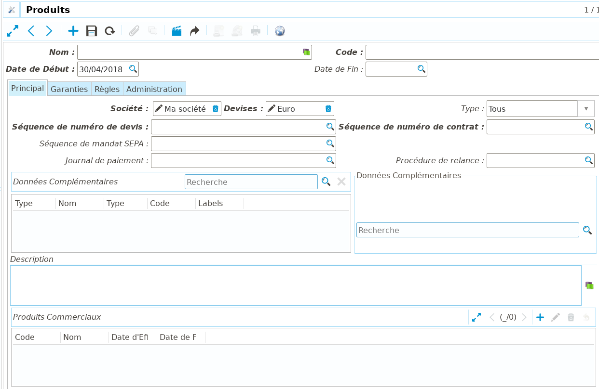
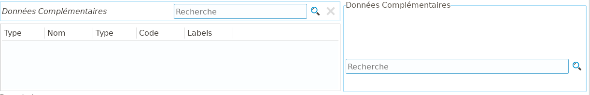
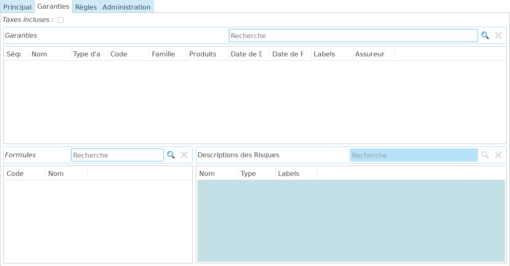
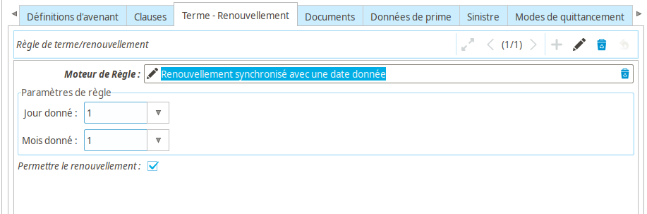
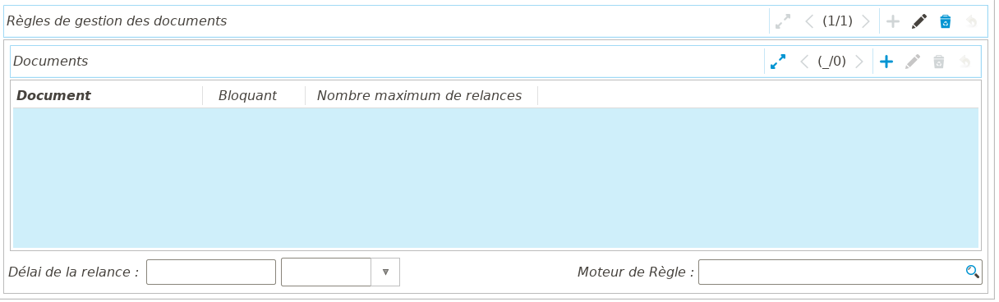

Produits
========

L'objet de **Coog** étant la gestion de contrats / sinistres d'assurance,
l'élément central du paramétrage est évidemment celui des produits souscrits /
souscriptibles.

Le paramétrage de ces produits se fait sur des écrans différents, et dépend
fortement des modules installés. Toutefois, fondamentalement, un *Produit* dans
**Coog** est un agrégat de *Garanties*. Autrement dit, la majorité des éléments
de configuration sont définis sur les garanties, le produit n'étant qu'un
enrobage permettant de fournir un ensemble packagé.

Nous nous concentrerons dans cette partie sur les aspects propres au produit,
les éléments issus du paramétrage des garanties étant abordé dans la partie
*Garantie* de la formation.

Présentation générale
---------------------

Un produit contient les éléments « habituels » d'un élément de paramétrage :
*Nom*, *Code*, *Société*, et *Libellés* (dans l'onglet *Administration*).

On trouve également :

* *Date de début* : La date de début de validité du produit. Il sera
  **impossible** de souscrire un contrat ayant une date d'effet antérieure à
  cette date. Il peut être utile, lors de la mise en place du produit, de
  définir cette date dans le future, de sorte qu'il soit plus difficile
  d'accidentellement créer un contrat dessus
* *Date de fin* : Cette date contrôle la date de fin d'ouverture à la
  souscription du produit. Il sera impossible de souscrire un contrat ayant une
  date d'effet postérieure à cette date
* *Devise* : La devise (dans le sens de « monnaie ») qui sera utilisée pour le
  fonctionnement des contrats ayant souscrit ce produit
* *Type* : Ce champ contrôle les types de souscripteurs autorisés pour les
  contrats rattachés à ce produit. Les valeurs possibles sont *Personne
  physique*, *Société*, ou *Tous*
* *Description* : permet d'écrire un texte descriptif du produit, qui peut
  ensuite être repris typiquement dans des courriers d'éditique

Il s'agit des données « de base » du produit. Les autres champs vont être
expliqués par « groupes métier ».

Données complémentaires
-----------------------

Le *Produit* est à la fois un *Configurateur* de *Données complémentaires* pour
le contrat, et un *Porteur* pour les données de type *Produit*.

Les *Données complémentaires* de type *Produit* permettent d'ajouter des
données afin de *caractériser* les produits par exemple pour des extractions,
ou bien de l'éditique.

Garanties
---------

Comme expliqué en introduction, un *Produit* est globalement un assemblage de
*Garanties*. L'onglet éponyme permet de définir parmi les garanties paramétrées
dans **Coog** celles qui constituent ce produit.

En outre, afin de faciliter la souscription, il est possible de définir des
*Formules*. Une formule est un ensemble de garanties (avec un *Nom* et un
*Code*) pré-définit qui sera proposé au gestionnaire lors de la souscription.
Cela permet d'éviter d'avoir à sélectionner les garanties manuellement, il
suffit de sélectionner la formule dans une liste déroulante pour que les
garanties correspondantes soient souscrites. Cela n'empêche pas l'utilisateur
de faire une sélection manuelle si nécessaire.

Le champ *Description des risques*, non modifiable, permet de visualiser les
types de risques couverts par le produit. La notion de *Description de risque*
est abordée plus en détail dans la documentation des garanties.

Le champ *Taxes incluses* permet de s'assurer que les taxes sur les garanties
du produit sont toutes calculées de la même façon. Le cocher empêchera la
sélection de garanties configurées pour un calcul « Taxes non incluses ».

:Note: S'il est nécessaire de modifier cette caractéristique des garanties
       après qu'elles aient été ajoutées au produit, il est nécessaire de les
       retirer de la liste des garanties du produit, de sauvegarder,
       d'effectuer la modification sur les garanties, puis de les ajouter de
       nouveau au produit

Caractéristiques du contrat
---------------------------

Un certain nombre de champs contrôlent des éléments liés à la vie du contrat.
En premier lieu :

* *Séquence des numéros de devis* : Définit la *Séquence* utilisée pour
  numéroter les nouveaux devis. Cette séquence est en général partagée entre
  les différents produits, mais il est possible d'en créer une par produit si
  nécessaire
* *Séquence des numéros de contrat* : Lors de l'activation des contrats, cette
  séquence sera utilisée pour générer le numéro du contrat. Elle est en général
  propre à chaque produit
* *Durée de conservation des données* : Dans l'onglet « Conservation des
  données », ce champ contrôle le délai entre la date de fin du contrat et le
  moment où les données qui lui sont rattachées seront anonymisées. Cela permet
  de répondre aux problématiques de protection des données personelles des
  assurés
* *Définitions d'avenant* : Permet de définir la liste des avenants qui seront
  disponibles sur le contrat. L'intérêt est de pouvoir s'adapter au maximum aux
  caractéristiques du produit, et donc de ne pas proposer un avenant de
  modification de prêt sur un contrat prévoyance
* *Données du contrat* : Dans l'onglet « Données du contrat », il est possible
  de définir une règle qui sera utilisée pour initialiser certaines données du
  contrat. Cette règle doit retourner un dictionnaire de valeurs correspondant
  aux champs du contrat à mettre à jour. Cela permet par exemple de calculer
  automatiquement une date d'effet à partir d'une date de signature.

  .. code-block:: python

      return {
          'start_date': .......
          }
* *Clauses* : L'onglet *Clauses* permet de définir les clauses particulières
  qui seront disponibles lors de la souscription du contrat. Il sera alors
  possible de sélectionner une ou plusieurs de ces clauses pour les ajouter au
  contrat

Quittancement
-------------

Le *Produit* comprend également une partie du paramétrage lié au quittancement
(et à la comptabilisation associée) des contrats l'ayant souscrit. On retrouve
en premier lieu les données de configuration générale :

* *Séquence de mandat SEPA* : Si le produit permet les prélèvements, il est
  possible de définir une *Séquence* qui sera utilisée pour numéroter les
  mandats SEPA qui seront générés dans le cadre de la souscription des
  contrats. Ce paramétrage n'est pas obligatoire, dans le cas où l'on souhaite
  que les gestionnaires saisissent manuellement cette information (typiquement
  si le numéro est issu d'un autre système)
* *Journal de paiement* : Permet de définir le *Journal de paiement* (pour les
  prélèvements et / ou les virements liés aux contrats) qui sera utilisé pour
  ce produit. S'il n'est pas renseigné, le journal de paiement par défaut
  renseigné dans la configuration comptable sera utilisé. La configuration des
  journaux de paiement est détaillée dans la section *Configuration générale*
  de la documentation
* *Procédure de relance* : De la même façon, il est possible de définir une
  procédure de relance spécifique (dans le sens « différente de celle par
  défaut ») pour les impayés liés aux contrats. Par exemple, on peut souhaiter
  être plus souple et autoriser un délai de 3 mois pour payer les contrats liés
  à un produit particulier, mais rester strict pour les autres
* *Modes de quittancement* : Le champ *Modes de quittancement* permet de
  définir quelles options de paiement seront disponibles lors de la
  souscription des contrats. Par exemple, on peut souhaiter autoriser le
  prélèvement mensuel, trimestriel, semestriel et annuel, mais refuser le
  paiement par chèque sauf pour les contrats annuels

  La case *Modifier l'ordre* permet de ré-ordonner les modes de quittancement
  sélectionnés, de façon à optimiser la saisie. Par ailleurs, le premier
  élément de la liste sera celui sélectionné par défaut pour les nouveaux
  contrats.
* *Délai pour le paiement des frais à la signature* : Dans le cas où le
  paramétrage inclut des frais « À la signature du contrat », ce champ permet
  de contrôler le délai entre la date de signature et la date de
  comptabilisation de la quittance correspondante

Calcul des primes
-----------------

Bien que la majorité des informations de tarification soient définies dans les
garanties, la *Produit* permet de configurer certains éléments. Ces éléments de
configuration se trouvent dans l'onglet « Données de Prime » :

* *Dates de calcul* : Le paramétrage des tarifs sur les garanties utilise le
  *Moteur de règles*. Cela signifie qu'en théorie, les règles ayant accès à
  énormément de données, la valeur du tarif peux changer tous les jours. Pour
  des raisons évidentes de performances, nous souhaitons limiter les dates
  auxquelles **Coog** déclenchera des recalculs.

  Par défaut, **Coog** recalculera les tarifs :

  * À la date de souscription du contrat
  * Aux (éventuelles) dates de renouvellement
  * À la date de résiliation
  * Aux dates d'avenants tarifants

  Toutefois, en fonction des produits, on peut souhaiter forcer d'autres dates
  de calcul, via le champ *Dates de calcul* :

  .. image:: images/produit_dates_calcul.png
      :align: center

  Les différent types de « Règles » pour déterminer les dates de recalcul sont
  les suivantes :

  * *Annuellement à l'anniversaire du contrat* : Les tarifs seront recalculés
    tous les ans synchronisés à la dernière date de renouvellement du contrat.
    Pour un contrat souscrit (ou renouvellé) le 04/06/2020, les tarifs seront
    donc recalculés tous les 04/06
  * *Annuellement à cette date* : « cette date » correspond à la date saisie
    dans le champ *Date de synchro personnalisée*. Cette date sera alors
    utilisée comme référence pour le recalcul. Typiquement, on aura une date au
    01/01/2000, pour un recalcul tous les ans le 01/01
  * *Durée à partir de la date d'effet initiale du contrat* : Permet de
    calculer une date définit à l'aide des champs *Durée* et *Unité*. Par
    exemple, pour un contrat souscrit le 01/01/2020, avec une durée de *3
    mois*, les tarifs seront recalculés le 01/03/2020
  * *Durée à partir du début du terme courant du contrat* : Même comportement
    que pour le cas précédent, mais sur la base de la date de début du dernier
    renouvellement
  * *À cette date* : Permet de définir une date fixe via le champ *Date de
    synchro personnalisée*. Peut être utilisé pour forcer un recalcul à une
    date connue d'avance (on sait lors du paramétrage du produit que le
    08/10/2020 un changement particulier doit être pris en compte, donc on
    force cette date pour que les contrats souscrits avant le prenne en compte)
  * *Annuellement à l'anniversaire de l'assuré* : Force un calcul à tous les
    anniversaires de l'assuré, utile pour des contrats dont les tarifs
    dépendent de l'âge réel de l'assuré
  * *À chaque échéance de prêt* : Pour les produits de type emprunteur, permet
    de déclencher à calcul à chaque échéance du / des prêts du contrat. Cela a
    un coût important en termes de performances (lors de la souscription, il
    faudra potentiellement faire 300 calculs pour chaque garantie), il est donc
    recommandé de n'activer cette ligne que dans le cas où cela est nécessaire
    au vu des caractéristiques du produit

  :Important: **Coog** ne calculera les tarifs qu'aux dates indiquées
              ci-dessus. Si la règle de tarif prévoit un changement à une date
              non configurée, le risque est qu'un recalcul lié à un avenant
              censé être sans impact sur le tarif en ait un. Par exemple, si la
              règle de tarif prévoit un changement le 01/01, mais que les dates
              de calcul ne sont pas configurés pour le prendre en compte, un
              contrat allant du 01/12 au 30/11 ne « verra » la modification
              qu'au début de la période suivante. En revanche, si l'on effectue
              un avenant le 01/03, même si cet avenant n'est pas censé être
              tarfiant, le tarif évoluera en prenant en compte la modification

* *Frais* : Permet d'ajouter des frais sur le produit. Pour davantage
  d'informations sur la création d'un frais, se rapporter à la *Configuration
  générale*. Les frais ajouté ici seront automatiquement ajoutés aux contrats
  souscrits sur ce produit, avec la possibilité selon leur paramétrage d'y
  déroger
* *Règle de taux moyen prêt* : Pour le cas des produits emprunteur, permet de
  configurer la façon dont les frais rattachés au contrat seront réparti sur
  les différents prêts lors du calcul des taux réglementaires (TAEA...).

  .. image:: images/produit_taux_moyen_pret.png
      :align: center

  Ces règles sont partagées entre les produit (il n'y en a en général qu'une
  seule configurée dans une installation de **Coog**). Elles ont un *Nom* et un
  *Code*, et ont deux possibilités de fonctionnement :

  * En *Utilisant la règle par défaut*, la même règle de gestion sera appliquée
    à tous les frais :

    * *Ne pas prendre en compte les frais* : Ignorer les frais
    * *Appliquer au prêt le plus long* : L'intégralité des frais sera considéré
      comme faisant parti de la prime du prêt ayant la plus longue durée
    * *Appliquer au prêt le plus important* : Les frais seront rattachés au
      prêt ayant le montant initial le plus élevé
    * *Appliquer au prorata du montant* : Les frais seront réparti parmi les
      différents prêts au prorata de leur montant initial

  * Sinon, il est possible de spécifier le comportement frais par frais, en les
    saisissant dans le champ *Règles de frais*

Renouvellement
--------------

Certains contrats ne sont jamais renouvellés (contrat d'assurance vie entière,
contrats emprunteurs, etc.). D'autres en revanche sont des contrats annuels,
souvent à tacite reconduction.

**Coog** gère les termes et le renouvellement via des règles :

Le *Moteur de règles* permet de choisir une règle, qui retourne **la date de
fin de la période en cours**. Par exemple, pour des contrats annuels
renouvellés le premier janvier, cette règle retournera, pour l'année 2020, le
31 décembre 2020.

**Coog** fournit deux règle « par défaut » :

* Le *Renouvellement synchronisé avec une date donnée* permet justement de
  caler le renouvellement des contrats sur une date précise, à l'aide des
  paramètres de la règle
* Le *Renouvellement synchonisé avec la date de souscription* quant à lui va
  renouveller les contrats à leur date anniversaire respective

Le champ *Permettre le renouvellement* permet de contrôler le renouvellement en
l'autorisant ou pas. S'il n'est pas coché, la règle devient uniquement une
règle de terme, dans le sens où elle donnera la date de fin définitive du
contrat.

Pour les cas où l'on souhaite bloquer le renouvellement « au bout d'un certain
temps », il suffit de calculer des dates de fin au niveau des garanties, le
contrat étant automatiquement résilié si toutes les garanties le sont.

Documents
---------

Le volet *Documents* de la configuration produit est séparé en deux parties.

Modèles de courriers
~~~~~~~~~~~~~~~~~~~~

Comme expliqué dans la documentation de la partie *Éditique* de **Coog**, les
différents modèles de document pouvant être imprimés dans l'application sont,
quand cela est possible, filtré en fonction du produit sur lequel ils portent.
Pour rendre un document « disponible » pour un produit, il suffit de l'ajouter
dans la liste des *Modèles de courrier* du produit.

Il est en outre possible de réutiliser le même modèle de courrier pour des
produits différents, mais de modifier leur *Style* à l'aide du champ *Style du
rapport*. Le *Style* d'un document open office contient la « charte graphique »
du document, et permet de séparer la mise en forme du document de son contenu,
ce qui facilite le partage des modèles parmi les différents
produits.

Règles de documents
~~~~~~~~~~~~~~~~~~~

Il est courant lors des souscriptions de demander qu'un certain nombre de
documents soient fournit par le souscripteur avant de valider le contrat.
Certains de ces documents dépendent des garanties souscrites (et seront donc
configurés au niveau des garanties). D'autres dépendent uniquement du fait que
le produit soit souscrit.

Il est possible de définir des documents à demander lors de la souscription de
deux façons différentes :

* En renseignant la liste *Documents* avec les types de documents attendus.
  Pour chacun d'entre eux, il est possible d'indiquer si l'on souhaite qu'il
  soit bloquant pour la souscription, ainsi que le nombre maximum de relances
  si l'on souhaite que des relances soient effectuées automatiquement
* En saisissant une *Règle*, ce qui permet de faire varier les documents
  demandés en fonction des caractéristiques du contrat. Cette règle doit
  retourner un dictionnaire dont les clés sont les codes des types de documents
  demandés, et comme donné un autre dictionnaire indiquant si le document est
  bloquant ou pas

  .. code-block:: python

      return {
          'questionnaire_medical': {'blocking': True},
          'mandat_sepa': {'blocking': False},
          }

Il est dans tout les cas possibles de choisir un *Délai de relance*, qui sera
appliqué avant d'envoyer des relances automatiques pour le cas où la
fonctionnalité est configurée.
