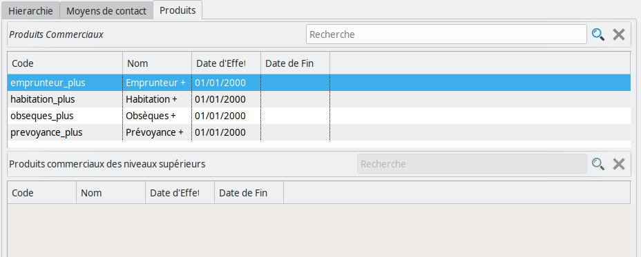

Réseaux de distribution
=======================

Les réseaux de distribution permettent de contrôler quels acteurs ont la
possibilité de souscrire de nouveaux contrats dans **Coog**, mais également de
gérer les niveaux de commissionnement multiples.

Structure
---------

Le réseau de distribution d'une installation de **Coog** est une arborescence.
Les « nœuds » de cette arborescence représentent les différentes entités ayant
vocation à utiliser **Coog**.

L'exemple ci-dessus correspond à un paramétrage classique de réseau de
distribution. On trouvera systématiquement, au niveau « 0 » un nœud « Racine ».

De manière générale, les accès donnés à un nœud sont également donné à ses
enfants, et à l'ensemble de ses parents. Concrètement, cela signifie que par sa
nature même, le nœud *Racine* aura accès à l'intégralité de l'application.

Sous ce nœud principal, on trouvera en général (mais, s'agissant entièrement de
configuration, cela peut varier en fonction des besoins) :

- Un nœud représentant les *Partenaires commerciaux*, qui ont négociés des
  accords avec la *Société* utilisatrice de **Coog** pour distribuer certains
  produits
- Un nœud correspondant au *Réseau Interne* à la *Société*
- Le *Reste du monde*, i.e. les différents apporteurs d'affaire n'ayant pas de
  liens formalisés avec la *Société*

:Attention: Les distinctions faites ci-dessus correspondent à des
            problématiques d'organisation, et n'ont pas de *sens* particulier
            dans **Coog**. Il est tout à fait possible d'avoir directement le
            niveau le plus fin « sous » le nœud *Racine*, l'inconvénient étant
            qu'il faudra manuellement donner les différents droits à chacun des
            nœuds

Pour bien clarifier le sujet, dans le cas suivant :

Si l'on donne au nœud « C1 » le droit de distribuer un produit, alors :

- *Root* (*Racine*) aura également le droit de le distribuer, car il est un
  parent de *C1*
- *C101*, *C102*, et *C103* également, car ils sont des enfants de *C1*
- *C2* et ses enfants en revanche ne pourront pas le faire (sauf si on leur
  donne le droit par ailleurs)

Détail d'un nœuds
-----------------

Un nœud est composé d'un *Nom* et d'un *Code* qui permettent de l'identifier
dans l'application. Il a également une liste de *Niveaux inférieurs*, qui
correspondent à ses enfants. Le champ *Niveau supérieur* quant à lui correspond
au parent du nœud sélectionné.

Le champ *Tiers*, de même que le champ *Adresse*, n'est pas obligatoire. Il a
en revanche un grande importance :

**Le fait qu'un tiers soit rattaché à un nœud du réseau de distribution en fait
automatiquement un courtier**

Autrement dit, la **définition** d'un courtier dans **Coog** est qu'il s'agit
d'un tiers rattaché à un nœud du réseau de distribution.

Le champ *Adresse* quant à lui permet, pour un nœud enfant d'un nœud rattaché à
un tiers, de choisir une adresse de ce tiers pour la rattacher au réseau.
Concrètement, cela permet de définir un nœud pour le courtier, et de rattacher
chacune de ses agences (via leur adresse) à des nœuds enfants :

.. code::

    Racine
      |
      +--> Courtiers
             |
             +--> Courtier 1 (rattaché à un tiers)
                     |
                     +--> Agence 1 (rattaché à l'adresse 1 du Tiers 1)
                     |
                     +--> Agence 3 (rattaché à l'adresse 2 du Tiers 1)
                     |
                     +--> Agence 2 (rattaché à l'adresse 3 du Tiers 1)

:Note: Le fait de saisir les adresses pour les nœuds enfants n'est pas
       indispensable, mais peut être utile pour l'éditique si l'on souhaite ne
       pas adresses l'ensemble des courriers au siège du courtier

Enfin, il est possible de définir, sur n'importe quel nœud (même s'il n'est pas
rattaché à un tiers), des moyens de contacts afin d'enregistrer dans **Coog**
comment il est possible de contacter l'entité concernée :

Rattachement des utilisateurs
-----------------------------

Il est possible de rattacher les utilisateurs de **Coog** à un réseau de
distribution. Ce faisant, les actions de cet utilisateur seront automatiquement
limités par le paramétrage du réseau auquel il sera rattaché. Par exemple, il
ne pourra pas souscrire de contrats sur un produit pour lequel le réseau auquel
il est rattaché n'a pas de produit commercial, et qui n'est pas distributeur.

.. image:: images/reseau_utilisateur.png
    :align: center

Un utilisateur qui n'est rattaché à aucun réseau sera considéré comme faisant
partie de tous les réseaux disponibles. Lors des saisies (par exemple en
souscription) où un réseau de distribution doit être renseigné, il aura le
choix parmi tous ceux applicables en fonction du contexte. A contrario, un
utilisateur rattaché à un réseau n'aura pas le choix, ou bien sera limité à son
réseau propre (incluant ses enfants).

Portefeuille client
-------------------

La notion de *Portefeuille client* dans **Coog** correspond à un cloisonnement
des personnes dans l'application. Un portefeuille est définit par un *Réseau de
distribution* pour lequel le champ *Portefeuille client* est coché. Il peut y
avoir autant de portefeuilles différents qu'il y a de noeuds dans le réseau de
distribution (bien que dans la majorité des cas ce ne sera pas le cas).

Concrètement, à partir du moment où un ou plusieurs portefeuilles sont
paramétrés, les utilisateurs qui ne sont pas membres du réseau de distribution
rattaché à ce portefuille (autrement dit qui ne sont ni parent ni enfant)
n'auront plus accès aux tiers / contrats qui y sont rattachés.

Cette fonctionnalité permet que les membres du réseau de distribution qui sont
« cousins » (qui ont un parent commun sans avoir de relation directe entre eux)
ne voient pas leurs clients respectifs.

Un utilisateur qui n'est pas rattaché à un réseau de distribution, ou bien à un
nœud parent de plusieurs portefeuilles différents, pourra choisir lors de la
création d'un tiers le portefeuille auquel le rattaché. Il est possible,
typiquement pour les tiers non souscripteurs (banques, courtiers, etc.), de ne
pas saisir de portefeuille. Dans ce cas ce tiers sera visible indépendamment du
réseau de distribution de l'utilisateur.

Distributeur
------------

Le champ *Distributeur* des réseaux de distribution permet de marquer le nœud
du réseau comme un « Distributeur de contrats ».

L'autre façon de voir les choses consiste à dire que les nœuds du réseau qui ne
sont pas marqués comme *distributeurs* ne peuvent pas être rattachés en tant
que distributeur sur un contrat.

Le fait qu'un contrat soit rattaché à un distributeur est tout d'abord une
question de visualisation : on peut consulter depuis le réseau de distribution
la liste des contrats qui lui sont rattachés. Un contrat rattaché à un enfant
d'un nœud du réseau est considéré comme rattaché au réseau.

Par ailleurs, lors de la saisie du contrat, le fait de saisir le réseau de
distribution va automatiquement forcer le courtier. Concrètement, le courtier
d'un contrat est un parent du réseau de distribution qui est rattaché à un
tiers.

:Attention: La notion de *distributeur* n'est pas propagée aux enfants /
            parents du nœud. Il n'y a pas de cloisonnement de données (le
            parent verra les contrats souscrit par ses enfants), mais le parent
            ne pourra pas être sélectionné directement comme distributeur du
            contrat, sauf bien sûr s'il est lui-même *Distributeur*

Produits commerciaux
--------------------

Comme expliqué dans la documentation portant sur le paramétrage produit, les
produits de **Coog** sont des *Produits techniques*. Pour permettre leur
souscription par des éléments du réseau, il est nécessaire de créer des
*Produits commerciaux*. Un produit commercial permet concrètement d'autoriser
un nœud du réseau (et tous ses enfants) à souscrire des contrats sur un produit
technique. Ses parents peuvent également le souscrire, étant donné qu'ils
peuvent « s'identifier » en tant que n'importe lequel de leurs enfants.

Les produits commerciaux rattachés directement au nœud ainsi que ceux qu'il
hérite de ses parents sont visibles dans l'onglet *Produits* :

