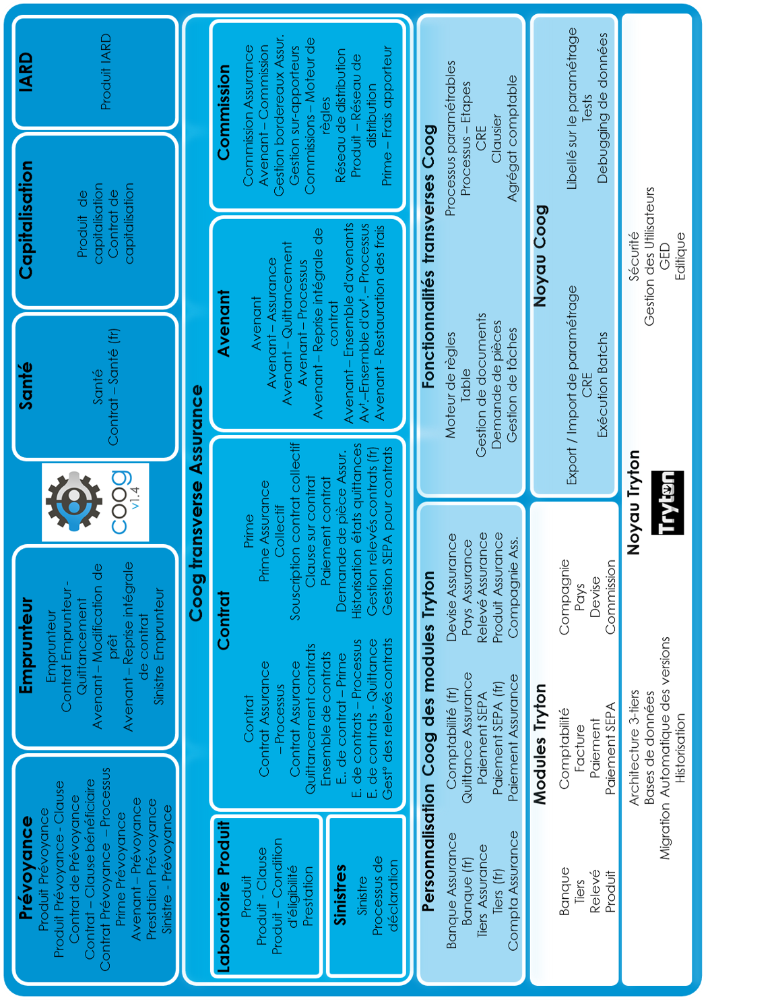

Fonctionnalités
===============

Introduction
------------

A l'origine il y'a `Tryton`_, framework qui fournit toutes les fonctionnalités
nécessaires à une plate-forme applicative complète : persistance des données,
modularité, gestion des utilisateurs (authentification, contrôle fin des accès
aux données), rapports, services web et internationalisation.
Il constitue ainsi une plate-forme applicative qui peut être utilisée dans un
large éventail de situations.

Coopengo a développé un ensemble de modules venant enrichir la base existante
des modules Tryton, afin d'obtenir **coog**, une solution applicative sur 
mesure pour les besoins des métiers de l'Assurance.

.. _Tryton: http://www.tryton.org/

Fonctionnalités Tryton, hors modules
------------------------------------

- Architecture 3 tiers
    Server et client écrits en Python et multiplate-forme (Linux, Windows et
    OS X), tout service est un webservice. Plusieurs bases de données
    supportées : PostgreSQL, MySQL ou SQLite.

- Gestion des utilisateurs
    Authentification, paramétrage fin d'habilitations et groupes 
    d'utilisateurs. Accès concurrents aux ressources.

- Gestion électronique de documents
    Sans limite de taille de fichiers, génération de rapports .odt WYSIWYG,
    intégration de clients mail.

- Et aussi
    Plus de 60 modules standards, mises à jour automatiques, historisation 
    des écritures, etc.

Fonctionnalités des modules
---------------------------

.. note:: Les fonctionnalités héritées du framework Tryton sont précédées de
  la mention ``[Tryton]`` pour les différencier de celles apportées par la
  surcouche coog.
