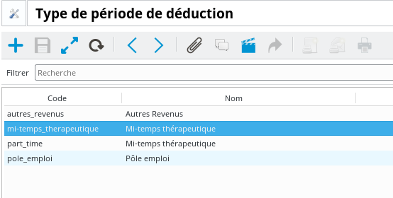
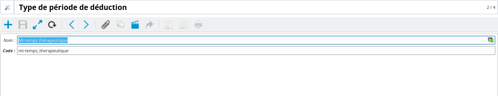
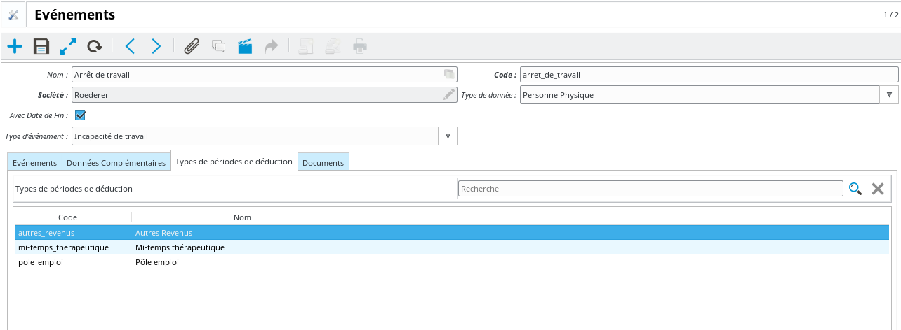
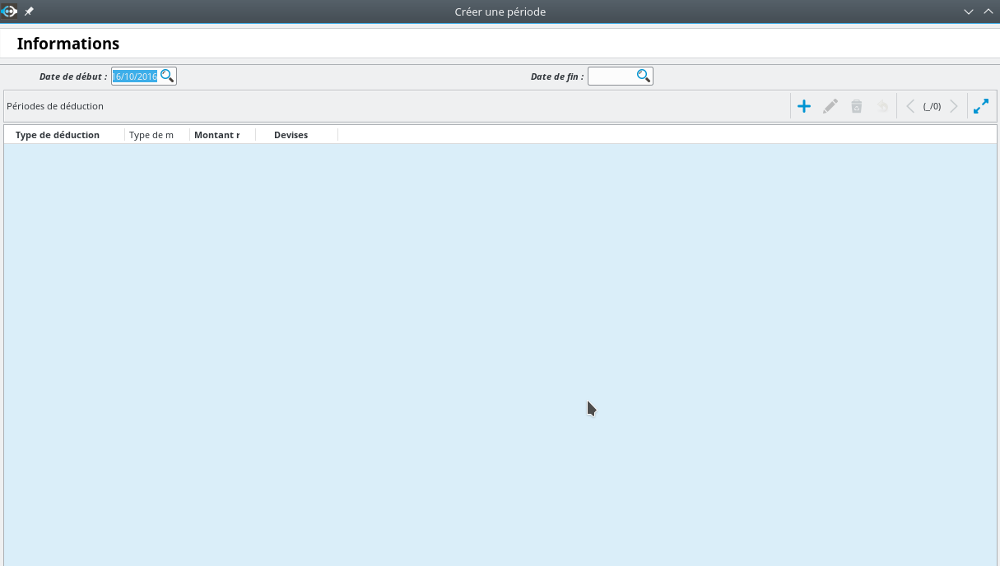
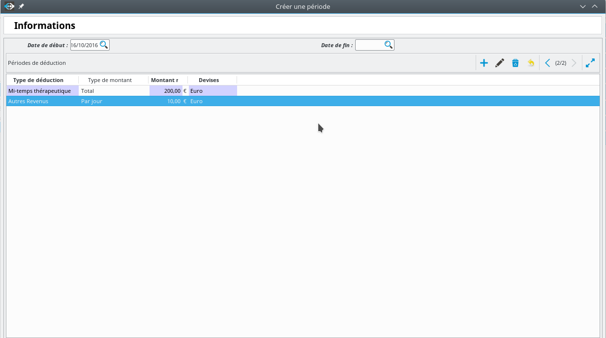

Configuration et utilisation des périodes de déducution
=======================================================

Ce tutoriel explique comment configurer et intégrer des revenus d'un assuré
pendant un arrêt de travail.

Configuration
-------------

Le module de gestion des périodes de déduction permet de configurer des types
de déductions différentes. On peut parler par exemple de temps partiel
thérapeutique, de compléments de revenus via pôle emploi, ou quoi que ce soit
d'autre. Le principe général est de permettre de saisir des revenus
complémentaires lors de la création de périodes d'indemnisation qui seront pris
en compte lors des calculs.

La création de ces types de déductions se fait via le point d'entrée
``Sinistres / Configuration / Types de périodes de déduction``.

Le champs ``code`` permet par la suite d'identifier le type de déduction dans
le cadre des algorithmes de calcul.

Il est ensuite possible de sélectionner en fonction du type d'événement les
différents types de déduction qui seront disponibles lors de la saisie des
périodes d'indemnisation.

Utilisation
-----------

Lors de la saisie d'une période d'indemnisation portant sur un préjudice pour
lequel des types de déduction sont possibles, l'outil permet de saisir
d'éventuelles périodes correspondantes.

Lors de la saisie, on sélectionne le type de période, le montant, et le type
de montant. Ce dernier paramètre a deux valeurs possibles :

- *Total* : le montant indiqué correspond à l'ensemble de la période

- *Par jour* : le montant indiqué est un montant journalier, le montant total
  étant le produit du montant indiqué par le nombre de jours de la période

