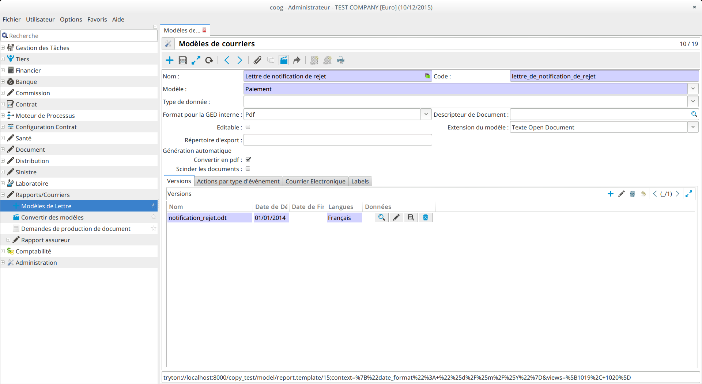
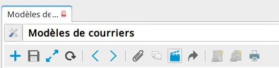
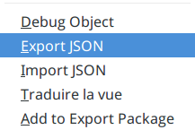
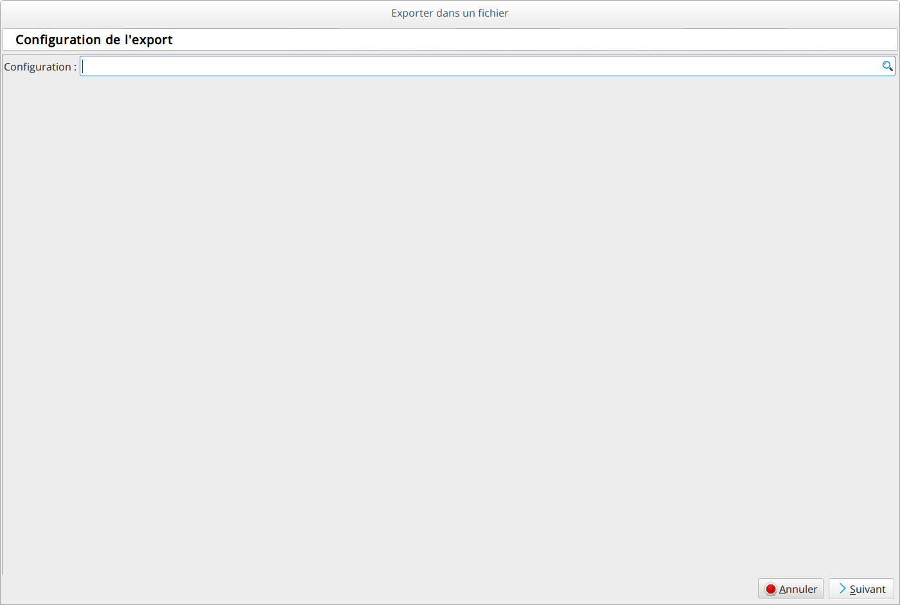
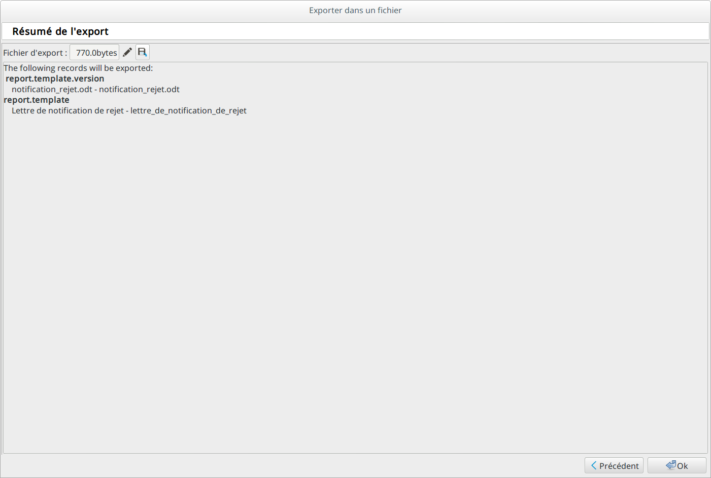

Importer/Exporter un paramétrage
=================================

Le but de ce tutoriel est d'expliquer comment exporter le paramétrage d'une base Coog pour l'importer dans une autre base.

Description du besoin
.....................

Par exemple, un modèle de lettre a été paramétré dans une base source, et l'utilisateur veut l'avoir de disponible dans une base cible.
La procédure expliquée ici peut s'appliquer à n'importe quelle donnée de paramétrage de Coog.

Prérequis
.........

Pour accéder aux fonctionnalités d'export import, il faut que le client Coog ait le plugin export_import_json installé.

Comment faire
.............

Exporter un objet
-----------------

A partir d'un objet dans la base source:

cliquer sur le menu 'Lancer une action',

puis 'Export JSON'

L'assistant d'export propose d'utiliser une configuration d'export.

Cette option n'étant pas utile ici, laisser vide et cliquer sur 'Suivant'.

Ici l'assistant nous présente un résumé des objets qui viennent d'être exportés.
Cliquer sur le bouton "Enregister sous" (icône de disquette) et enregister votre export
où vous le souhaitez. Cliquer ensuite sur Ok pour quitter l'assistant.

Importer un objet
-----------------

Pour importer sur la base cible l'objet qui vient d'être exporté, se connecter à la base cible, et cliquer sur le menu 'Lancer une action',
puis 'Import JSON'. Choisir le fichier qui a été enregistré à l'étape précédente.

L'import est aussi disponible depuis le menu 'Administation/Export
Import/Importer un fichier'.

Exports groupés
---------------

Cette fonctionnalité permet de regrouper un ensemble d'objets dans un même
fichier d'export via un package.

Depuis le menu 'Lancer une action', l'action 'Ajouter au package' ajoute
l'objet au package sélectionné.

Le menu 'Administation/Export Import/Exports groupés' regroupe les packages
créés. Ces packages peuvent être exportés suivant la méthode décrite ci dessus.
Le résultat sera un fichier JSON contenant l'ensemble des objets du package.

L'import d'un package se fait de la même façon que l'import d'un objet simple.
