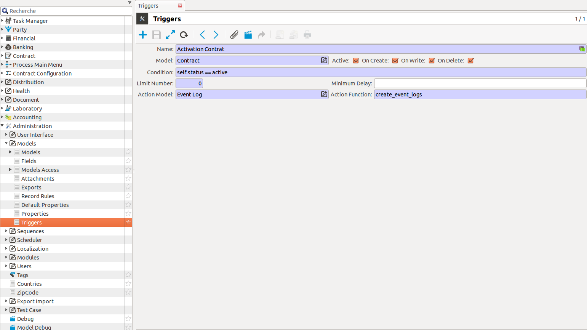

Module event_log
===================

The event_log module allows to record informations about actions made in coog.
For an event_log to be created, one needs to create a tryton trigger, and to
designate Event Log as the action model in said trigger. One also needs to
designate the function "create_event_logs" as the "action function" of the 
trigger.
The recorded informations are : the kind of action, corresponding to the name
of the trigger, the date of the action, the name of the user who made the 
action, the tryton object which is the object of the action, and a description.

For exemple, to create an event_log when a contract is activated, one only 
needs to create a trigger as indicated in the image below.

