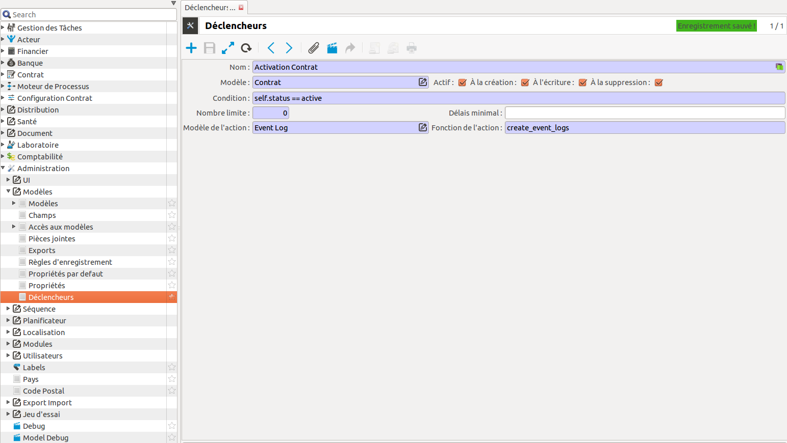

Module event_log
===================

Le module event_log permet d'enregistrer des informations concernant des actions
effectuées dans coog.
Pour qu'un event_log soit créé, il faut créer un déclencheur tryton
en désignant Event Log comme modèle de l'action dans le déclencheur. Il faut
également désigner la fonction create_event_logs comme "fonction de 
l'action" dans le déclencheur.
Les informations enregistrées sont : le type d'action, correspondant au nom
du déclencheur, la date de de l'action, le nom de l'utilisateur ayant
effectué l'action, l'objet tryton qui est la cible de l'action, et une
description.

Par exemple pour créer un event_log lorsqu'un contrat est activé, il suffit
de créer un déclencheur paramétré comme dans l'image ci-dessous:

