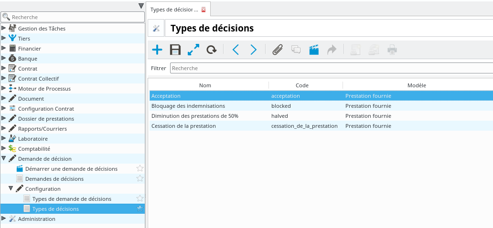
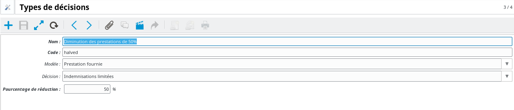
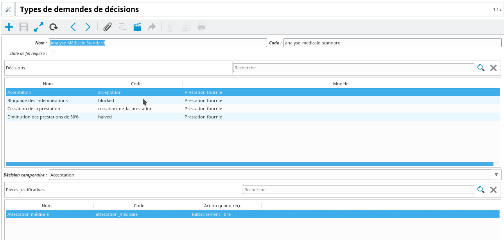
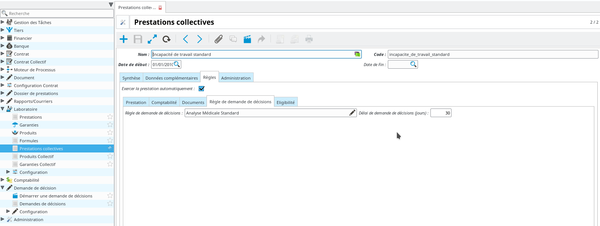
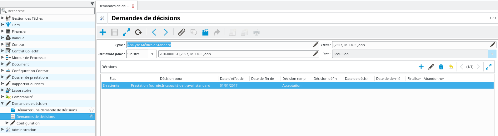
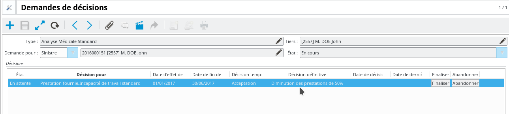
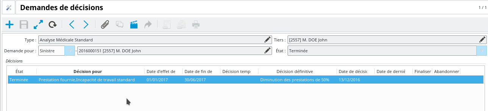
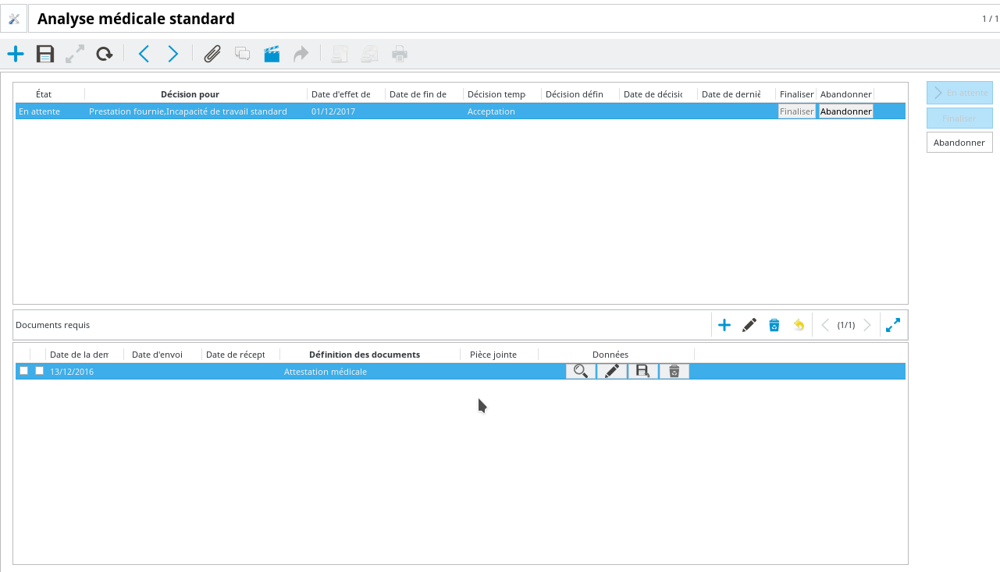

Configuration et utilisation des demandes de décision
=====================================================

Note : Ce tutoriel est basé sur un exemple de demande de décision de type
"Analyse médicale" dans le cadre du paiement de prestations. Les principes sont
adaptables à d'autres types d'analyse, sous réserve que les actions à mettre en
place soient disponibles. L'exemple présenté ici utilise les modules de demande
de décisions sinistre et indemnisation, ainsi que l'utilisation des processus.

Configuration
-------------

La configuration se passe dans le point d'entrée ``Demande de décision /
Configuration``.

Types de décision
~~~~~~~~~~~~~~~~~

Les types de décisions sont les décisions possibles à l'issue de la demande
de décision. Chaque type de décision est constitué a minima :

- du type de données sur lequel porte la décision

- d'un nom, qui sera le libellé de la décision dans l'application

- d'une décision, qui correspond à la façon dont l'application va se comporter
  suite à la décision. Les valeurs possibles dépendent du type de données
  concerné, ainsi que des modules installés.

Pour prendre le cas d'une expertise médicale dans le cadre d'une indemnisation
sinistre, le type de données sera ``Prestation``. Les décisions possibles seront
par exemple, si le module de demandes de décisions sur les indemnisations est
installé :

- *Rien* : Le système ne déclenchera aucune action liée à la prise de décision,
  il se contentera d'informer l'utilisateur de son existence.

- *Indemnisations bloquées* : Le système empêchera la validation (et donc le
  paiement) des périodes d'indemnisations postérieures à la date d'effet de la
  décision.

- *Indemnisations limitées* : Un deuxième paramètre permettra d'indiquer le
  pourcentage de réduction des indemnisations qui seront calculées par le
  système.

Types de demande de décisions
~~~~~~~~~~~~~~~~~~~~~~~~~~~~~

Les types de demande de décisions sont un ensemble de règles déterminant les
paramètres de la demande. Dans le cas d'analyses médicales pour des
indemnisations, on peut imaginer avoir des règles différentes (en termes de
décisions possibles, de processus...) en fonction du type de prestation
concerné.

Ces éléments de paramétrages sont constitués :

- d'un nom permettant de l'identifier

- d'une liste de décisions possibles

- de la décision "d'attente", c'est-à-dire de la décision qui sera appliquée
  entre la date de début de l'analyse et la validation de la décision
  définitive

- d'une case à cocher indiquant si la décision a ou non une date de fin

- dans le cas où il y a effectivement une date de fin attendue, il est possible
  de configurer une nouvelle analyse à déclencher automatiquement après la date
  de fin qui sera sélectionnée

Concrètement, pour une analyse médicale, on peut configurer par exemple deux
types d'analyse différents :

- Dans le cas du premier, on bloque les prestations le temps que la décision
  soit prise

- Dans le cas du second, aucun blocage n'est effectué par défaut, on continue
  de payer les prestations normalement tant que la décision n'a pas été validée

Configuration métier
~~~~~~~~~~~~~~~~~~~~

En fonction des modules installés, d'autres options de configuration seront
disponibles. Par exemple, il est possible si les modules correspondants sont
installés de configurer des analyses médicales au bout d'un certain temps après
le début d'un sinistre.

Utilisation
-----------

Création
~~~~~~~~

Toute demande d'analyse peut être initiée par un utilisateur habilité via le
point d'entrée ``Demande de décision / Demandes de décisions``. En fonction des
modules installés, certaines demandes peuvent être initiées automatiquement.
Par exemple, si une prestation est configurée pour générer une analyse
médicale, la demande sera créée au moment où le service sera délivré.

Une demande est constituée :

- de l'entité concernée par la demande (typiquement, un sinistre, un contrat,
  un tiers...)

- d'une référence vers le type de demande. Analyse médicale en souscription,
  examens complémentaires en sinistre, avec éventuellement des variantes en
  fonction du besoin et de la configuration

- d'un tiers. Typiquement, le souscripteur ou l'assuré sur un contrat, la
  personne assurée sur un sinistre

- d'une liste de demande de résultats. Il s'agit des éléments précis pour
  lesquels une décision est attendue. En souscription contrat, il s'agira des
  garanties requérant une analyse. En analyse sinistre, ce seront les
  différentes prestations. Chaque élément de cette liste pourra avoir des
  décisions différentes, et des dates d'effet / de fin associées également
  différentes.

Les demandes d'analyse démarrent au statut ``Brouillon``. Ce statut indique que
les données de base (type d'analyse, liste de résultats attendus) ne sont pas
figées, et sont encore susceptibles d'être modifiées.

Validation
~~~~~~~~~~

Les demandes de décisions doivent être ``Validées`` pour entrer en vigueur. Cette
validation peut être faite manuellement, ou via un traitement automatique.
Lorsqu'une demande est validée, ses éléments principaux ne peuvent plus être
modifiés. Les seuls changements possibles consisteront en la prise de décision,
la modification de la date d'effet / de fin des décisions, ou l'abandon de la
demande.

Note : Il restera possible de modifier les données de base si aucune décision
n'a été prise jusqu'à présent.

A partir du moment où la demande est validée, les décisions provisoires
deviennent effectives à partir de la date d'effet planifiée. Par exemple, si on
active une demande d'analyse médicale aujourd'hui avec effet dans un mois et
une décision provisoire de blocage des indemnisations, il sera impossible de
valider une période d'indemnisation dépassant le mois prochain.

Abandon
~~~~~~~

Toute demande ``Validée`` peut être abandonnée à n'importe quel moment. L'abandon
implique l'abandon des décisions non validées (i.e. la décision provisoire
cesse de s'appliquer). En revanche, les décisions *confirmées* resteront
valides.

Prise de décisions
~~~~~~~~~~~~~~~~~~

A partir du moment où une demande est ``Validée``, il devient possible
de prendre des décisions. Les choix possibles dépendent de l'élément sur lequel
porte la décision (prestation, garantie, etc...) ainsi que du type d'analyse
demandé.

Afin de prendre une décision éclairée, les demandes de décision peuvent donner
lieu à des demandes de documents complémentaires. Ces demandes de documents
peuvent être initiées et visualisées directement sur la demande, mais seront
rattachées à l'objet métier pour le compte duquel la demande de décision a été
faite. Typiquement, il s'agira d'un contrat ou d'un sinistre.

La prise de décision consiste en :

- Le choix de la décision définitive

- Une éventuelle modification de la date de prise d'effet

- Une éventuelle (en fonction du paramétrage du type de demande) saisie de la
  date de fin de la décision

Une fois ces données renseignées, il devient possible de ``Finaliser`` la
décision, ce qui revient à la rendre effective en remplacement de la décision
provisoire. Une fois toutes les décisions de la demande finalisées ou
abandonnées, il devient possible de ``Terminer`` la demande dans son ensemble, ce
qui la fera disparaître.

Selon le paramétrage, la finalisation de la demande peut donner lieu à une
nouvelle demande future, qui viendra en remplacement de la décision finalisée à
partir de cette date.

Processus
---------

Si le module correspondant est installé, les demandes de décisions peuvent être
traitées à l'aide de processus configurables. L'intérêt est une plus grande
flexibilité sur le traitement des demandes.

Création
~~~~~~~~

Un nouveau point d'entrée ``Demande de décision / Démarrer une demande de
décisions`` permet de démarrer la création d'une demande sur la base d'un
processus paramétré. La saisie de l'entité sur laquelle porte la demande ainsi
que du type de demande permet de sélectionner automatiquement le processus
adapté.

Utilisation
~~~~~~~~~~~

L'utilisation d'un processus laisse plus de place au paramétrage sur le
comportement des demandes de décision, mais les grandes lignes restent les
mêmes : Création / Validation / Finalisation ou Abandon.

L'intérêt supplémentaire consiste en la possibilité de personnaliser les écrans
correspondants aux différentes étapes, et d'éventuellement séparer les
habilitations, les processus permettant de limiter l'accès à certaines étapes
à des groupes d'utilisateurs précis.

Enfin, il est possible d'automatiser certaines parties liées aux processus via
des paramétrages appropriés sur les événements associés aux demandes de
décision. Par exemple, on peut vouloir déclencher un processus lors du passage
d'une demande de l'état ``Brouillon`` à ``Validée``.

